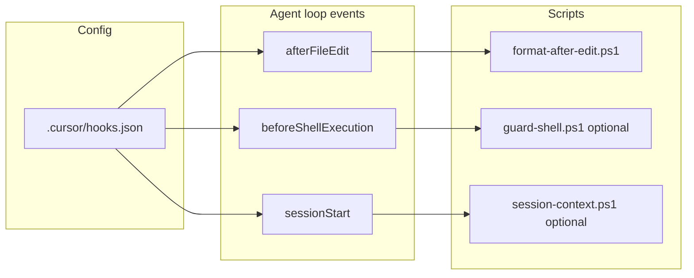

# Cursor Hooks Development Plan

## Scope: Cursor's Native Hooks

**Cursor Hooks** here means the built-in feature in **Settings → Hooks** ("Configure and manage Cursor hooks"). Hooks are:

- Configured in a `**hooks.json**` file (project: `<project>/.cursor/hooks.json`).
- Implemented as **scripts** (e.g. in `.cursor/hooks/`) that receive JSON on stdin and return JSON on stdout.
- Run at specific **agent-loop stages** (e.g. `afterFileEdit`, `beforeShellExecution`, `sessionStart`).

They let you observe, block, or modify agent behavior—e.g. run formatters after edits, gate risky shell commands, or inject context at session start. See [Cursor Docs: Hooks](https://cursor.com/docs/agent/hooks).

**Current state:** The project has **no** `.cursor/hooks.json`; "Configured Hooks (0)" in the UI. All work is additive.

---

## 1. Configuration Layout

- **Config file:** `<project>/.cursor/hooks.json`
- **Scripts directory:** `<project>/.cursor/hooks/`
- **Paths in hooks.json:** For project hooks, Cursor runs from the **project root**, so use paths like `.cursor/hooks/format-after-edit.ps1`, not `./hooks/...`.

Optional: add JSON schema for `hooks.json` in `.vscode/settings.json` so the file has validation and IntelliSense (schema URL from Cursor/community, e.g. `cursor-hooks` if available).

---

## 2. Recommended Hooks for MythosMUD

Priorities aligned with existing rules (CLAUDE.md, pre-commit, server/client split).

| Hook event                          | Purpose                                  | Script / behavior                                                                                                                                                                                                                          |
| ----------------------------------- | ---------------------------------------- | ------------------------------------------------------------------------------------------------------------------------------------------------------------------------------------------------------------------------------------------ |
| **afterFileEdit**                   | Keep agent edits aligned with pre-commit | Run formatter on edited file: Python to ruff format; TS/JSON/MD under client to npm run format (or invoke ruff/npm from one small script). Script reads stdin for `file_path` and `edits`, then formats that file and exits 0.             |
| **beforeShellExecution** (optional) | Reduce risk of dangerous agent commands  | Matcher on high-risk patterns (e.g. taskkill/node.exe, rm -rf, or project-specific no-nos from rules). Script returns `permission: "allow"` or `"deny"` (or `"ask"`). Optional so it can be added after core hooks work.                   |
| **sessionStart** (optional)         | Inject project context for the agent     | Return `additional_context` with a short reminder (e.g. "MythosMUD: run tests from project root with `make test`, use PowerShell not bash, one server only."). Keeps agent behavior aligned with CLAUDE.md without duplicating full rules. |

**Not in initial scope:** `beforeReadFile` (no need to block file access yet), `stop`/`sessionEnd` (no analytics/retry requirement for now), Tab-specific hooks (can add later if needed).

---

## 3. Implementation Details

**afterFileEdit formatter**

- **Script:** `.cursor/hooks/format-after-edit.ps1` (PowerShell; project is Windows-first).
- **Input:** JSON on stdin with `file_path` (absolute) and `edits`. Use `file_path` to decide: if path is under `server/` and extension is `.py`, run `ruff format` on that file; if path is under `client/` and extension in `(.ts|.tsx|.json|.md)`, run client formatter (e.g. `cd client; npm run format` for that file if the client script supports it).
- **Output:** None required for `afterFileEdit`; exit 0. On failure, exit non-zero (Cursor treats as hook failure; action still proceeds by default).
- **Performance:** Keep fast (under a few seconds) so the agent loop stays responsive.

**beforeShellExecution guard (optional, phase 2)**

- **Script:** `.cursor/hooks/guard-shell.ps1`. Input: JSON with `command`, `cwd`, `timeout`. Parse `command` for dangerous patterns from project rules (e.g. `taskkill` targeting `node.exe`, or `rm -rf` without safeguards). Output: JSON `{"permission": "allow"|"deny"|"ask", "user_message": "...", "agent_message": "..."}`. Use `matcher` in `hooks.json` so the hook runs only when the command matches a regex (e.g. taskkill, rm, del /q).

**sessionStart context (optional)**

- **Script:** `.cursor/hooks/session-context.ps1`. Output: JSON `{"additional_context": "Short bullet list of MythosMUD reminders (tests, PowerShell, one server, etc.)"}`. No blocking; purely additive.

**hooks.json structure**

- `version: 1`. `hooks` object: keys = event names, values = arrays of hook objects. Each hook: `command` (e.g. `".cursor/hooks/format-after-edit.ps1"`), optional `timeout`, optional `matcher` (for beforeShellExecution). Example skeleton (no optional hooks yet):

```json
{
  "version": 1,
  "hooks": {
    "afterFileEdit": [
      { "command": ".cursor/hooks/format-after-edit.ps1", "timeout": 15 }
    ]
  }
}
```

---

## 4. VS Code Conflict Audit and Resolution

To avoid duplicates or conflicts, **audit VS Code first** and remove overlapping behavior from `.vscode/settings.json` (and any extensions/tasks that run on save or on edit). Prefer the Cursor hook as the single implementation where both apply.

**Current VS Code settings that overlap with Cursor hooks**

| Setting                                                             | Current value            | Overlap with Cursor hook                                                                                                                                     |
| ------------------------------------------------------------------- | ------------------------ | ------------------------------------------------------------------------------------------------------------------------------------------------------------ |
| `editor.formatOnSave`                                               | `true`                   | Same intent as **afterFileEdit** (format after edit). When the agent saves, VS Code would also run formatters; risk of double format or different formatter. |
| `[python] editor.defaultFormatter`                                  | `charliermarsh.ruff`     | Used by format-on-save; same as **afterFileEdit** (ruff for server Python).                                                                                  |
| `[typescript]`, `[typescriptreact]`, etc. `editor.defaultFormatter` | `esbenp.prettier-vscode` | Used by format-on-save; same as **afterFileEdit** (client TS/JSON via npm format).                                                                           |
| `markdownlint.run`                                                  | `"onSave"`               | Runs on every save (user or agent). Overlaps with “lint/format on edit”; could run in addition to **afterFileEdit** for MD.                                  |

**Resolution (remove from VS Code, use Cursor hook)**

1. **Formatting after edit**

- Remove or set `editor.formatOnSave` to `false`.
- Remove or comment out per-language `editor.defaultFormatter` entries for `[python]`, `[typescript]`, `[typescriptreact]`, `[javascript]`, `[javascriptreact]`, `[json]`, `[jsonc]`.
- Rationale: **afterFileEdit** is the single place that formats agent-edited files (ruff + client npm format). User-initiated formatting can stay as manual “Format Document” or pre-commit.

1. **Markdown lint on save**

- Set `markdownlint.run` to `"off"` or remove the setting.
- If we want markdown lint for agent-edited MD files, extend **afterFileEdit** (or a separate hook) to run markdownlint for edited `.md` files instead of relying on VS Code on-save.
- Rationale: One place for “after agent edit” behavior; avoid running markdownlint both in VS Code and in a hook.

1. **No other “on save” / “on edit” automation**

- Confirm there is no `tasks.json` or extension that runs format/lint on save or on file change. If any exist, remove or disable them for the same paths the Cursor hook handles.

1. **Keep non-overlapping VS Code settings**

- Keep `markdownlint.ignore`, `git.*`, `editor.wordWrapColumn`, and all other settings that do not duplicate hook behavior.

**Implementation order for conflict resolution**

- Do the VS Code audit and removals **before** or **with** the first Cursor hook implementation (e.g. before/while adding **afterFileEdit** and `format-after-edit.ps1`).
- After removals, verify: agent edit → only Cursor hook formats; user can still run “Format Document” or pre-commit manually.

---

## 5. Documentation and Validation

- **README or docs:** Add a short "Cursor Hooks" section that points to Settings to Hooks and to `.cursor/hooks.json`, lists each configured hook (event and purpose) and where the script lives, and notes that project hooks run from the project root and that scripts are in `.cursor/hooks/`.
- **Execution log:** Use the Hooks tab in Cursor Settings to confirm hooks run and to debug (e.g. "No hook executions yet" then run an agent edit and check again).
- **Testing:** Manually trigger an agent file edit and verify the file gets formatted; optionally run a guarded shell command and verify allow/deny/ask.

---

## 6. Implementation Order

1. **Audit and resolve VS Code conflicts:** In `.vscode/settings.json`, set `editor.formatOnSave` to `false`; remove or comment per-language `editor.defaultFormatter` for python, typescript, typescriptreact, javascript, json, jsonc; set `markdownlint.run` to `"off"`. Confirm no `tasks.json` or extension runs format/lint on save for the same paths. (See Section 4.)
2. **Create** `.cursor/hooks.json` with `afterFileEdit` only and `.cursor/hooks/format-after-edit.ps1` that: reads JSON from stdin; dispatches by `file_path` to ruff (server Python) or client formatter (client TS/JSON/MD); exits 0 on success.
3. **Test** via Agent: edit a Python file and a TS file, confirm formatting is applied; check Hooks execution log. Confirm VS Code no longer formats on save (no double format).
4. **Document** in README or `docs/` the Cursor Hooks section and that formatting after agent edit is handled by Cursor hooks; users can use “Format Document” or pre-commit for manual edits.
5. **Optional (phase 2):** Add `beforeShellExecution` with matcher and `guard-shell.ps1`; then `sessionStart` and `session-context.ps1` if desired.

---

## 7. Summary Diagram



All hooks are **project-level** (version-controlled under `.cursor/`), run from the project root, and are visible in Settings to Hooks and the Execution Log.
