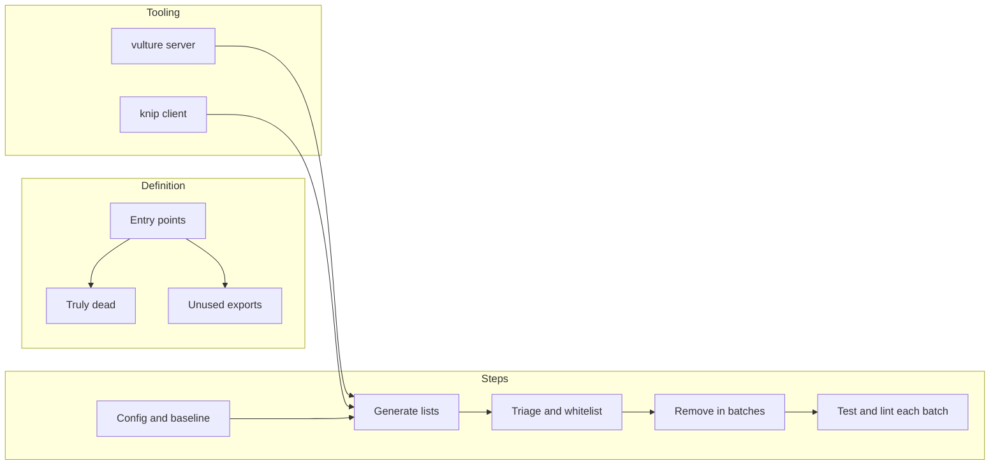

# Dead Code Analysis and Removal Plan

## 1. Definition of "Dead Code" for This Repo

Use two categories so removal is safe and reviewable:

- **Truly dead**: Code that is unreachable from application entry points and not referenced by tests or tooling. Safe to remove.
- **Unused exports / optional dead**: Symbols that are exported but never imported anywhere (including tests). Treat as a separate list; remove only after confirming they are not part of a public API or reserved for future use.

**Explicitly not dead (do not remove):**

- **Server:** Imports kept for side effects (e.g. [server/api/players.py](e:\projects\GitHub\MythosMUD\server\api\players.py), [server/models](e:\projects\GitHub\MythosMUD\server\models)) and symbols marked "reserved for future use" (e.g. [server/services/combat_service.py](e:\projects\GitHub\MythosMUD\server\services\combat_service.py), [server/utils/command_parser.py](e:\projects\GitHub\MythosMUD\server\utils\command_parser.py)). These already have `noqa: F401` or equivalent justification.
- **Client:** Intentionally unused variables in tests or components that use the `_` prefix or eslint-disable with a comment; code only used by tests (e.g. test utilities) is optional—list separately rather than delete by default.

**Entry points for reachability:**

- **Server:** [server/main.py](e:\projects\GitHub\MythosMUD\server\main.py) → [server/app/factory.py](e:\projects\GitHub\MythosMUD\server\app\factory.py) `create_app` and registered routers/lifespan.
- **Client:** [client/src/main.tsx](e:\projects\GitHub\MythosMUD\client\src\main.tsx) → AppRouter → App (and lazy Map/Skills).

---

## 2. Tooling

### Server (Python)

- **Primary:** [vulture](https://github.com/jendrikseipp/vulture) — finds unused code (functions, classes, variables). Not currently in the project; add as dev dependency and run from repo root.
- **Existing:** Ruff (F401 for unused imports), mypy, pytest with coverage. Use coverage to sanity-check that removed code was not covered by tests.
- **Config:** Add a `vulture.ini` or `pyproject.toml` section to:
  - Exclude test directories and `server/tests/`.
  - Whitelist known false positives (e.g. FastAPI `_request` parameters, side-effect imports in `__init__.py`, reserved stubs in combat_service/command_parser).

### Client (TypeScript)

- **Chosen:** [knip](https://github.com/webpro/knip) — finds unused files, exports, and dependencies in one tool. Add as dev dependency and a script in [client/package.json](e:\projects\GitHub\MythosMUD\client\package.json). Configure ignore/allow patterns for test files and intentional public API (e.g. `src/main.tsx` exports if any).
- **Existing:** ESLint `@typescript-eslint/no-unused-vars` (argsIgnorePattern `^`) already catches many unused locals; no additional config needed for that.

---

## 3. Ordered Steps

### Phase 1: Setup and baseline

1. Add vulture to server dev dependencies (e.g. in [pyproject.toml](e:\projects\GitHub\MythosMUD\pyproject.toml) or requirements-dev).
2. Add vulture config (excludes, whitelist) so that known intentional unused code is not reported.
3. Add knip to client dev dependencies and a script in [client/package.json](e:\projects\GitHub\MythosMUD\client\package.json).
4. Run `make test` (and client tests if present) and record baseline; ensure CI/lint passes before any removal.

### Phase 2: Generate dead-code lists

1. **Server:** Run vulture from project root over `server/` (excluding `server/tests/`). Save output to a file (e.g. `dead-code-server.txt`).
2. **Client:** Run knip on `client/src`. Save output (e.g. `dead-code-client.txt`).
3. Triage:

- Merge with known intentional unused list (see "Explicitly not dead" above).
- Mark each finding as: **remove**, **keep (whitelist)**, or **investigate**. For "investigate," add a short reason (e.g. "used only in e2e") and decide remove vs keep in a follow-up.

### Phase 3: Removal in batches

1. Remove server dead code in small batches (e.g. one module or one logical group per batch). After each batch:

- Run `make test` from project root.
- Run ruff/mypy; run Codacy CLI on changed files per [.cursor/rules/codacy.mdc](e:\projects\GitHub\MythosMUD.cursor\rules\codacy.mdc).

1. Remove client dead code in small batches. After each batch:

- Run client unit tests and e2e if applicable; run ESLint and client build.

1. Update vulture/knip config with any new whitelists so the tools do not regress.

### Phase 4: Documentation and CI (optional)

1. Document the chosen definition of dead code and the whitelist locations in the repo (e.g. in [CLAUDE.md](e:\projects\GitHub\MythosMUD\CLAUDE.md) or a short `docs/dead-code.md`).
2. Optionally add a CI job or pre-commit check that runs vulture and knip so new dead code is flagged (with the same exclusions/whitelists).

---

## 4. Known Intentional "Unused" (Whitelist / Do Not Remove)

Keep these in the vulture/knip config or a dedicated whitelist file so the next run does not suggest removing them:

| Location                                                         | Reason                                                                         |
| ---------------------------------------------------------------- | ------------------------------------------------------------------------------ |
| `server/api/players.py` (and similar router imports)             | Side-effect registration with FastAPI                                          |
| `server/models` (and other `__init__.py` re-exports)             | F401 explicitly allowed in pyproject for `__init__.py`                         |
| `server/services/combat_service.py`                              | Reserved for future use (stub/placeholder)                                     |
| `server/utils/command_parser.py`                                 | Reserved for future use                                                        |
| FastAPI route handlers using `_request` or similar unused params | Convention; whitelist pattern in vulture                                       |
| Client: test utilities and components only used in tests         | Exclude from knip or list as "optional" and do not remove without confirmation |
| Client: `_`-prefixed args/vars                                   | Already ignored by ESLint; knip may still list exports—whitelist if needed     |

---

## 5. Risk Mitigation

- **Tests:** Every removal batch must be followed by the full test suite (`make test` for server; client tests for client). No removal without running tests.
- **Commits:** Prefer one logical batch per commit (e.g. "Remove dead code in server.services.foo") so reverts are easy.
- **Coverage:** If a removed symbol was covered by tests, delete or adjust the now-redundant tests so coverage and behavior remain consistent.

---

## 6. Summary Diagram

This plan gives a clear definition of dead code, tooling choices (vulture + knip), a safe removal workflow, and an explicit whitelist so existing intentional "unused" code is not removed.
