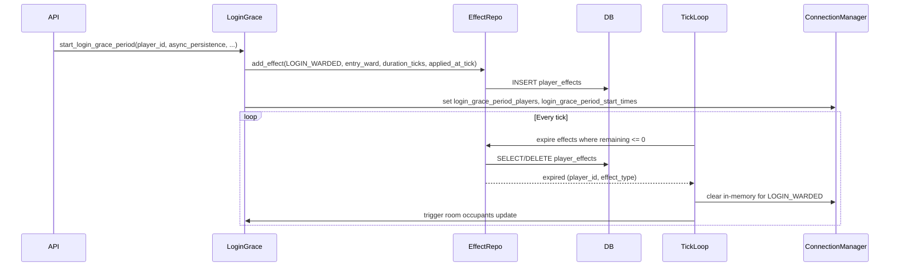

# Effects System ADR and Implementation Plan

## Part 1: ADR-009 (Effects System Architecture)

### Location and index

- **File:** [docs/architecture/decisions/ADR-009-effects-system-architecture.md](docs/architecture/decisions/ADR-009-effects-system-architecture.md)
- **Index:** Add a row to the table in [docs/architecture/decisions/README.md](docs/architecture/decisions/README.md): ADR-009 | Effects System Architecture | Accepted | 2026-02-09

### ADR content to write

**Title:** ADR-009: Effects System Architecture

**Status:** Accepted
**Date:** 2026-02-09

**Context**

- MythosMUD needs a unified, persistent effects system for status effects (buffs, debuffs, protection, DoT/HoT).
- Today, the "game-entry warded" behavior is implemented ad hoc: in-memory state and an asyncio task in [server/realtime/login_grace_period.py](server/realtime/login_grace_period.py) (10-second immunity after MOTD dismissal). Other effects live in a JSON blob on the player ([server/models/player.py](server/models/player.py) `status_effects` Text column) with tick processing in [server/app/game_tick_processing.py](server/app/game_tick_processing.py).
- Design options were researched and recorded in [docs/EFFECTS_SYSTEM_REFERENCE.md](docs/EFFECTS_SYSTEM_REFERENCE.md). This ADR captures the chosen architecture and the decision to migrate game-entry warded as the first effect.

**Decision**

1. **Stacking:** Most potent wins, with granular categories (e.g. poison, stun, entry_ward, lucidity_protection). Same category keeps the single strongest instance; different categories stack.
2. **Duration:** Tick-based; persist `duration` and `applied_at_tick`. Remaining = duration - (current_tick - applied_at_tick). Game tick counter must be persisted for durations to survive restarts.
3. **Categories:** Granular categories (not broad buff/debuff). Stacking rules apply per category.
4. **Stat modifications:** Calculate on demand from base stats + active effects. Fallback to a separate modification registry if performance requires it.
5. **Processing:** Tick-based only; no event-driven callbacks for effects.
6. **Storage:** Separate `player_effects` table (not JSON on player). Columns: player_id, effect_type, category, duration, applied_at_tick, intensity, source, visibility_level, created_at.
7. **Scripting:** Data-only effects; behavior in code. No custom scripts/callbacks.
8. **Intensity:** Effect-specific (e.g. DoT linear, stat mods step function).
9. **Expiration:** Immediate cleanup in the tick that processes the effect.
10. **Visibility:** Per-effect level: hidden, visible, detailed. Default: visible.
11. **First effect:** Game-entry warded (current "login grace period") is implemented as effect type `login_warded`, category `entry_ward`, and migrated from the asyncio-based implementation to this system.

**Alternatives considered**

- **Stacking:** Replace-only, full stacking, or category-only; chosen most potent wins + granular categories for CoC-aligned feel and MUD flexibility.
- **Duration:** Absolute timestamp vs tick counter; chosen tick counter for consistency with game loop and future persistence of tick.
- **Storage:** JSONB on player vs separate table; chosen separate table for querying, indexing, and cascading.
- **Processing:** Event-driven or hybrid; chosen tick-only for simplicity.
- **Scripting:** Scriptable effects (Ranvier-style); rejected for security and simplicity; data-only chosen.

**Consequences**

- **Positive:** Single, queryable effects store; game-entry warded survives restarts if tick is persisted; clear stacking and visibility rules; one place to add future effects.
- **Negative:** Tick counter must be persisted for duration semantics across restarts; all call sites that checked "login grace" must use the new effect or a thin wrapper.
- **Neutral:** Legacy `status_effects` JSON on player remains until other effect types are migrated; both can coexist during transition.

**References**

- [EFFECTS_SYSTEM_REFERENCE.md](docs/EFFECTS_SYSTEM_REFERENCE.md) (design decisions and options)
- [login_grace_period.py](server/realtime/login_grace_period.py) (current warded implementation)

---

## Part 2: Separate implementation plan document

Create a **separate** implementation plan file that follows the same format as other plans in this project (e.g. [login_grace_period_implementation_32b067c4.plan.md](.cursor/plans/login_grace_period_implementation_32b067c4.plan.md), [first_weapon_switchblade_85972031.plan.md](.cursor/plans/first_weapon_switchblade_85972031.plan.md)):

- **Location:** `.cursor/plans/effects_system_implementation.plan.md`
- **Structure:** YAML frontmatter with `name`, `overview`, and `todos` (each todo: `id`, `content`, `status: pending`); then markdown body with `# Title`, `## Overview`, `## Reference`, `## Architecture`, `## Implementation Details` (numbered sections with file paths), `## Testing`, `## Optional / Follow-up`, and a mermaid diagram where useful.

The full content of that separate implementation plan is in the next section. When executing this plan, create the file `.cursor/plans/effects_system_implementation.plan.md` with the content below (and do not duplicate the ADR content there; the implementation plan references ADR-009 and the reference doc).

---

## Content for `.cursor/plans/effects_system_implementation.plan.md`

````markdown
---
name: Effects System Implementation
overview: Implement the effects system per ADR-009 (separate player_effects table, tick-based duration, granular categories) and migrate game-entry warded (login grace period) to the first effect (LOGIN_WARDED / entry_ward).
todos:
  - id: add-login-warded-enum
    content: Add LOGIN_WARDED to StatusEffectType in server/models/game.py
    status: pending
  - id: create-player-effect-model
    content: Create server/models/player_effect.py (PlayerEffect table) and add player_effects relationship on Player
    status: pending
  - id: alembic-migration-player-effects
    content: Add Alembic migration to create player_effects table with FKs and indexes
    status: pending
  - id: player-effect-repository
    content: Create server/persistence/repositories/player_effect_repository.py (add, delete, get active, has_effect, remaining_ticks, expire)
    status: pending
  - id: wire-repo-async-persistence
    content: Wire PlayerEffectRepository into AsyncPersistenceLayer and persistence/repositories/__init__.py
    status: pending
  - id: tick-process-player-effects
    content: In game_tick_processing.py process player_effects table; expire rows where remaining <= 0
    status: pending
  - id: tick-expire-login-warded-cleanup
    content: On LOGIN_WARDED expiration clear connection_manager in-memory state and trigger room occupants update
    status: pending
  - id: start-grace-add-effect
    content: In login_grace_period.py start_login_grace_period adds LOGIN_WARDED effect via async_persistence and sets in-memory state (no asyncio task)
    status: pending
  - id: api-pass-async-persistence
    content: In players.py start_login_grace_period_endpoint pass async_persistence and current_tick into start_login_grace_period
    status: pending
  - id: unit-tests-repository
    content: Unit tests for PlayerEffectRepository (add, get active, has_effect, remaining_ticks, expiration)
    status: pending
  - id: unit-tests-grace-period-effect
    content: Update unit tests for login grace period to assert effect in DB and in-memory state; expiration clears both
    status: pending
  - id: integration-test-grace-effect
    content: Integration test start grace -> effect in DB -> tick expires -> in-memory cleared and room update
    status: pending
  - id: docs-reference-first-effect
    content: Add Implementation First effect subsection to EFFECTS_SYSTEM_REFERENCE.md referencing ADR-009
    status: pending
isProject: false
---

# Effects System Implementation Plan

## Overview

Implement the effects system as defined in ADR-009 and migrate the existing game-entry warded behavior (login grace period) to the first effect. This includes:

- A separate `player_effects` table with tick-based duration (`duration`, `applied_at_tick`), granular categories, and visibility levels
- A `PlayerEffectRepository` and integration with `AsyncPersistenceLayer`
- Game-tick processing that expires effects and, for `login_warded`, clears in-memory state and triggers room occupants update
- Changing `start_login_grace_period` to add a LOGIN_WARDED effect instead of starting an asyncio task

## Reference

- [ADR-009: Effects System Architecture](docs/architecture/decisions/ADR-009-effects-system-architecture.md)
- [EFFECTS_SYSTEM_REFERENCE.md](docs/EFFECTS_SYSTEM_REFERENCE.md) (design decisions and options)
- Current warded implementation: [server/realtime/login_grace_period.py](server/realtime/login_grace_period.py)

## Architecture

Flow when starting grace period and when tick expires:


````

```

```

```

```

```

```

```

```

```

```

```

```

```

## Implementation Details

### 1. Models and enum

- **File:** [server/models/game.py](server/models/game.py)
Add `LOGIN_WARDED = "login_warded"` to `StatusEffectType`.
- **New file:** [server/models/player_effect.py](server/models/player_effect.py)
SQLAlchemy model `PlayerEffect`: table `player_effects` with `id` (UUID PK), `player_id` (FK to players), `effect_type`, `category`, `duration`, `applied_at_tick`, `intensity`, `source`, `visibility_level`, `created_at`.
- **File:** [server/models/player.py](server/models/player.py)
Add relationship `player_effects: Mapped[list["PlayerEffect"]]` with `back_populates="player"` and cascade delete.

### 2. Database migration

- **Location:** [server/alembic/versions/](server/alembic/versions/)
New migration: create `player_effects` table, foreign key to `players.player_id`, indexes on `player_id`, `effect_type`, `category`.

### 3. PlayerEffectRepository

- **New file:** [server/persistence/repositories/player_effect_repository.py](server/persistence/repositories/player_effect_repository.py)
Methods: `add_effect(...)`, `delete_effect(effect_id)`, `get_active_effects_for_player(player_id, current_tick)`, `get_effects_expiring_this_tick(current_tick)` or equivalent, `has_effect(player_id, effect_type)`, `get_effect_remaining_ticks(player_id, effect_type)`. Use async session pattern from [HealthRepository](server/persistence/repositories/health_repository.py) (`get_session_maker()`).
- **File:** [server/persistence/repositories/**init**.py](server/persistence/repositories/__init__.py)
Export `PlayerEffectRepository`.
- **File:** [server/async_persistence.py](server/async_persistence.py)
Instantiate `_player_effect_repo`; expose `add_player_effect`, `remove_player_effect_by_id`, `get_active_player_effects`, `has_player_effect`, `get_player_effect_remaining_ticks`, and a method that expires effects for a given `current_tick` and returns list of `(player_id, effect_type)` for expired rows.

### 4. Game tick processing

- **File:** [server/app/game_tick_processing.py](server/app/game_tick_processing.py)
Add a step (e.g. before or after existing status effect processing) that: calls async_persistence to expire `player_effects` for `current_tick`; for each expired effect with `effect_type == "login_warded"`, remove that `player_id` from `connection_manager.login_grace_period_players` and `login_grace_period_start_times`, and trigger room occupants update (reuse logic from [login_grace_period.py](server/realtime/login_grace_period.py) `_trigger_room_occupants_update` / `_grace_period_expiration_handler`). Requires access to `app`/`container` and `connection_manager`.

### 5. Login grace period migration

- **File:** [server/realtime/login_grace_period.py](server/realtime/login_grace_period.py)
`start_login_grace_period(player_id, manager, async_persistence, get_current_tick)` (or receive these via a different mechanism): compute `duration_ticks` for 10 seconds (e.g. 100 at 10 ticks/sec from config); call `async_persistence.add_player_effect(player_id, effect_type="login_warded", category="entry_ward", duration=duration_ticks, applied_at_tick=get_current_tick(), source="game_entry", visibility_level="visible")`; set `manager.login_grace_period_players[player_id]` and `manager.login_grace_period_start_times[player_id] = time.time()` so existing `is_player_in_login_grace_period` and `get_login_grace_period_remaining` still work. Do **not** start the asyncio `_grace_period_task`.
- **File:** [server/api/players.py](server/api/players.py)
In `start_login_grace_period_endpoint`, obtain `async_persistence` from `request.app.state.container.async_persistence` and a current-tick getter (e.g. from `server.app.game_tick_processing import get_current_tick`); pass them into `start_login_grace_period`.

### 6. Optional: persist game tick

If durations must survive server restarts (ADR-009): persist `current_tick` (e.g. in a small table or key-value) periodically and load on startup in the game tick loop so `_current_tick` continues from the saved value. Can be a follow-up task.

## Testing

- **Unit:** [server/tests/unit/persistence/repositories/](server/tests/unit/) (or equivalent) for `PlayerEffectRepository`: add effect, get active, has_effect, remaining_ticks, expiration.
- **Unit:** Update [server/tests/unit/realtime/test_login_grace_period.py](server/tests/unit/realtime/test_login_grace_period.py) and related tests so that starting grace period inserts into `player_effects` and sets in-memory state; simulate or mock tick expiration and assert in-memory cleared and room update triggered.
- **Integration:** One test that runs start grace period -> effect present in DB -> tick processing expires it -> in-memory cleared and room occupants update sent.

## Optional / Follow-up

- Remove asyncio `_grace_period_task` and related code from [login_grace_period.py](server/realtime/login_grace_period.py) once migration is verified.
- Make `get_login_grace_period_remaining` compute from effect remaining_ticks tick_interval and remove `login_grace_period_start_times` if desired.
- Persist game tick for cross-restart duration semantics.

```

```

```

```

```

```

```

```

```

```

```

```

```

```

```
