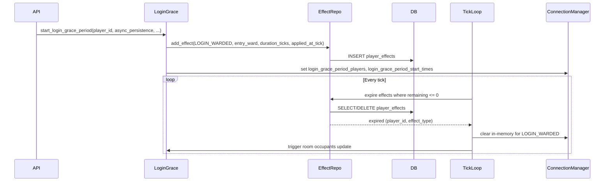

# Effects System Implementation Plan

## Overview

Implement the effects system as defined in ADR-009 and migrate the existing game-entry warded behavior (login grace period) to the first effect. This includes:

- A separate `player_effects` table with tick-based duration (`duration`, `applied_at_tick`), granular categories, and visibility levels
- A `PlayerEffectRepository` and integration with `AsyncPersistenceLayer`
- Game-tick processing that expires effects and, for `login_warded`, clears in-memory state and triggers room occupants update
- Changing `start_login_grace_period` to add a LOGIN_WARDED effect instead of starting an asyncio task
- **Client:** Active effects shown in the player title bar/panel ([HeaderBar](client/src/components/ui-v2/HeaderBar.tsx)) next to player name, Mythos time, and logout

## Reference

- [ADR-009: Effects System Architecture](docs/architecture/decisions/ADR-009-effects-system-architecture.md)
- [EFFECTS_SYSTEM_REFERENCE.md](docs/EFFECTS_SYSTEM_REFERENCE.md) (design decisions and options)
- Current warded implementation: [server/realtime/login_grace_period.py](server/realtime/login_grace_period.py)

## Architecture

Flow when starting grace period and when tick expires:

## Implementation Details

### 1. Models and enum

- **File:** [server/models/game.py](server/models/game.py)
  Add `LOGIN_WARDED = "login_warded"` to `StatusEffectType`.
- **New file:** [server/models/player_effect.py](server/models/player_effect.py)
  SQLAlchemy model `PlayerEffect`: table `player_effects` with `id` (UUID PK), `player_id` (FK to players), `effect_type`, `category`, `duration`, `applied_at_tick`, `intensity`, `source`, `visibility_level`, `created_at`.
- **File:** [server/models/player.py](server/models/player.py)
  Add relationship `player_effects: Mapped[list["PlayerEffect"]]` with `back_populates="player"` and cascade delete.

### 2. Database migration

- **Location:** [server/alembic/versions/](server/alembic/versions/)
  New migration: create `player_effects` table, foreign key to `players.player_id`, indexes on `player_id`, `effect_type`, `category`.

### 3. PlayerEffectRepository

- **New file:** [server/persistence/repositories/player_effect_repository.py](server/persistence/repositories/player_effect_repository.py)
  Methods: `add_effect(...)`, `delete_effect(effect_id)`, `get_active_effects_for_player(player_id, current_tick)`, `get_effects_expiring_this_tick(current_tick)` or equivalent, `has_effect(player_id, effect_type)`, `get_effect_remaining_ticks(player_id, effect_type)`. Use async session pattern from [HealthRepository](server/persistence/repositories/health_repository.py) (`get_session_maker()`).
- **File:** [server/persistence/repositories/**init**.py](server/persistence/repositories/__init__.py)
  Export `PlayerEffectRepository`.
- **File:** [server/async_persistence.py](server/async_persistence.py)
  Instantiate `_player_effect_repo`; expose `add_player_effect`, `remove_player_effect_by_id`, `get_active_player_effects`, `has_player_effect`, `get_player_effect_remaining_ticks`, and a method that expires effects for a given `current_tick` and returns list of `(player_id, effect_type)` for expired rows.

### 4. Game tick processing

- **File:** [server/app/game_tick_processing.py](server/app/game_tick_processing.py)
  Add a step (e.g. before or after existing status effect processing) that: calls async_persistence to expire `player_effects` for `current_tick`; for each expired effect with `effect_type == "login_warded"`, remove that `player_id` from `connection_manager.login_grace_period_players` and `login_grace_period_start_times`, and trigger room occupants update (reuse logic from [login_grace_period.py](server/realtime/login_grace_period.py) `_trigger_room_occupants_update` / `_grace_period_expiration_handler`). Requires access to `app`/`container` and `connection_manager`.

### 5. Login grace period migration

- **File:** [server/realtime/login_grace_period.py](server/realtime/login_grace_period.py)
  `start_login_grace_period(player_id, manager, async_persistence, get_current_tick)` (or receive these via a different mechanism): compute `duration_ticks` for 10 seconds (e.g. 100 at 10 ticks/sec from config); call `async_persistence.add_player_effect(player_id, effect_type="login_warded", category="entry_ward", duration=duration_ticks, applied_at_tick=get_current_tick(), source="game_entry", visibility_level="visible")`; set `manager.login_grace_period_players[player_id]` and `manager.login_grace_period_start_times[player_id] = time.time()` so existing `is_player_in_login_grace_period` and `get_login_grace_period_remaining` still work. Do **not** start the asyncio `_grace_period_task`.
- **File:** [server/api/players.py](server/api/players.py)
  In `start_login_grace_period_endpoint`, obtain `async_persistence` from `request.app.state.container.async_persistence` and a current-tick getter (e.g. from `server.app.game_tick_processing import get_current_tick`); pass them into `start_login_grace_period`.

### 6. Optional: persist game tick

If durations must survive server restarts (ADR-009): persist `current_tick` (e.g. in a small table or key-value) periodically and load on startup in the game tick loop so `_current_tick` continues from the saved value. Can be a follow-up task.

### 7. Client: effects in header bar (visualization)

- **File:** [client/src/components/ui-v2/HeaderBar.tsx](client/src/components/ui-v2/HeaderBar.tsx)
  Add an optional `activeEffects` prop (e.g. list of `{ effect_type, label?, remaining_seconds? }` or equivalent). Render effects in the header bar between the left block (player name, connection status) and the right block (Mythos Time, logout). Use compact display: labels or icons per effect; optional tooltip or inline text for remaining time (e.g. "Warded (0:08)" for LOGIN_WARDED).
- **Data flow:** Expose active effects to the client via game state or a dedicated API/WebSocket payload (e.g. include `active_effects` in `game_state` or `room_state` when the player has effects). [GameClientV2Container](client/src/components/ui-v2/GameClientV2Container.tsx) / [GameClientV2](client/src/components/ui-v2/GameClientV2.tsx) pass the list into `HeaderBar`. Server authority: client displays whatever the server sends; no client-side expiration timer required for correctness (server sends updated list or remaining time).
- **Collapsed header:** In collapsed state, show a compact effects indicator (e.g. icon or count) if desired, or omit to keep the bar minimal.

## Testing

- **Unit:** [server/tests/unit/persistence/repositories/](server/tests/unit/) (or equivalent) for `PlayerEffectRepository`: add effect, get active, has_effect, remaining_ticks, expiration.
- **Unit:** Update [server/tests/unit/realtime/test_login_grace_period.py](server/tests/unit/realtime/test_login_grace_period.py) and related tests so that starting grace period inserts into `player_effects` and sets in-memory state; simulate or mock tick expiration and assert in-memory cleared and room update triggered.
- **Integration:** One test that runs start grace period -> effect present in DB -> tick processing expires it -> in-memory cleared and room occupants update sent.
- **Client (optional):** Unit test for HeaderBar with `activeEffects` prop (renders effect labels; no effects = no section). E2E or integration: after MOTD dismiss, header shows warded effect until it expires.

## Optional / Follow-up

- Remove asyncio `_grace_period_task` and related code from [login_grace_period.py](server/realtime/login_grace_period.py) once migration is verified.
- Make `get_login_grace_period_remaining` compute from effect remaining_ticks tick_interval and remove `login_grace_period_start_times` if desired.
- Persist game tick for cross-restart duration semantics.
