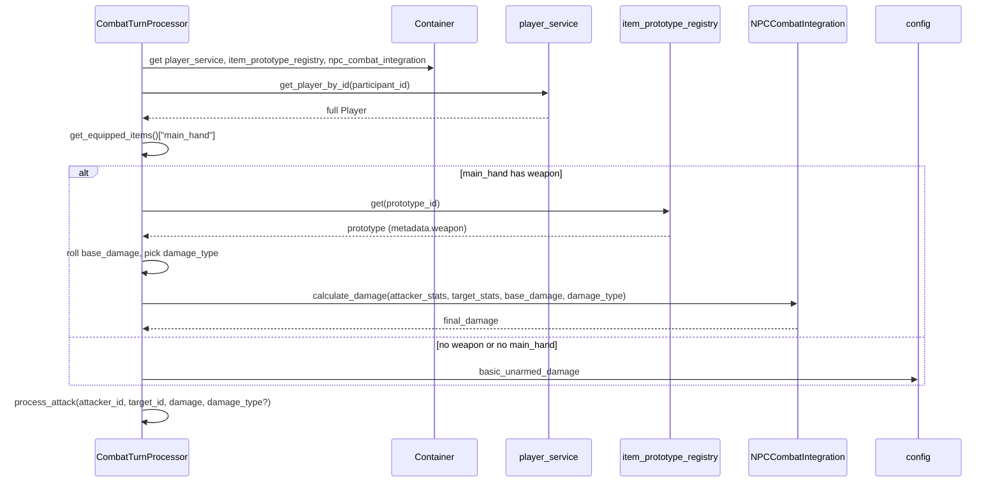

# First Weapon: Switchblade Knife

## Scope

- **Weapon**: Switchblade knife — 1d4+0 (min 1, max 4, modifier 0), slashing and piercing, non-magical, main_hand only, used for auto-attack when equipped.
- **Damage representation**: `min_damage`, `max_damage`, `modifier` in item metadata, with `damage_types` and `magical`.
- **In scope (formerly out of scope)**: Pass `damage_type` into combat and use [NPCCombatIntegration.calculate_damage](server/npc/combat_integration.py) for player weapon attacks (strength/constitution); add item_type `weapon` and use it for the switchblade; add client-facing weapon stats display where equipment is shown.

## 1. Weapon metadata schema (item prototype)

Store weapon stats in [ItemPrototype](server/models/item.py) `metadata_payload` (exposed as `metadata` on [ItemPrototypeModel](server/game/items/models.py)). Use a `**weapon**` sub-object so other metadata (e.g. lore) can coexist:

- `weapon.min_damage` (int)
- `weapon.max_damage` (int)
- `weapon.modifier` (int)
- `weapon.damage_types` (list of strings, e.g. `["slashing", "piercing"]`)
- `weapon.magical` (bool)

No new validators required for metadata. Add `weapon` to [ALLOWED_ITEM_TYPES](server/game/items/constants.py) (see section 2). [ALLOWED_WEAR_SLOTS](server/game/items/constants.py) already includes `main_hand`.

## 2. Add item_type "weapon"

- **File**: [server/game/items/constants.py](server/game/items/constants.py)
- Add `"weapon"` to `ALLOWED_ITEM_TYPES` so the switchblade (and future weapons) can use `item_type: "weapon"` instead of `"equipment"`, making them distinguishable in schema and UI.

## 3. Add switchblade prototype to the database

- **Location**: Add a new migration under [data/db/migrations/](data/db/migrations/) (e.g. `07_add_switchblade_weapon.sql`) following the pattern of [02_item_prototypes.sql](data/db/02_item_prototypes.sql) (INSERT with ON CONFLICT DO UPDATE).
- **Row**: One row for the switchblade:
  - `prototype_id`: e.g. `weapon.main_hand.switchblade`
  - `name`, `short_description`, `long_description`: Mythos-appropriate copy
  - `item_type`: `weapon` (after adding to ALLOWED_ITEM_TYPES)
  - `wear_slots`: `["main_hand"]`
  - `metadata`: e.g. `{"weapon": {"min_damage": 1, "max_damage": 4, "modifier": 0, "damage_types": ["slashing", "piercing"], "magical": false}}`
  - Other columns: flags `[]`, weight, base_value, durability, stacking_rules, usage_restrictions, effect_components, tags as appropriate (no MAGICAL flag; tags e.g. `["weapon","main_hand","melee"]`).

## 4. Resolve player auto-attack damage from equipped main_hand

**File**: [server/services/combat_turn_processor.py](server/services/combat_turn_processor.py)

In `_process_player_turn`, **before** the existing “Use configured damage for automatic attacks” block (around lines 419–427):

1. **Load full player, registry, and NPC combat integration** (same pattern as spell branch ~lines 177–182):
  - `app = getattr(get_config(), "_app_instance", None)`; if `app` and `app.state.container`: get `player_service`, `item_prototype_registry`, and `npc_combat_integration` (or equivalent access to [NPCCombatIntegration.calculate_damage](server/npc/combat_integration.py)) from container / combat service.
2. **Resolve equipped main_hand**:
  - `full_player = await player_service.persistence.get_player_by_id(player.participant_id)` (use a distinct variable name to avoid shadowing the `player` CombatParticipant).
  - `equipped = full_player.get_equipped_items()` then `main_hand_stack = equipped.get("main_hand")`.
3. **Resolve weapon damage and apply strength/constitution**:
  - If `main_hand_stack` and `item_prototype_registry`: get `prototype_id` from the stack, then `prototype = registry.get(prototype_id)`.
  - If prototype and `prototype.metadata.get("weapon")` has `min_damage` and `max_damage`: treat as weapon. Roll `base_damage = random.randint(min_damage, max_damage) + modifier`. Pick `damage_type` from weapon (e.g. first of `weapon["damage_types"]` or `"physical"` if missing). Resolve attacker and target stats (from full_player and target participant or persistence), then `damage = npc_combat_integration.calculate_damage(attacker_stats, target_stats, weapon_damage=base_damage, damage_type=damage_type)`.
  - Else: keep current behavior `damage = config.game.basic_unarmed_damage` (and use `damage_type = "physical"` if passed anywhere).
4. **Call** `process_attack(..., damage=damage)` (and, if process_attack is extended to accept `damage_type`, pass it for effects; see section 5).

**Dependencies**: Access to `item_prototype_registry` and to [NPCCombatIntegration](server/npc/combat_integration.py) (e.g. via combat service or container) so player weapon attacks use the same strength/constitution logic as NPCs.

## 5. Pass damage_type into process_attack (optional API extension)

- **File**: [server/services/combat_service.py](server/services/combat_service.py)
- Extend `process_attack(attacker_id, target_id, damage, is_initial_attack=False)` with an optional `damage_type: str = "physical"` parameter.
- Where combat effects or logging use damage type (e.g. [apply_combat_effects](server/npc/combat_integration.py)), pass `damage_type` through so future resistance/absorption can key off it. If no call sites use it yet, add the parameter and pass it down for consistency; turn processor (section 4) will pass the weapon’s damage_type.

## 6. Shared weapon-damage helper

To keep turn processor readable and reusable (e.g. for future combat command or NPC weapons), add a small helper that, given an equipped stack and a prototype registry, returns either weapon info (base damage roll, damage_type, metadata) or indicates non-weapon. Place it in a module used by combat (e.g. under `server/game/` or `server/services/`) and call it from `_process_player_turn`.

## 7. Testing

- **Unit**:
  - Resolve damage from equipped main_hand: mock player with `get_equipped_items()` returning a stack with a prototype that has `metadata.weapon`; assert damage is in [min_damage, max_damage] + modifier.
  - No weapon / non-weapon in main_hand: assert damage equals `config.game.basic_unarmed_damage`.
  - Missing registry or missing player: fallback to basic_unarmed_damage.
- **Integration** (if existing combat flow tests exist): Equip switchblade, enter combat, assert auto-attack damage uses weapon roll and strength/constitution (and is in expected range).

## 8. Documentation and rollout

- Ensure [load seed/migration docs](data/db/README.md) or scripts run the new migration (e.g. [scripts/load_seed_using_project_db.py](scripts/load_seed_using_project_db.py) or equivalent) so the switchblade prototype exists in environments that use seed data.
- If [process_attack](server/services/combat_service.py) or inventory/equipment API changes, update OpenAPI spec per [mythosmud-openapi-workflow](.cursor/skills/mythosmud-openapi-workflow/SKILL.md). No COPPA impact.

## 9. Client-facing weapon stats display

- **API**: Where equipment or item details are returned to the client (e.g. inventory/equipped payloads or item lookup), include weapon stats when present: expose `metadata.weapon` (or a normalized shape) so the client can show min/max damage, modifier, damage types, and magical flag. Reuse existing item/inventory schema if it already passes through `metadata`; otherwise add a stable `weapon` field (e.g. on equipped stack or prototype response).
- **Client**: In the UI that shows equipped items or item details (e.g. equipment panel or “look” result), display weapon stats (e.g. “1d4+0 slashing, piercing”) when the item has weapon metadata. Locate the relevant client components (e.g. equipment/inventory views) and add conditional rendering for `weapon` data.

## Flow summary

