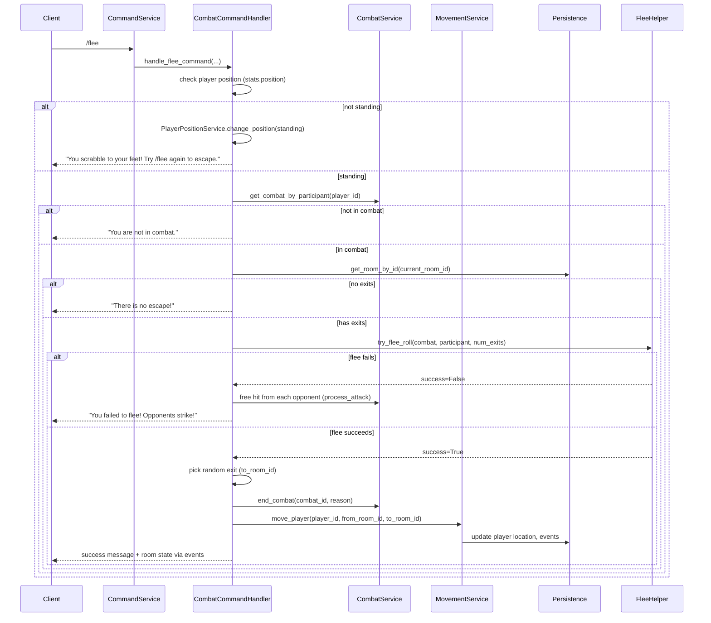

# Implement /flee command and flee effect

## Goal

When a player in combat uses `/flee`, they leave combat and are moved to a **random adjacent room**. The existing involuntary flee (lucidity-driven) remains unchanged; this plan adds **voluntary** flee only.

## Current state

- **Involuntary flee** already exists: [server/services/combat_flee_handler.py](e:\projects\GitHub\MythosMUD\server\services\combat_flee_handler.py) and [server/services/combat_service.py](e:\projects\GitHub\MythosMUD\server\services\combat_service.py) (e.g. `end_combat(..., f"{target.name} flees in terror from the attack")`).
- **Combat commands** are routed via [server/commands/command_service.py](e:\projects\GitHub\MythosMUD\server\commands\command_service.py) (handler map) and [server/utils/command_parser.py](e:\projects\GitHub\MythosMUD\server\utils\command_parser.py) (CommandType to factory). Combat handlers live in [server/commands/combat.py](e:\projects\GitHub\MythosMUD\server\commands\combat.py); they use `_get_player_and_room`, `CombatService.get_combat_by_participant`, and `end_combat(combat_id, reason)`.
- **Movement**: [server/game/movement_service.py](e:\projects\GitHub\MythosMUD\server\game\movement_service.py) `move_player(player_id, from_room_id, to_room_id)` is the single entry point. It **blocks** movement when `_player_combat_service.is_player_in_combat_sync(player_id)` is true, so flee must **end combat before** calling `move_player`.
- **Room exits**: [server/models/room.py](e:\projects\GitHub\MythosMUD\server\models\room.py) — `Room.exits` is `dict[direction, to_room_id]`. Persistence loads it via [server/async_persistence.py](e:\projects\GitHub\MythosMUD\server\async_persistence.py); `get_room_by_id(room_id)` returns a `Room` with `exits` populated.

## Architecture (high level)

## Implementation steps

### 1. Command type and routing

- **Add `CommandType.FLEE = "flee"`** in [server/models/command_base.py](e:\projects\GitHub\MythosMUD\server\models\command_base.py) (with other combat commands).
- **Command parser**: In [server/utils/command_parser.py](e:\projects\GitHub\MythosMUD\server\utils\command_parser.py), map `CommandType.FLEE.value` to a new factory method `create_flee_command` (same pattern as attack/punch/kick).
- **Command factory**: Add `create_flee_command` in the command factory module that returns a parsed command with `command_type: "flee"`.
- **Command processor**: In [server/utils/command_processor.py](e:\projects\GitHub\MythosMUD\server\utils\command_processor.py), include `CommandType.FLEE` in `_is_combat_command()` so flee is treated as a combat command (no target, same rest/grace checks as attack).
- **Command service**: In [server/commands/command_service.py](e:\projects\GitHub\MythosMUD\server\commands\command_service.py), register `"flee": handle_flee_command` and add `from .combat import ..., handle_flee_command`.

### 2. Flee command handler

- **New handler** `handle_flee_command` in [server/commands/combat.py](e:\projects\GitHub\MythosMUD\server\commands\combat.py) (and module-level `async def handle_flee_command(...)` that delegates to `handler.handle_flee_command(...)`).
- **Logic**:
  - Reuse rest/grace checks (e.g. `_check_and_interrupt_rest`) and get player + room via `_get_player_and_room`.
  - **Standing check**: If the player is not standing (e.g. `player.get_stats().get("position") != PositionState.STANDING` — position is in player stats per [server/models/player.py](e:\projects\GitHub\MythosMUD\server\models\player.py) and [server/models/game.py](e:\projects\GitHub\MythosMUD\server\models\game.py) `PositionState`), do **not** perform flee. Call `PlayerPositionService.change_position(player_name, "standing")` to force them to their feet (same service used by [server/commands/position_commands.py](e:\projects\GitHub\MythosMUD\server\commands\position_commands.py) and [server/game/follow_service.py](e:\projects\GitHub\MythosMUD\server\game\follow_service.py)). Return a message like "You scrabble to your feet! Try /flee again to escape." The player must issue `/flee` again to actually attempt the flee.
  - If not in combat (`get_combat_by_participant(player_id)` returns None): return message like "You are not in combat."
  - Get current room from player (`current_room_id`), then `persistence.get_room_by_id(room_id)`. If room has no `exits` or empty: return "There is no escape!" (or similar).
  - **Success roll**: Call a shared helper (e.g. `try_voluntary_flee_roll(combat, fleeing_participant, num_exits)`) that returns success/failure. See section 5 for formula and placement.
  - **On failure**: Do not end combat; do not move. Call CombatService to apply **free hit**: each other participant in the combat (opponents) who is alive and can act gets one attack against the fleeing player via `process_attack(attacker_id=opponent_id, target_id=fleeing_player_id, ...)`. Then return a failure message to the player (e.g. "You failed to flee! Your opponents strike!").
  - **On success**: Pick one exit at random (`secrets.choice(list(room.exits.values()))`). Call `await combat_service.end_combat(combat.combat_id, reason)`, then `await movement_service.move_player(...)`. Return success message; room state and combat_ended propagate via existing events.
- **CombatCommandHandler** must have access to `MovementService`, `PlayerPositionService` (or equivalent: persistence + connection_manager + alias_storage to construct it), and to the flee-roll helper (or CombatService method that encapsulates roll + free-hit so the handler stays thin).

### 3. Dependency injection

- Ensure **MovementService** and **PlayerPositionService** (or deps to build it) are available where the flee handler runs. [server/commands/combat.py](e:\projects\GitHub\MythosMUD\server\commands\combat.py) uses `get_combat_command_handler(app)` which builds `CombatCommandHandler` with container-provided services. Add `movement_service` and position service (or persistence, connection_manager, alias_storage as in [server/commands/position_commands.py](e:\projects\GitHub\MythosMUD\server\commands\position_commands.py)) to the container and to `CombatCommandHandler.__init`\_\_, and use them in `handle_flee_command`.

### 4. Client (minimal)

- Ensure the client **sends** the `flee` command when the user types `/flee` or selects a flee action: command list / parser should already include "flee" once the server accepts it; confirm the client command palette or combat UI sends `command_type: "flee"` and handles the response.
- **No new events required**: `combat_ended` and room/player state updates already propagate; the client should update UI when it receives combat_ended and room_state/game_state for the new room.

### 5. Success roll (Option B) and free hit on failure

**5a. Success roll**

- **Shared helper**: Add a function (or small module) used only for voluntary flee, e.g. in [server/services/combat_flee_handler.py](e:\projects\GitHub\MythosMUD\server\services\combat_flee_handler.py) or a new `server/services/voluntary_flee.py`. Signature idea: `try_voluntary_flee_roll(combat: CombatInstance, fleeing_participant_id: UUID, num_exits: int) -> bool`.
- **Formula**: Implement a configurable or simple formula. Example (tune as needed):
  - Base chance (e.g. 50%) plus bonus per exit (e.g. +10% per exit, capped), minus penalty per opponent (e.g. -10% per other alive participant). Roll with `random.random()` (or `secrets` for CSPRNG if preferred); if roll < computed chance then success.
  - Alternatively start with a flat percentage (e.g. 60% success) and add factors in a follow-up. Document the chosen formula in code or config.
- **Inputs**: Combat (to count opponents and read participant stats if needed), fleeing participant id, number of valid exits. Optionally use participant agility/dexterity from [CombatParticipant](e:\projects\GitHub\MythosMUD\server\models\combat.py) for future tuning.
- **Output**: `True` if flee succeeds, `False` if it fails. No side effects (roll only).

**5b. Free hit on failure**

- **When**: Only when the voluntary flee roll fails. Combat continues; the fleeing player does not move.
- **Who attacks**: Every other participant in the same combat who is alive and can act (e.g. `can_act_in_combat()`): each such opponent gets **one** attack against the fleeing player.
- **How**: Use existing [CombatService.process_attack](e:\projects\GitHub\MythosMUD\server\services\combat_service.py) for each opponent: `await combat_service.process_attack(attacker_id=opponent.participant_id, target_id=fleeing_player_id, is_initial_attack=False)`. Damage is resolved inside `process_attack` (normal melee/weapon resolution). Process opponents in a deterministic order (e.g. by turn_order or participant id); if an attack kills the fleeing player, combat will end via existing death handling and remaining free hits need not be applied (or apply only while target is still alive, per current process_attack behavior).
- **Where**: Either (1) a method on CombatService, e.g. `execute_flee_failed_free_hits(combat_id, fleeing_participant_id)`, that iterates opponents and calls `process_attack`, or (2) the same logic in the flee command handler with access to combat and combat_service. Prefer (1) to keep combat logic in the service and the handler thin.
- **Messages**: Emit appropriate room/combat messages so the player and room see that the flee failed and opponents struck (reuse existing attack event/messaging from `process_attack`).

### 6. Testing

- **Unit tests (handler)**: `handle_flee_command`: **not standing** (player sitting/lying): position_service.change_position(player_name, "standing") called, message like "scrabble to your feet" / "try /flee again", no combat check or flee roll; not in combat; in combat with no exits; in combat with exits and **flee roll succeeds** (mock roll to return True: end_combat and move_player called, success message); in combat with exits and **flee roll fails** (mock roll to return False: execute_flee_failed_free_hits or process_attack called per opponent, no end_combat, no move, failure message).
- **Unit tests (flee roll)**: `try_voluntary_flee_roll`: with fixed seed or mocked random, assert success/failure for given combat (e.g. 0 exits vs many exits, 0 opponents vs many opponents) per formula.
- **Unit tests (free hit)**: `execute_flee_failed_free_hits`: given combat with one or more opponents, assert `process_attack` called once per alive opponent with fleeing player as target; if target dies mid-loop, assert combat ends and remaining attacks not applied (or per existing death behavior).
- **Integration test** (optional but recommended): Start combat, call flee; verify either (a) flee succeeds and player moved and combat ended, or (b) flee fails and player takes damage and remains in combat.

### 7. Help and command list

- Add a short help string for `flee` in [server/utils/command_helpers.py](e:\projects\GitHub\MythosMUD\server\utils\command_helpers.py) (and any central command list the client uses) so "flee" appears in help.

# Flee plan addendum: flee effect vs lucidity-driven flee

Merge this into the main flee plan (flee_command_and_effect_85736dc2.plan.md).

## Requirement

- **Flee effect** (applied to a player or NPC): When the "flee" effect is applied to an entity (e.g. by a spell, item, or other game mechanic), it must operate **the same as if that entity had run `/flee`**. Same mechanics: success roll, on failure free hits from opponents, on success end combat and move to a random adjacent room. Applies to both players and NPCs.
- **Lucidity-driven (involuntary) flee**: Stays **different**. No success roll, no free hit, no room move. It only ends combat with a "flees in terror" message (current behavior in `combat_flee_handler.check_involuntary_flee` and `combat_service._check_involuntary_flee`). Do not change lucidity flee to use the voluntary-flee logic.

## Plan updates to make

### 1. Goal section

Replace the goal paragraph with:

When a player in combat uses `/flee`, they leave combat and are moved to a **random adjacent room**. The same behavior applies when the **flee effect** is applied to a player or NPC (e.g. from a spell or other mechanic): it operates like the entity ran `/flee` (success roll, free hit on failure, end combat + move to random adjacent room on success). **Lucidity-driven (involuntary) flee** is separate and operates differently: no success roll, no free hit, no room move; it only ends combat with a "flees in terror" message and remains as implemented today.

### 2. New subsection: Flee effect (applied to player or NPC)

Add after the "Current state" section (or early in Implementation steps):

**Flee effect**

- When the game applies the **flee effect** to a combat participant (player or NPC), use the **same** logic as the `/flee` command: success roll, on failure execute free hits (opponents attack the fleeing entity), on success end combat and move the entity to a random adjacent room.
- **Shared implementation**: Factor the core "execute voluntary flee for a combat participant" into a single service or function (e.g. on CombatService or a voluntary_flee module) that accepts `combat_id` and `fleeing_participant_id` (or combat + participant). It performs: get room and exits for participant's current location; if no exits return failure; success roll; on failure call `execute_flee_failed_free_hits`; on success call `end_combat` and move the entity (player via MovementService.move_player, NPC via existing NPC movement e.g. npc_instance_service.move_npc_instance or movement_integration). The `/flee` command handler then: does standing check (players only), in-combat check, gets room/exits, and calls this shared routine. Any "apply flee effect" entry point (spells, effects system, etc.) calls the same shared routine for the affected participant.
- **Players**: Standing check applies only when flee is initiated by the **command** (player typed `/flee`). When the flee **effect** is applied to a player, the effect system may skip the standing check (or enforce it; product decision). If skipped, the shared routine does not force standing.
- **NPCs**: When the flee effect is applied to an NPC, run the shared routine only (no standing check). Move the NPC using existing NPC movement APIs; ensure the NPC's current room has exits and pick a random exit, then move the NPC instance to that room.

### 3. Lucidity-driven flee (unchanged)

Add a short explicit note in the plan:

**Lucidity-driven (involuntary) flee** is unchanged. It does **not** use the voluntary flee success roll, free hits, or room move. It continues to use `check_involuntary_flee` in [server/services/combat_flee_handler.py](server/services/combat_flee_handler.py) and `_check_involuntary_flee` in [server/services/combat_service.py](server/services/combat_service.py), ending combat with a reason like "flees in terror from the attack" and publishing the existing combat_ended event. No movement to another room.

### 4. Files to touch

Add to the plan's file summary:

- **Flee effect entry points**: Wherever effects are applied to entities (e.g. spell resolution, effect tick), add handling for "flee" effect that invokes the shared voluntary-flee routine for the target participant (player or NPC).
- **NPC movement**: Use [server/services/npc_instance_service.py](server/services/npc_instance_service.py) `move_npc_instance` or [server/npc/movement_integration.py](server/npc/movement_integration.py) for moving an NPC to the chosen adjacent room when flee succeeds.

### 5. Testing

Add:

- **Flee effect (player)**: Apply flee effect to a player in combat; assert same outcome as /flee (roll, free hit on fail, end combat + move on success). Optionally test with player sitting/lying if effect path skips standing check.
- **Flee effect (NPC)**: Apply flee effect to an NPC in combat; assert success roll, free hit on fail, end combat + NPC moved to random adjacent room on success.
- **Lucidity flee unchanged**: Existing involuntary-flee tests still pass; no movement to another room for lucidity flee.

## Files to touch (summary)

| Area                 | Files                                                                                                                                                                                                                                                                                    |
| -------------------- | ---------------------------------------------------------------------------------------------------------------------------------------------------------------------------------------------------------------------------------------------------------------------------------------- |
| Command type         | [server/models/command_base.py](e:\projects\GitHub\MythosMUD\server\models\command_base.py)                                                                                                                                                                                              |
| Parser + factory     | [server/utils/command_parser.py](e:\projects\GitHub\MythosMUD\server\utils\command_parser.py), command factory module for `create_flee_command`                                                                                                                                          |
| Processor            | [server/utils/command_processor.py](e:\projects\GitHub\MythosMUD\server\utils\command_processor.py)                                                                                                                                                                                      |
| Handlers + DI        | [server/commands/combat.py](e:\projects\GitHub\MythosMUD\server\commands\combat.py), [server/commands/command_service.py](e:\projects\GitHub\MythosMUD\server\commands\command_service.py)                                                                                               |
| Flee roll + free hit | [server/services/combat_flee_handler.py](e:\projects\GitHub\MythosMUD\server\services\combat_flee_handler.py) (add `try_voluntary_flee_roll`); [server/services/combat_service.py](e:\projects\GitHub\MythosMUD\server\services\combat_service.py) (add `execute_flee_failed_free_hits`) |
| Container            | Wire MovementService into CombatCommandHandler (wherever combat handler is built from container)                                                                                                                                                                                         |
| Help                 | [server/utils/command_helpers.py](e:\projects\GitHub\MythosMUD\server\utils\command_helpers.py)                                                                                                                                                                                          |
| Tests                | Unit tests for flee handler (success/failure paths, free hit); unit tests for `try_voluntary_flee_roll` and `execute_flee_failed_free_hits`; optional integration test                                                                                                                   |

## Order of operations (flee flow)

1. Validate player (rest, grace period, in room).
2. **Standing check**: If player is not standing (stats position != STANDING), call `PlayerPositionService.change_position(player_name, "standing")`, return "You scrabble to your feet! Try /flee again to escape." Do not run any other flee logic; player must `/flee` again.
3. Get combat by participant; if none, return "You are not in combat."
4. Get current room; if no exits, return "There is no escape!"
5. **Success roll**: Call `try_voluntary_flee_roll(combat, fleeing_participant_id, num_exits)`.
6. **If roll fails**: Call `execute_flee_failed_free_hits(combat_id, fleeing_participant_id)` (or equivalent: each opponent attacks fleeing player once via `process_attack`). Return "You failed to flee!" (or similar). Do not end combat; do not move.
7. **If roll succeeds**: Choose random `to_room_id` from `room.exits`. **End combat** with reason (e.g. "So-and-so flees from combat!"). **Move player** via `MovementService.move_player(player_id, from_room_id, to_room_id)`. Return success message to the player.

This keeps server authority (combat ends first on success, then movement) and reuses existing events for client sync. Free hit uses existing attack resolution and events.
