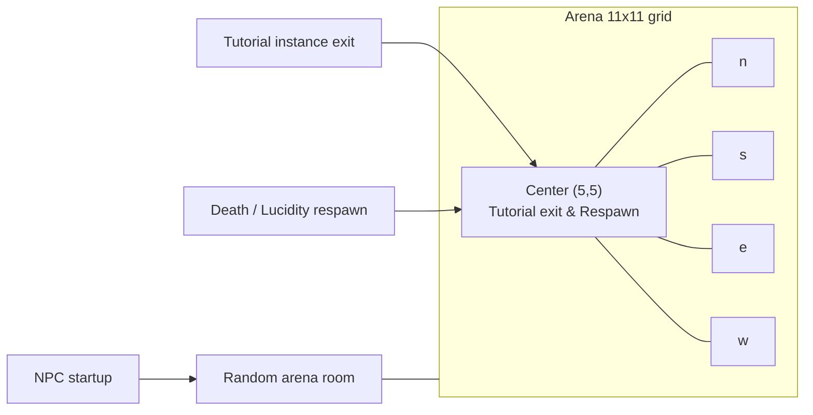

# Gladiator ring (arena) implementation

## Summary

- **Zone** `limbo/arena` and **subzone** `arena` (of that zone).
- **121 rooms** in a 11x11 grid; **center room** (5,5) is the "first room" (tutorial exit + respawn).
- **Tutorial exit** and **death/lucidity respawn** both use the arena center room.
- **NPCs** keep their existing spawns and **also** get one spawn in a random arena room at startup.

---

## 1. Schema and data: zone, subzone, rooms, links

**Room ID format** (from [server/world_loader.py](e:\projects\GitHub\MythosMUD\server\world_loader.py)): `plane_zone_sub_zone_room_file` → for zone `limbo/arena` and subzone `arena`, room IDs will be `limbo_arena_arena_<room_stable_id>`.

**Zone**

- Add zone with `stable_id = 'limbo/arena'`, `name = 'arena'` (or "Arena"), `zone_type` and `environment` suitable for an arena.
- `zones` has `chk_zones_zone_type` (city, countryside, mountains, swamp, tundra, desert, death). Either add `'arena'` in a small migration or use an existing type (e.g. `death` for limbo-style).

**Subzone**

- Add subzone with `stable_id = 'arena'`, `zone_id` = new zone UUID, `name = 'arena'`.

**Rooms**

- Add 121 rooms in subzone `arena` with `stable_id` values `limbo_arena_arena_arena_0_0` … `limbo_arena_arena_arena_10_10` (row `r`, col `c` → `arena_r_c`).
- Each row needs: `id` (UUID), `subzone_id`, `stable_id`, `name`, `description`, `attributes` (e.g. `{"environment": "arena"}`).
- **Center room** for all wiring: `limbo_arena_arena_arena_5_5` (0-indexed center of 11x11).

**Room links**

- [room_links](e:\projects\GitHub\MythosMUD\data\db\mythos_dev_dml.sql) use `from_room_id` / `to_room_id` = room **UUIDs**.
- For each cell (r, c), add links to adjacent cells: north (r-1,c), south (r+1,c), east (r,c+1), west (r,c-1) when in bounds.
- Implementation: script or migration that inserts 121 rooms (with fixed UUIDs for reproducibility) and the corresponding room_links rows.

**Deliverable**

- New Alembic migration (or equivalent) that: (1) adds zone `limbo/arena` and subzone `arena`; (2) inserts 121 arena rooms with stable_ids `limbo_arena_arena_arena_r_c`; (3) inserts room_links for the grid.
- Apply the same logical changes to [data/db/mythos_dev_dml.sql](e:\projects\GitHub\MythosMUD\data\db\mythos_dev_dml.sql), [data/db/mythos_unit_dml.sql](e:\projects\GitHub\MythosMUD\data\db\mythos_unit_dml.sql), and [data/db/mythos_e2e_dml.sql](e:\projects\GitHub\MythosMUD\data\db\mythos_e2e_dml.sql) (COPY blocks for zones, subzones, rooms, room_links) so all schemas have the arena. If DML is generated from DB, run migration on dev then re-dump DML and sync unit/e2e.

---

## 2. Tutorial exit room → arena center

**Current behavior**

- Tutorial bedroom template has `instance_exit_room_id` in attributes ([data/db/mythosdml.sql](e:\projects\GitHub\MythosMUD\data\db\mythos_dev_dml.sql) rooms COPY: tutorial bedroom row has `"instance_exit_room_id": "earth_arkhamcity_sanitarium_room_foyer_001"`).
- [InstanceManager](e:\projects\GitHub\MythosMUD\server\game\instance_manager.py) uses that when remapping instance exits; default is [DEFAULT_EXIT_ROOM_ID](e:\projects\GitHub\MythosMUD\server\game\instance_manager.py) = foyer.

**Change**

- Set tutorial bedroom’s `instance_exit_room_id` to the arena center room’s **stable_id**: `limbo_arena_arena_arena_5_5`.
- Update the tutorial bedroom row in all three DML files (and any migration that seeds it) so `attributes` includes `"instance_exit_room_id": "limbo_arena_arena_arena_5_5"`.
- Optionally set [InstanceManager.DEFAULT_EXIT_ROOM_ID](e:\projects\GitHub\MythosMUD\server\game\instance_manager.py) to the same for consistency (only affects templates that don’t set `instance_exit_room_id`).

---

## 3. Death and lucidity respawn → arena center

**Current behavior**

- [player_respawn_service.py](e:\projects\GitHub\MythosMUD\server\services\player_respawn_service.py): `DEFAULT_RESPAWN_ROOM = "earth_arkhamcity_sanitarium_room_foyer_001"`; used when player has no custom `respawn_room_id` and in lucidity/delirium respawn paths (e.g. around lines 302, 424).

**Change**

- Set `DEFAULT_RESPAWN_ROOM = "limbo_arena_arena_arena_5_5"` in [server/services/player_respawn_service.py](e:\projects\GitHub\MythosMUD\server\services\player_respawn_service.py).
- No change to logic: existing `get_respawn_room` and respawn flows already use `DEFAULT_RESPAWN_ROOM` when no custom respawn is set.

---

## 4. NPCs also spawn in arena (one copy per type, random arena room)

**Current behavior**

- [NPCStartupService](e:\projects\GitHub\MythosMUD\server\services\npc_startup_service.py) spawns each definition once: [determine_spawn_room](e:\projects\GitHub\MythosMUD\server\services\npc_startup_service.py) uses `npc_def.room_id` or subzone default; no second location.
- NPC definitions live in DB ([get_npc_definitions](e:\projects\GitHub\MythosMUD\db\procedures\npcs.sql)); each has one `room_id` / `sub_zone_id`.

**Change**

- After the existing startup spawn pass (required + optional), add a **second pass**: for each definition that was spawned (or for all definitions that have a valid primary spawn), also spawn **one** instance in a **random** room among the 121 arena rooms.
- **Arena room list**: either (a) constant list of 121 room IDs `limbo_arena_arena_arena_0_0` … `limbo_arena_arena_arena_10_10`, or (b) derive from persistence/cache by subzone (e.g. “arena” under zone “limbo/arena”). Option (a) is simpler and avoids depending on cache shape.
- Use `random.choice(arena_room_ids)` for each definition. Ensure room cache is warmed so [get_room_by_id](e:\projects\GitHub\MythosMUD\server\services\npc_startup_service.py) accepts these IDs.
- Spawn still via [NPCInstanceService.spawn_npc_instance](e:\projects\GitHub\MythosMUD\server\services\npc_startup_service.py); same definition, different `room_id`. Population limits: if the service enforces per-definition or per-room caps, a second spawn per definition in the arena may require allowing multiple instances per definition (or treating “arena” as an extra spawn location that doesn’t count toward the original cap). Confirm spawn API allows a second instance per definition; if not, extend as needed.

**Files**

- [server/services/npc_startup_service.py](e:\projects\GitHub\MythosMUD\server\services\npc_startup_service.py): add `ARENA_ROOM_IDS` (or helper that returns 121 IDs), and a post-pass that, for each definition, calls spawn once with a random arena room ID.

---

## 5. Config and fallbacks

- **Game config** default room ([server/config/models/game.py](e:\projects\GitHub\MythosMUD\server\config\models\game.py)): currently `earth_arkhamcity_sanitarium_room_foyer_001`; leave as-is unless you want new players who skip tutorial to start at arena (then set to `limbo_arena_arena_arena_5_5`).
- **Player creation** ([server/game/player_creation_service.py](e:\projects\GitHub\MythosMUD\server\game\player_creation_service.py)): `starting_room_id` and tutorial resolution unchanged; only the **exit** from tutorial and **respawn** point move to arena.
- **Validation/fallbacks** that reference the foyer (e.g. [player_repository_room.py](e:\projects\GitHub\MythosMUD\server\persistence\repositories\player_repository_room.py) fallback_room_id, [player_repository_save.py](e:\projects\GitHub\MythosMUD\server\persistence\repositories\player_repository_save.py) default_room): leave as foyer unless you want invalid-room recovery to send players to the arena; then switch those to `limbo_arena_arena_arena_5_5`.

---

## 6. Testing and verification

- **Unit tests**: any tests that assert `DEFAULT_RESPAWN_ROOM` or tutorial exit room should be updated to expect `limbo_arena_arena_arena_5_5` where appropriate.
- **Integration**: ensure room cache load includes the new zone/subzone/rooms (get_rooms_with_exits and room loader use DB procedures).
- **Manual**: create character → leave tutorial → confirm in arena center; die or trigger lucidity respawn → confirm respawn in arena center; confirm NPCs appear in world and also in arena (random rooms).

---

## Dependency order

1. Schema + DML: zone, subzone, 121 rooms, room_links (so `limbo_arena_arena_arena_5_5` exists).
2. Tutorial exit and respawn constants point to `limbo_arena_arena_arena_5_5`.
3. NPC startup second pass: depends on arena rooms existing in cache and spawn API supporting a second instance per definition if applicable.

---

## Optional diagram (arena grid)

