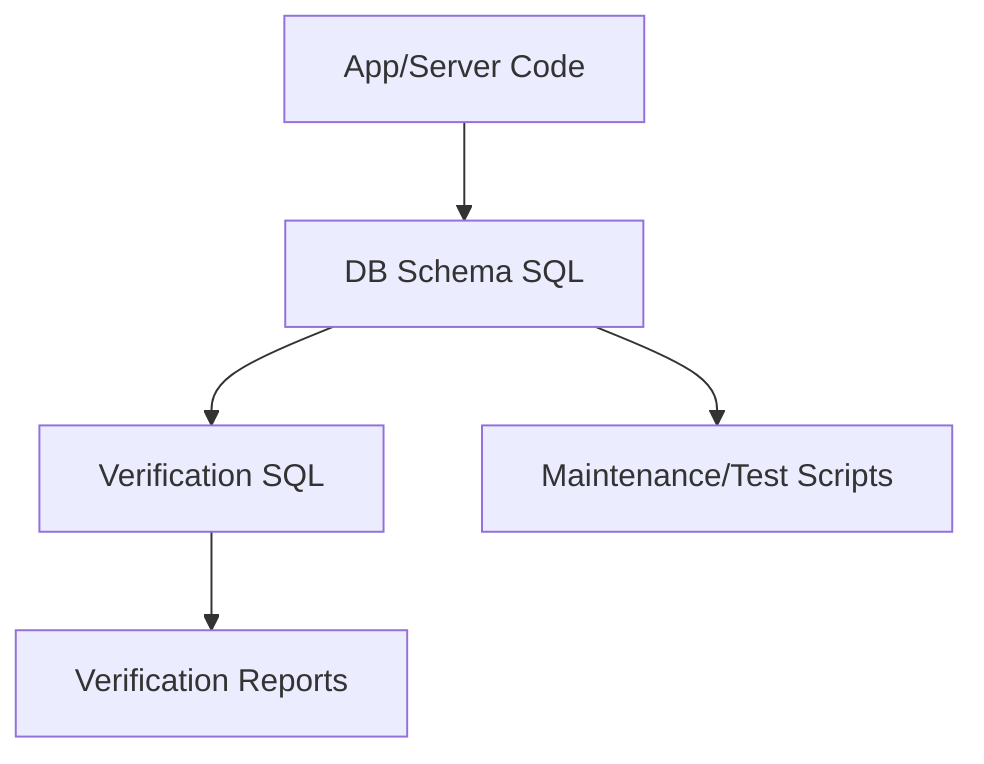

# PostgreSQL Audit Remediation Plan

## Context and Inputs

- **Primary reference**: `[.cursor/rules/postgresql.mdc](.cursor/rules/postgresql.mdc)`
- **Audit report**: `[docs/POSTGRESQL_AUDIT_REPORT_2026.md](docs/POSTGRESQL_AUDIT_REPORT_2026.md)`
- **Key locations impacted**:
  - Verification SQL: `[db/verification/users_players.sql](db/verification/users_players.sql)`
  - SQLite-era script: `[server/scripts/add_npc_name_constraint.sql](server/scripts/add_npc_name_constraint.sql)`
  - NPC DB scripts: `[scripts/populate_test_npc_databases.py](scripts/populate_test_npc_databases.py)`, `[scripts/init_npc_database.py](scripts/init_npc_database.py)`
  - Runtime schema: `[db/schema/04_runtime_tables.sql](db/schema/04_runtime_tables.sql)`
  - Authoritative schema (pg_dump): `[db/schema/authoritative_schema.sql](db/schema/authoritative_schema.sql)`

## 1. Fix high-risk semantic and compatibility issues

- **1.1 Update `users_players.sql` to match current schema**
  - Compare table/column references in `[db/verification/users_players.sql](db/verification/users_players.sql)` against the current canonical schema in `[db/schema/authoritative_schema.sql](db/schema/authoritative_schema.sql)`.
  - Remove references to obsolete staging tables and columns (e.g., `staging_*`, `sanity_score`) that no longer exist.
  - Rewrite joins and column selections to:
    - Use the correct live tables and `snake_case` identifiers.
    - Use explicit `join` syntax per the style guide.
  - Ensure all queries in this file:
    - Use lowercase keywords.
    - Avoid `select *`.
    - Avoid `not in` in favor of `not exists` or `left join ... is null` when needed.
- **1.2 Replace SQLite-specific NPC constraint script with PostgreSQL-compatible version**
  - Review `[server/scripts/add_npc_name_constraint.sql](server/scripts/add_npc_name_constraint.sql)` and confirm all SQLite-only constructs (`pragma`, `datetime`, `regexp` behavior, etc.).
  - Decide whether this script is still needed in a pure PostgreSQL world:
    - If obsolete: deprecate/remove it and update any documentation or scripts that reference it.
    - If still needed logically: create a new PostgreSQL-native version that:
      - Uses proper PostgreSQL constraint or `check` syntax.
      - Uses `timestamptz` and `now()` where timestamps are involved.
      - Respects naming, formatting, and data-type rules from the guide.

## 2. Eliminate `select *` in application and maintenance scripts

- **2.1 Fix NPC DB scripts**
  - In `[scripts/populate_test_npc_databases.py](scripts/populate_test_npc_databases.py)` and `[scripts/init_npc_database.py](scripts/init_npc_database.py)`:
    - Identify all `select *` queries.
    - Replace them with explicit column lists ordered to match the code’s expectations.
    - Keep column identifiers and SQL keywords in the canonical style (snake_case identifiers, lowercase keywords).
  - Confirm that any other raw SQL in these scripts follows the formatting rules (one root keyword per line, explicit aliases with `as`).
- **2.2 Review other `select *` usage**
  - Use project-wide search to locate remaining `select *` instances in non-migration, non-test-only contexts.
  - For each, assess whether it is:
    - Safe in a test fixture or one-off admin script, or
    - Part of runtime/production logic where schema drift could cause subtle bugs.
  - Replace runtime/production `select *` with explicit column lists; leave clearly test-only uses as-is or add comments justifying them.

## 3. Align schema definitions and data types with PostgreSQL guide

- **3.1 Normalize runtime tables vs authoritative schema**
  - Compare `[db/schema/04_runtime_tables.sql](db/schema/04_runtime_tables.sql)` with `[db/schema/authoritative_schema.sql](db/schema/authoritative_schema.sql)`.
  - Resolve discrepancies around:
    - `uuid` vs string-like columns (e.g., ensure `player_id` columns are `uuid`).
    - Prefer `text` over `varchar(n)` unless a strict business length is justified.
    - Ensure timestamp columns use `timestamptz` with proper defaults (e.g., `default now()`).
  - Update `04_runtime_tables.sql` to mirror the canonical types and constraints, preserving any intentional local overrides with comments.
- **3.2 Enforce data-type rules in auxiliary SQL**
  - Scan other `.sql` files (migrations, verification, utilities) for disallowed or discouraged types:
    - Replace `serial`/`bigserial` (if any are found) with `bigint generated always as identity`.
    - Replace `char(n)` with `varchar(n)` or `text` as appropriate.
    - Replace `money` with `numeric(19, 4)` or another explicit precision.
  - Confirm all foreign key columns follow `<referenced_table>_id` naming and are typed consistently across references.

## 4. Tighten query style and structural patterns

- **4.1 Enforce explicit joins and `not exists` patterns**
  - Re-scan for any implicit joins (`from a, b where a.id = b.id`) or `not in` usage with subqueries.
  - Where found, refactor to:
    - Explicit `inner join`/`left join` syntax.
    - `not exists` or `left join ... is null` for exclusion logic.
- **4.2 Standardize keyword casing and formatting in hand-written SQL**
  - Focus on editable, hand-maintained SQL (migrations, verification, helper scripts), not auto-generated dumps.
  - For those files:
    - Normalize to lowercase keywords (`select`, `from`, `where`, etc.).
    - Put root keywords on their own lines with indented column lists and `as` aliases.
    - Add `comment on table` and `comment on column` where missing but helpful for critical tables/columns.

## 5. Ensure secure, parameterized database access in code

- **5.1 Confirm parameterization patterns**
  - Review Python (and any other language) modules that execute SQL to confirm they consistently use parameterized queries.
  - Where any dynamic SQL exists:
    - Verify string interpolation is never used for user input.
    - If needed, refactor to proper parameter binding.
- **5.2 Add targeted tests for risky paths**
  - For key DB entry points (e.g., helpers that construct queries based on input), add or extend tests to:
    - Assert that arguments are passed as parameters, not interpolated into SQL strings.
    - Exercise edge cases that could previously have led to SQL injection or malformed queries.

## 6. Testing and verification

- **6.1 Add PostgreSQL-focused tests for changed SQL**
  - For each modified SQL-heavy file (especially `users_players.sql` and any rewritten scripts):
    - Introduce or extend transactionally-isolated tests that:
      - Set up minimal schema and data needed.
      - Execute the SQL under test.
      - Assert correct outputs, row counts, and constraint behavior.
  - Place tests in the appropriate DB-focused test directories following existing conventions.
- **6.2 Run full test and verification suite**
  - After code and SQL changes:
    - Run `make test` to validate fast/unit suite.
    - Optionally run `make test-comprehensive` if changes significantly alter DB behavior.
  - If verification scripts are used by CI, run them against a disposable PostgreSQL instance to ensure they still pass end-to-end.

## 7. Documentation and ongoing hygiene

- **7.1 Document PostgreSQL patterns for contributors**
  - Update or add a short contributor-facing guide (e.g., in `docs/` or `CONTRIBUTING.md`) summarizing the key PostgreSQL rules:
    - Naming conventions.
    - Data-type preferences.
    - `select *` avoidance.
    - Join and `not exists` patterns.
  - Link this doc to `.cursor/rules/postgresql.mdc` so humans and tools stay aligned.
- **7.2 Establish guardrails for future SQL**
  - If not already present, add simple repository checks (linting scripts or CI steps) that:
    - Warn on `select *` outside of known fixtures.
    - Warn on `not in (` with subqueries.
    - Optionally enforce lowercase keywords in `.sql` migrations.
  - Ensure these checks are fast and scoped to developer-authored SQL, not auto-generated dumps.
