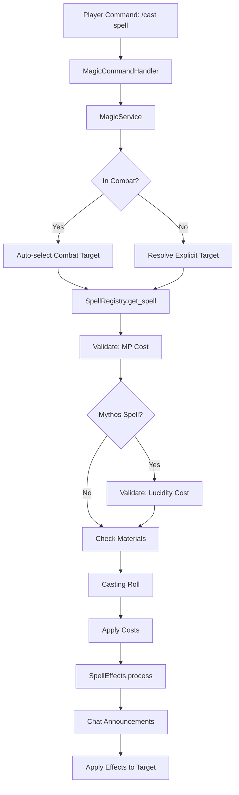

# Magic and Spellcasting System - Comprehensive Feature Plan

## Implementation Status

**Last Updated:** 2025-12-13

**Completed Phases:** Phase 1 (Core Infrastructure), Phase 2 (Magic Service Core), Phase 3 (Commands and UI - partial), Phase 4 (Spell Learning and Progression), Phase 5 (MP Regeneration), Phase 6 (Material Components)

**Remaining Work:** None - All phases complete! (Service initialization in app startup completed)

## System Overview

A holistic magic system where all spells cost Magic Points (MP). Mythos spells additionally cost lucidity, while non-Mythos spells do not. The system integrates with existing combat, chat, command, and player progression systems.

## Architecture

### Core Components

```
server/game/magic/
├── spell_registry.py           # Global spell database/registry
├── spell_effects.py            # Spell effect processing engine
├── magic_service.py            # Core magic business logic
└── spell_targeting.py          # Target resolution for spells

server/models/
├── spell.py                    # Spell data models (Pydantic)
└── player_spells.py            # Player spell learning/mastery models

server/commands/
└── magic_commands.py           # /cast, /spells, /spell commands

server/persistence/
└── spell_persistence.py        # Spell learning/mastery persistence
```

### Data Flow



## Database Schema Changes

### New Tables

#### `spells` (Global Spell Registry)

```sql
CREATE TABLE spells (
    spell_id VARCHAR(255) PRIMARY KEY,
    name VARCHAR(100) NOT NULL UNIQUE,
    description TEXT NOT NULL,
    school VARCHAR(50) NOT NULL CHECK (school IN ('mythos', 'clerical', 'elemental', 'other')),
    mp_cost INTEGER NOT NULL CHECK (mp_cost >= 0),
    lucidity_cost INTEGER NOT NULL DEFAULT 0 CHECK (lucidity_cost >= 0),
    corruption_on_learn INTEGER NOT NULL DEFAULT 0 CHECK (corruption_on_learn >= 0),
    corruption_on_cast INTEGER NOT NULL DEFAULT 0 CHECK (corruption_on_cast >= 0),
    casting_time_seconds INTEGER NOT NULL DEFAULT 0 CHECK (casting_time_seconds >= 0),
    target_type VARCHAR(50) NOT NULL CHECK (target_type IN ('self', 'entity', 'location', 'area', 'all')),
    range_type VARCHAR(50) NOT NULL CHECK (range_type IN ('touch', 'same_room', 'adjacent_room', 'unlimited')),
    effect_type VARCHAR(50) NOT NULL,
    effect_data JSONB NOT NULL DEFAULT '{}',
    materials JSONB NOT NULL DEFAULT '[]',  -- Array of {item_id, consumed: bool}
    created_at TIMESTAMPTZ NOT NULL DEFAULT NOW()
);
```

#### `player_spells` (Learned Spells)

```sql
CREATE TABLE player_spells (
    id SERIAL PRIMARY KEY,
    player_id VARCHAR(255) NOT NULL REFERENCES players(player_id) ON DELETE CASCADE,
    spell_id VARCHAR(255) NOT NULL REFERENCES spells(spell_id) ON DELETE CASCADE,
    mastery INTEGER NOT NULL DEFAULT 0 CHECK (mastery >= 0 AND mastery <= 100),
    learned_at TIMESTAMPTZ NOT NULL DEFAULT NOW(),
    last_cast_at TIMESTAMPTZ,
    times_cast INTEGER NOT NULL DEFAULT 0,
    UNIQUE(player_id, spell_id)
);
CREATE INDEX idx_player_spells_player_id ON player_spells(player_id);
CREATE INDEX idx_player_spells_spell_id ON player_spells(spell_id);
```

### Player Stats Updates

Add to `players.stats` JSONB:

- `power` (POW): INTEGER 1-100 (new stat)
- `current_mp`: INTEGER >= 0
- `max_mp`: INTEGER >= 0 (initially POW * 0.2, then tracked independently)

## Implementation Phases

### Phase 1: Core Infrastructure

#### 1.1 Add Power Stat and Magic Points

- [x] Add `power` stat to `Stats` model (`server/models/game.py`)
- [x] Add `current_mp` and `max_mp` to `Stats` model
- [x] Update player stats defaults to include power (default 50) and MP (max_mp = power * 0.2)
- [x] Create database migration for new stats
- [x] Update player creation to initialize MP from POW
- [x] Add MP display to client UI (`client/src/stores/gameStore.ts`)

#### 1.2 Spell Registry

- [x] Create `SpellRegistry` class (`server/game/magic/spell_registry.py`)
  - In-memory cache of all spells
  - Load from database on startup
  - Methods: `get_spell(spell_id)`, `list_spells(school=None)`, `search_spells(query)`
- [x] Create spell data models (`server/models/spell.py`)
  - `Spell` (Pydantic model)
  - `SpellMaterial` (for components)
  - `SpellEffect` (for effect data)
- [x] Create initial spell database entries (seed data)
  - Example Mythos spell: "Call Cthulhu" (high MP, lucidity cost, corruption)
  - Example Clerical spell: "Blessing" (low MP, no lucidity, heals)
- [x] Create database migration for `spells` table

#### 1.3 Player Spell Storage

- [x] Create `PlayerSpell` model (`server/models/player_spells.py`)
- [x] Create database migration for `player_spells` table
- [x] Add persistence methods for spell learning/mastery
- [x] Update player model to include spell list accessors

### Phase 2: Magic Service Core

#### 2.1 Magic Service

- [x] Create `MagicService` class (`server/game/magic/magic_service.py`)
  - MP management (spend, restore, check)
  - Spell validation (can cast, has materials, enough resources)
  - Casting roll logic (simplified CoC mechanics)
  - Cost application (MP, lucidity for Mythos spells)
- [x] Integrate with existing `PlayerService` for stat modifications
- [x] Integrate with `PlayerLucidity` for lucidity costs

#### 2.2 Spell Targeting

- [x] Create `SpellTargetingService` (`server/game/magic/spell_targeting.py`)
  - Resolve targets: self, entity by name, location, area (all in room)
  - Integrate with `TargetResolutionService` for entity targeting
  - Auto-select combat target if player in combat and no target specified
  - Validate target type matches spell requirements
- [x] Query `CombatService.get_combat_by_participant()` for combat targets
- [x] Use `PlayerCombatService.get_player_combat_state()` to check combat status

#### 2.3 Spell Effects Engine

- [x] Create `SpellEffects` class (`server/game/magic/spell_effects.py`)
  - Process effect types: heal/damage, status effects, stat mods, lucidity/corruption, teleport, object creation
  - Apply mastery modifiers to effectiveness
  - Integrate with `StatusEffect` system
  - Integrate with combat system for damage
  - Integrate with lucidity system for sanity effects

### Phase 3: Commands and UI

#### 3.1 Magic Commands

- [x] Create `MagicCommandHandler` (`server/commands/magic_commands.py`)
  - `/cast <spell_name> [target]` - Cast spell with optional target
  - `/spells` - List learned spells with mastery
  - `/spell <spell_name>` - Show spell details
- [x] Integrate with `CommandService` and `CommandProcessor`
- [x] Add command validation (Pydantic models)
- [x] Handle combat auto-targeting logic

#### 3.2 Chat Integration

- [x] Integrate spell casting messages with `ChatService` (structure in place, full implementation pending)
- [x] Context-sensitive announcements:
  - Room description to all occupants (e.g., "Professor Armitage gestures wildly and chants...")
  - Mechanical details to caster only (e.g., "Blindness spell cast, 5 MP spent, mastery check passed")
- [x] Format spell effect descriptions for chat
- [x] Handle spell failure messages

### Phase 4: Spell Learning and Progression

#### 4.1 Spell Learning

- [x] Create spell learning service
  - Learn from spellbooks (item interaction)
  - Learn from NPCs (NPC teacher commands)
  - Learn from quest rewards
- [x] Apply corruption when learning Mythos spells
- [x] Validate prerequisites (minimum stats, other spells)

#### 4.2 Spell Mastery

- [x] Track mastery progression (increase on successful casts)
- [x] Apply mastery to spell effectiveness (already implemented in Phase 2)
- [x] Display mastery in `/spells` command (already implemented in Phase 3)
- [x] Consider mastery in casting roll success chance (already implemented in Phase 2)

### Phase 5: MP Regeneration

#### 5.1 MP Regeneration System

- [x] Automatic MP regeneration over time (configurable rate)
- [x] Rest/meditation command speeds up regen
- [x] Consumable items restore MP (service method ready, integration pending item consumption system)
- [x] Display current/max MP in status
- [x] Integrate with existing tick system for passive regen

### Phase 6: Material Components

#### 6.1 Material System

- [x] Material validation during casting
- [x] Consume materials if required (update inventory)
- [x] Check for reusable materials (don't consume)
- [x] Error messages for missing materials
- [x] Material descriptions in spell info

## Key Design Decisions

### Stat Management

- **Power (POW)**: New base stat (1-100), initially rolled like other stats
- **Magic Points**: `max_mp = POW * 0.2` initially, then tracked independently
- MP can be modified by items, buffs, etc. without changing POW

### Mythos vs Non-Mythos

- **Single System**: One magic system handles both types
- **Mythos Spells**:
  - Cost MP + lucidity
  - Increase corruption on learn/cast (per spell definition)
  - School: "mythos"
- **Non-Mythos Spells**:
  - Cost MP only
  - No corruption
  - Schools: "clerical", "elemental", "other"

### Casting Mechanics

- **Simplified CoC**: Basic casting roll (skill check), no pushed rolls or backlash
- **Roll Formula**: Base success chance modified by mastery, stats (Intelligence?)
- **Failure**: Spell fails, costs still paid (MP, lucidity if Mythos)

### Combat Integration

- Check `PlayerCombatService.get_player_combat_state()` for combat status
- If in combat and no target specified, query `CombatService.get_combat_by_participant()` for other participant
- Spells can be cast during combat (subject to casting time)

### Effect System

- Effects are extensible via JSONB `effect_data` field
- Common effects: heal, damage, status_effect, stat_modify, lucidity_adjust, corruption_adjust, teleport, create_object
- Mastery increases effect magnitude (e.g., heal_amount * (1 + mastery/100))

## Testing Strategy

### Unit Tests

- Spell registry loading and lookup
- MP cost calculations
- Spell targeting resolution
- Effect processing (each effect type)
- Material validation
- Combat target auto-selection

### Integration Tests

- Full cast flow: command → validation → effect → chat
- MP regeneration over time
- Spell learning from different sources
- Mastery progression
- Mythos spell corruption application

### E2E Tests

- Player casts spell on NPC
- Player casts spell in combat (auto-target)
- Player learns spell from book
- MP regenerates after resting

## Dependencies

### Existing Systems

- Command parser (`server/utils/command_processor.py`)
- Player stats (`server/models/game.py`, `server/models/player.py`)
- Lucidity system (`server/models/lucidity.py`)
- Combat system (`server/services/combat_service.py`, `server/services/player_combat_service.py`)
- Chat system (`server/game/chat_service.py`)
- Target resolution (`server/services/target_resolution_service.py`)
- Status effects (`server/models/game.py` StatusEffect)
- Inventory system (for materials)

### New Dependencies

- None (uses existing PostgreSQL, Pydantic, etc.)

## Migration Path

1. **Database Migration**: Create `spells` and `player_spells` tables
2. **Stats Migration**: Add `power`, `current_mp`, `max_mp` to existing players
3. **Initial Spell Data**: Seed database with initial spell set
4. **Feature Rollout**: Phase 1 → Phase 2 → Phase 3 → etc.

## Future Enhancements (Out of Scope)

- Spell research/creation
- Spell combinations/rituals
- Spell resistance/immunity
- Spell schools with mechanical interactions
- Spell cooldowns (currently no cooldowns)
- Spell preparation system (currently casting times only, no prep)

## Files to Create/Modify

### New Files

- [x] `server/game/magic/__init__.py`
- [x] `server/game/magic/spell_registry.py`
- [x] `server/game/magic/magic_service.py`
- [x] `server/game/magic/spell_effects.py`
- [x] `server/game/magic/spell_targeting.py`
- [x] `server/game/magic/spell_learning_service.py`
- [x] `server/models/spell.py`
- [x] `server/models/spell_db.py` (SQLAlchemy model)
- [x] `server/models/player_spells.py`
- [x] `server/commands/magic_commands.py`
- [x] `server/commands/read_command.py`
- [x] `server/commands/teach_command.py`
- [x] `server/commands/rest_command.py`
- [x] `server/game/magic/mp_regeneration_service.py`
- [x] `server/game/magic/magic_service.py` (material validation and consumption)
- [x] `server/persistence/repositories/spell_repository.py`
- [x] `server/persistence/repositories/player_spell_repository.py`
- [x] `db/migrations/015_add_magic_system_tables.sql`
- [x] `data/spells/seed_spells.sql`

### Modified Files

- [x] `server/models/game.py` (add power, MP stats)
- [x] `server/models/player.py` (MP initialization, spell relationship)
- [x] `server/models/__init__.py` (export new models)
- [x] `server/commands/command_service.py` (register magic commands)
- [x] `server/game/player_service.py` (MP management methods)
- [x] `client/src/stores/gameStore.ts` (MP display)
- [x] `client/src/components/ui-v2/panels/CharacterInfoPanel.tsx` (MP display)
