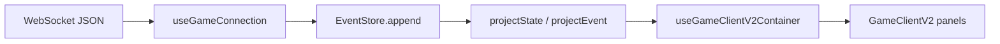

# Client message handling and GameState projection

This note describes how the React web client keeps **Game Info** messages and **Character Panel**
meters aligned. The server is authoritative; the client folds WebSocket events into a single
`GameState` via an append-only event log and a pure projector.

## Data flow

- **Ingress**: `useGameConnectionRefactored` parses frames into `GameEvent`.
- **Canonical state**: `useEventProcessing` appends each event, then replaces React state with
  `projectState(log)` plus preserved `commandHistory`.
- **UI**: `deriveHealthStatusFromPlayer` / `deriveLucidityStatusFromPlayer` read **only** from
  `gameState.player` so meters track the same numbers as the projector.

## Event catalog

See the table on `GameEvent` in
`client/src/components/ui-v2/eventHandlers/types.ts` and `PROJECTED_EVENT_TYPES` in
`client/src/components/ui-v2/eventLog/projectorConstants.ts`. Only allowlisted types change
projected state; unknown types are ignored.

## Message mapping

Combat log lines for `npc_attacked` / `player_attacked` are built in
`client/src/components/ui-v2/eventLog/messageMapper.ts`. `player_attacked` also merges
`target_current_dp` / `target_max_dp` into `player.stats` when present so the health bar matches
the Game Info line.

## Troubleshooting

| Symptom                                     | Likely cause                               | Where to look                                                                                        |
| ------------------------------------------- | ------------------------------------------ | ---------------------------------------------------------------------------------------------------- |
| Game Info shows damage but HP bar unchanged | Event had text but no player stat update   | `player_attacked` payload must include `target_current_dp` or a later `player_update` / `game_state` |
| Healing text but HP stale                   | `command_response` without `player_update` | Server should send stats in `command_response` or `player_dp_updated`                                |
| Follow dialog stuck after accept            | `follow_request_cleared` not projected     | Must be in `PROJECTED_EVENT_TYPES` (fixed)                                                           |
| State resets on reconnect                   | Event store cleared                        | Expected; full `game_state` should follow                                                            |

## Tests

- `client/src/components/ui-v2/eventLog/__tests__/projector.test.ts` -- projector and DP merge
- `client/src/components/ui-v2/eventLog/__tests__/messageMapper.test.ts` -- pure formatters
