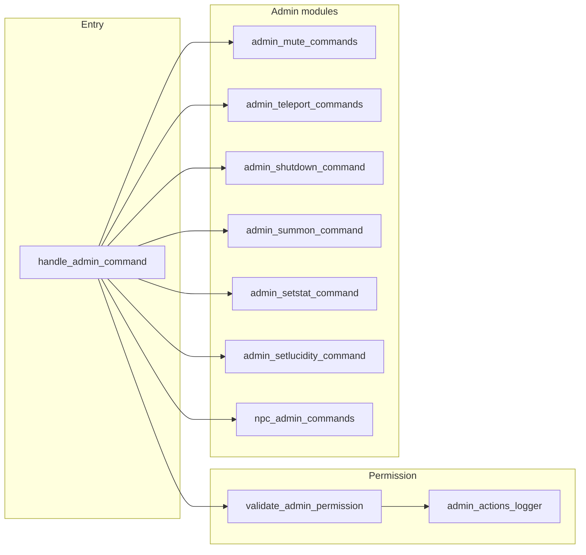

# Admin Commands Subsystem Design

## Overview

The admin commands subsystem groups all commands that require admin permission: mute/unmute (and
global), add_admin, teleport/goto, summon, shutdown, setstat, setlucidity, npc (admin NPC spawn/
despawn/list). Permission is validated via player.is_admin; admin actions are logged via
admin_actions_logger. Each admin command is implemented in its own module (admin_commands,
admin_teleport_commands, admin_mute_commands, admin_shutdown_command, admin_summon_command,
admin_setstat_command, admin_setlucidity_command, npc_admin_commands); the main "admin" command
dispatches subcommands.

## Architecture

**Components:**

- **admin_commands**: [server/commands/admin_commands.py](server/commands/admin_commands.py) –
  handle_admin_command: parses subcommand and args; dispatches to handle_mute_command,
  handle_teleport_command, handle_goto_command, handle_add_admin_command, etc. Top-level
  commands (mute, teleport, goto, shutdown, ...) are also registered directly in command_service.
- **admin_permission_utils**: [server/commands/admin_permission_utils.py](server/commands/
  admin_permission_utils.py) – validate_admin_permission(player, player_name): checks player
  and player.is_admin; logs result via get_admin_actions_logger().log_permission_check (success
  or failure with additional_data).
- **admin_mute_commands**: Mute/unmute (player or global); UserManager and persistence.
- **admin_teleport_commands / goto_helpers / teleport_helpers**: handle_teleport_command,
  handle_goto_command – move player to room (MovementService.add_player_to_room, remove from
  old room); validate_admin_permission and room existence.
- **admin_shutdown_command**: handle_shutdown_command – graceful server shutdown; admin only.
- **admin_summon_command**: Summon player or NPC to admin's room.
- **admin_setstat_command**: Set player stat (e.g. current_dp, level) for debugging; admin only.
- **admin_setlucidity_command**: Set player lucidity; admin only.
- **npc_admin_commands**: handle_npc_command – admin NPC spawn/despawn/list; uses lifecycle and
  spawning services.
- **admin_actions_logger**: [server/structured_logging/admin_actions_logger.py](server/
  structured_logging/admin_actions_logger.py) – Logs permission checks and admin actions for
  audit.

## Key design decisions

- **Single permission check**: player.is_admin (boolean on player model); no role hierarchy in
  code. validate_admin_permission centralizes check and audit log.
- **Admin command routing**: "admin" command takes subcommand (e.g. admin teleport &lt;player&gt;
  &lt;room&gt;); other commands (mute, teleport, goto, shutdown, npc, etc.) are first-class
  command names. command_service maps both; admin subcommand handler reconstructs args for
  dispatch.
- **Audit logging**: All permission checks and sensitive actions logged via admin_actions_logger;
  log_permission_check and action-specific log methods.
- **Security**: Admin-only; no elevation of privilege beyond is_admin. Input validation (room id,
  player name) in each module to avoid injection or invalid state.

## Constraints

- **Player must be admin**: validate_admin_permission returns False if not player or not
  player.is_admin; command returns error message.
- **Dependencies**: Persistence (player, room), MovementService (teleport/goto), UserManager
  (mute), ConnectionManager (summon, shutdown), lifecycle/spawning (npc admin), admin_actions_logger.

## Component interactions

1. **admin &lt;subcommand&gt; [args]** – Parse subcommand; validate*admin_permission(player);
   if not admin return error; dispatch to handle*\* for mute, teleport, goto, add_admin, etc.;
   each handler may log action.
2. **teleport / goto** – validate_admin_permission; resolve target player and destination room;
   remove from current room, add to new room (MovementService); persist current_room_id.
3. **mute / unmute** – validate_admin_permission; UserManager mute/unmute; persistence if needed.
4. **shutdown** – validate_admin_permission; trigger graceful shutdown sequence.
5. **setstat / setlucidity** – validate_admin_permission; load player; set stat; save_player.
6. **npc** – validate_admin_permission; npc spawn/despawn/list via lifecycle and spawning.

## Developer guide

- **Adding new admin command**: Create handler (or add to existing module); register in
  command_service and in handle_admin_command if using "admin &lt;subcommand&gt;" form; call
  validate_admin_permission at start; log action via admin_actions_logger.
- **Changing permission model**: Currently is*admin only; for roles, extend validate_admin*
  permission to check role and action; update admin_actions_logger payload.
- **Tests**: Mock player.is_admin; test permission denied and granted; test each admin module
  with admin player.
- **Security**: Never trust client for admin flag; always load player from persistence and check
  is_admin server-side.

## Troubleshooting

- **"You do not have permission"**: validate_admin_permission failed; check player.is_admin in
  DB and that command uses same player object from persistence.
- **Admin action not logged**: Ensure handler calls validate_admin_permission (which logs) and
  any action-specific admin_actions_logger call.
- **Teleport not moving player**: Check MovementService.add*player_to_room and remove_player*
  from_room; ensure current_room_id persisted; room_id valid.
- **Subcommand not found**: handle_admin_command must map subcommand to handler; check
  command_data.subcommand and args reconstruction (command_service CRITICAL comment for admin
  subcommands).

See also [GAME_BUG_INVESTIGATION_PLAYBOOK](.cursor/rules/GAME_BUG_INVESTIGATION_PLAYBOOK.mdc) and
security/COPPA requirements in project rules.

## Related docs

- [COMMAND_MODELS_REFERENCE.md](../COMMAND_MODELS_REFERENCE.md)
- [SUBSYSTEM_MOVEMENT_DESIGN.md](SUBSYSTEM_MOVEMENT_DESIGN.md) (teleport/goto)
- [SUBSYSTEM_NPC_DESIGN.md](SUBSYSTEM_NPC_DESIGN.md) (npc admin)
