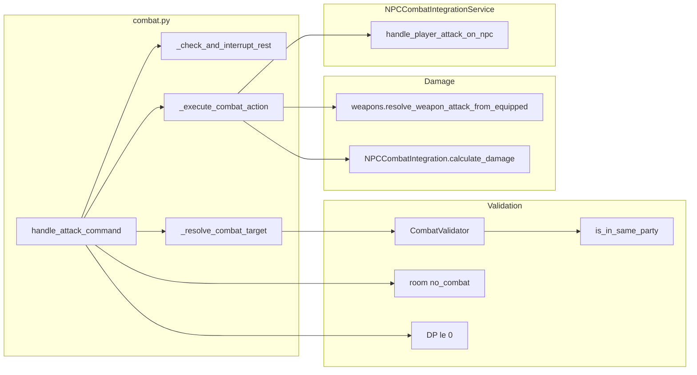

# Combat Subsystem Design

## Overview

The combat subsystem handles player-vs-NPC combat. Players use attack (or aliases punch, kick,
strike) with a target name; the target is resolved in the same room and must be an NPC. Damage is
derived from equipped weapon (prototype metadata) or config basic_unarmed_damage, then applied via
NPCCombatIntegrationService. Combat is blocked in no_combat rooms, when incapacitated (DP <= 0),
during login grace period, and (via CombatValidator) when attacking a party member if target were a
player; only NPC targets are currently allowed. Rest is interrupted when the player issues a combat
command.

## Architecture

**Components:**

- **combat.py**: [server/commands/combat.py](server/commands/combat.py) – CombatCommandHandler:
  rest/grace check, get player/room, validate target name, resolve target (TargetResolutionService),
  require NPC and alive, validate combat action, execute (weapon resolution, damage calc,
  handle_player_attack_on_npc). Top-level handlers handle_attack_command, handle_punch_command, etc.
  (aliases). get_combat_command_handler(app) lazy-inits handler from container.
- **CombatValidator**: [server/validators/combat_validator.py](server/validators/combat_validator.py) –
  validate_can_attack_target(attacker_id, target_id, target_type): if party_service and target_type
  player, is_in_same_party blocks with thematic message. Used for consistency; current command flow
  only allows NPC targets.
- **weapons.py**: [server/game/weapons.py](server/game/weapons.py) – resolve*weapon_attack_from*
  equipped(main_hand_stack, registry): returns WeaponAttackInfo(base_damage, damage_type) from
  prototype metadata (weapon.min_damage, max_damage, modifier, damage_types) or None for unarmed.
- **NPCCombatIntegration**: [server/npc/combat_integration.py](server/npc/combat_integration.py) –
  calculate_damage(attacker_stats, target_stats, weapon_damage, damage_type) for CON/resistance.
- **NPCCombatIntegrationService**: [server/services/npc_combat_integration_service.py](server/services/
  npc_combat_integration_service.py) – handle_player_attack_on_npc(player_id, npc_id, room_id,
  action_type, damage, npc_instance): login grace check, room match, start or queue combat, apply
  damage; returns True/False for success.
- **TargetResolutionService**: Resolves target name in player's room; combat requires single NPC
  match and is_alive.

## Key design decisions

- **NPC-only targets**: \_resolve_combat_target requires target_type == NPC; "You can only attack
  NPCs" for players. Party check in validator would block same-party if PvP were added.
- **Rest interrupt**: Combat command cancels rest (same as movement); no rest during combat initiation.
- **Login grace period**: handle_player_attack_on_npc blocks attack if player in grace period;
  command layer also blocks with "You are still warded..."
- **no_combat rooms**: room.attributes.no_combat (e.g. tutorial, ADR-009) blocks combat with
  "The cosmic forces forbid violence in this place."
- **Incapacitated (DP <= 0)**: Player cannot attack until death/respawn (DP -10); "You are
  incapacitated and cannot attack."
- **Weapon from equipped main_hand**: Prototype metadata.weapon (min_damage, max_damage, modifier,
  damage_types); else config.game.basic_unarmed_damage.
- **Single handler singleton**: get_combat_command_handler(app) creates CombatCommandHandler once
  from container (combat_service, event_bus, player_combat_service, connection_manager,
  async_persistence, item_prototype_registry, party_service).

## Constraints

- **Same room**: Target resolved in player's current_room_id.
- **Alive NPC**: npc_instance.is_alive; dead NPC returns "{name} is already dead."
- **Dependencies**: AsyncPersistence, NPC instance service (lifecycle_manager.active_npcs),
  config (basic_unarmed_damage), optional item_prototype_registry, party_service (validator).

## Component interactions

1. **attack &lt;target&gt;** – Rest/grace check; get player and room; current_dp <= 0 -> block; room
   no_combat -> block; resolve target (NPC, alive); validate_combat_action; get weapon damage or
   unarmed; NPCCombatIntegration.calculate_damage; npc_combat_service.handle_player_attack_on_npc;
   return "You {command} {npc_name}!" or "You cannot attack {npc_name} right now."
2. **handle_player_attack_on_npc** – Grace period check; get/create combat; room mismatch can end
   combat; apply damage to NPC; broadcast/events as per combat service.
3. **Punch/kick/strike** – Same as attack with command_type set to punch/kick/strike for messaging.

## Developer guide

- **Adding attack alias**: Register in command_service (e.g. "smack" -> handle_attack_command);
  optionally set command_data["command_type"] for message. Add to CombatValidator.attack_aliases
  if validator uses it.
- **New weapon metadata**: Ensure prototype has metadata.weapon with min_damage, max_damage;
  optional modifier and damage_types; weapons.resolve_weapon_attack_from_equipped reads from
  registry.
- **PvP**: To allow player targets, change \_resolve_combat_target to allow TargetType.PLAYER and
  call CombatValidator.validate_can_attack_target(attacker_id, target_id, "player") so same-party
  is blocked.
- **Tests**: server/tests/unit/commands/test_combat\*.py, server/tests/unit/validators/
  test_combat_validator.py, server/tests/unit/services/test_npc_combat_integration_service.py.

## Troubleshooting

- **"You cannot attack ... right now"**: handle_player_attack_on_npc returned False (e.g. grace
  period, room mismatch, NPC not found). Check logs: "Combat initiation failed".
- **"You are incapacitated"**: current_dp <= 0; player must be healed or respawn (DP -10).
- **"The cosmic forces forbid violence"**: room.attributes.no_combat is true (tutorial/no_combat
  zone).
- **"Target not found" / "is already dead"**: TargetResolutionService no match or NPC not in
  lifecycle_manager or not is_alive.
- **Wrong damage**: Check equipped main_hand and prototype metadata.weapon; fallback
  basic_unarmed_damage in config.

See also [SUBSYSTEM_PARTY_DESIGN.md](SUBSYSTEM_PARTY_DESIGN.md), [SUBSYSTEM_REST_DESIGN.md]
(SUBSYSTEM_REST_DESIGN.md), [SUBSYSTEM_NPC_DESIGN.md](SUBSYSTEM_NPC_DESIGN.md), and
[GAME_BUG_INVESTIGATION_PLAYBOOK](.cursor/rules/GAME_BUG_INVESTIGATION_PLAYBOOK.mdc).

## Related docs

- [COMMAND_MODELS_REFERENCE.md](../COMMAND_MODELS_REFERENCE.md)
- [ADR-009: Instanced rooms](../architecture/decisions/ADR-009-instanced-rooms.md) (no_combat,
  no_death)
