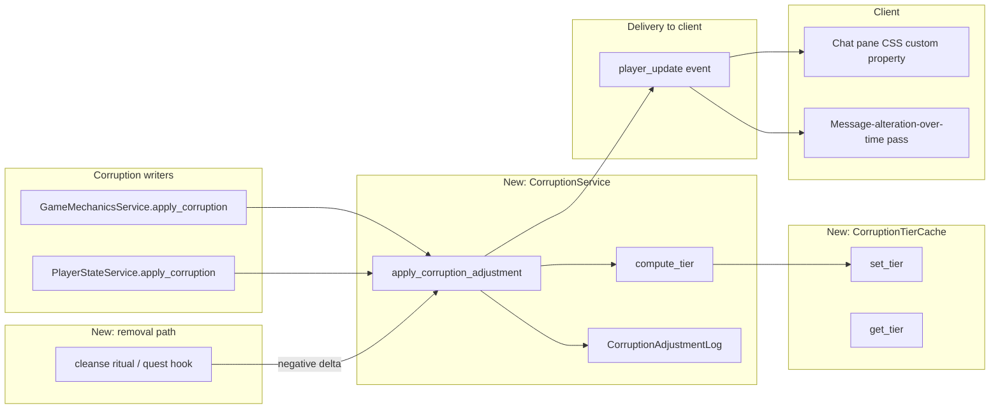

# Corruption Subsystem Design

**Version 1.1.0** · MythosMUD · 2026-09-10

---

## AI READING INSTRUCTION

Read `[SPEC]` and `[BUG]` blocks for authoritative facts.
Read `[NOTE]` only if additional context is needed.
`[?]` blocks are unverified — treat with lower confidence.

---

## 1. Overview

**[SPEC]**
**Status:** Planned — corruption exists today only as a bare stat with no tiers, no cache, no
chat integration, and no recovery path. This document specifies the subsystem that gives it those,
filed to close part of `#145`.

Corruption is currently `server/models/game.py:174` — `corruption: int = Field(default=0,
description="Taint from dark forces")` — written by `mechanics.apply_corruption`
(`server/game/mechanics.py:72`) and `player_state_service.apply_corruption`
(`server/game/player_state_service.py:90`), which both delegate to
`persistence.apply_corruption`. Its only reader is `is_corrupted() -> bool`
(`server/models/game.py:322`, threshold `>= 50`). No chat code, no client code, and no tier model
exist yet.

This doc builds corruption a **tier model deliberately mirroring lucidity's** (see
[SUBSYSTEM_LUCIDITY_DESIGN.md](SUBSYSTEM_LUCIDITY_DESIGN.md), `server/models/lucidity.py`), because
corruption is expected to grow non-visual effects over time — the tier machinery is built to carry
that weight from the start, not retrofitted later. Its **first** manifestation is a global chat
perceptual filter, licensed by
[ADR-025](../architecture/decisions/ADR-025-corruption-perceptual-filter.md).

## 2. Architecture

**[SPEC]**

**Components (new unless noted):**

- **`CorruptionService`** (`server/services/corruption_service.py`, new) — mirrors
  `LucidityService` (`server/services/lucidity_service.py:57`). `apply_corruption_adjustment(player_id,
  delta, reason_code, metadata=None)` replaces direct `persistence.apply_corruption` calls as the
  single write path: clamps to `0..100`, computes the new tier, writes the tier cache, and appends
  an immutable ledger row. Existing callers (`mechanics.py:72`, `player_state_service.py:90`)
  route through it instead of calling persistence directly, exactly as lucidity's callers route
  through `LucidityService`.
- **`CorruptionTierCache`** (`server/services/corruption_tier_cache.py`, new) — a direct structural
  copy of `LucidityTierCache` (`server/services/lucidity_tier_cache.py`): `set_tier`, `get_tier`,
  `clear`, module-level singleton. A cache miss is `"pure"` (fail safe to the least-corrupted
  reading, mirroring lucidity's fail-safe-to-truthful rule).
- **`CorruptionAdjustmentLog`** (`server/models/corruption.py`, new) — a direct structural copy of
  `LucidityAdjustmentLog` (`server/models/lucidity.py:100`): `player_id`, `delta`, `reason_code`,
  `metadata`, `location_id`, `created_at`. Gives corruption the same audit trail lucidity has, which
  the tier-expansion rationale in §1 requires — future non-visual effects will need to answer "why
  is this player at this corruption level," the same question the ledger already answers for
  lucidity.
- **Removal path** — no dedicated service; a costly, deliberate action (ritual, cleansing rite, or
  quest completion — content design, out of scope here) calls
  `CorruptionService.apply_corruption_adjustment` with a negative delta and a distinguishing
  `reason_code` (e.g. `"ritual_cleanse"`). See §3 for why this is asymmetric with lucidity's passive
  recovery.
- **Client filter** (`client/src/components/ui-v2/panels/ChatHistoryPanel.tsx`, modified) — reads
  the player's own corruption value (already delivered via `player_update`/`game_state`, per
  ADR-025 no new wire payload is needed) and sets one CSS custom property on the chat pane's root
  element. See §5 for the exact mapping and §3 for why this is a pane-wide filter, not a per-message
  effect.
- **Message-alteration-over-time pass** (client, new) — the "existing messages change over time"
  bullet from `#145`. A client-side-only re-render pass over the *already-received* history buffer,
  driven by the same corruption value and each entry's own age — never a server round-trip, never a
  mutation of what was actually said. See §5.

## 3. Key design decisions

**[SPEC]**

- **Tiers, not a boolean, and not lucidity's tick-driven state machine.** Five tiers over
  `0..100` (#815 added `touched`), chosen so the existing `is_corrupted() >= 50` threshold lands
  exactly on a tier boundary and needs no change:

  | Tier | Range |
  | --- | --- |
  | `pure` | 0 only |
  | `touched` | 1–24 |
  | `marked` | 25–49 |
  | `corrupted` | 50–74 (`is_corrupted()` becomes true entering this tier) |
  | `warped` | 75–100 |

  `pure` is reserved for exactly 0 rather than a 0–24 band. `#815`'s permanence floor (below) makes
  `pure` an **absorbing state you can only ever leave** — once corruption exceeds 0 it can never
  return to 0 through `CorruptionService`, so a cleansed veteran and a novice must read differently
  everywhere the tier is consulted. `touched` exists to carry that distinction.

  Unlike lucidity, corruption has **no passive tick service** — there is nothing analogous to
  `PassiveLucidityFluxService` for corruption, because corruption never decays passively (see next
  bullet). The tier cache is instead written through synchronously by `CorruptionService` on every
  adjustment, the same write-through half of lucidity's two-path freshness strategy
  (`lucidity_tier_cache.py:9-15`) without the tick-loop backstop half.
- **Asymmetric recovery: no decay, designed removal.** Corruption is "taint from dark forces" by
  its own field description — it should not evaporate on a timer the way lucidity recovers via rest
  and ritual. `#145`'s acceptance criterion "recovery is clearly indicated" is satisfied by the
  removal path (§2), not by passive decay. This keeps corruption meaningfully different from
  lucidity rather than becoming a second lucidity under a different name, while still giving players
  a path out.
- **Global perceptual filter, not per-message styling** (per
  [ADR-025](../architecture/decisions/ADR-025-corruption-perceptual-filter.md)). The filter reads
  one number the viewer already possesses about themselves and applies it uniformly to their entire
  chat pane. It never reads or reacts to any property of an individual message — that is what keeps
  it compatible with [ADR-024](../architecture/decisions/ADR-024-server-authoritative-perceived-reality.md).
- **Tier machinery sized for non-visual effects later.** The corruption doc's tier/cache/ledger
  triad exists so that when corruption gains behavioral effects (NPC reactions, occult-check
  modifiers, whatever comes next), the state to drive them is already in place. This document does
  not specify those effects — only the substrate.

## 4. Constraints

**[SPEC]**

- **Range**: `0..100`, clamped in `CorruptionService`, mirroring `PlayerLucidity`'s
  `CheckConstraint("current_lcd BETWEEN -100 AND 100")` pattern
  (`server/models/lucidity.py:54`) but unsigned (corruption has no "negative corruption" concept).
- **Permanence floor (#815)**: within `CorruptionService.apply_corruption_adjustment`, once a
  player's corruption exceeds 0 it can never return below 1 — the floor is derived from the current
  value (`1 if current > 0 else 0`), not tracked as separate state. This applies only to writes
  through the service; `admin setstat` bypasses the service entirely for every occult-range stat
  (tracked in `#816`) and can still zero a player's corruption directly, by design — an admin
  override wipes the scar.
- **`is_corrupted()` compatibility**: any tier boundary change must keep the `corrupted` tier's
  floor at exactly 50, or `server/models/game.py:322`'s existing callers silently change behavior.
- **Dependencies**: `CorruptionService` depends on persistence (for the ledger table) and
  `CorruptionTierCache`; no dependency on `LucidityService` or `passive_lucidity_flux/` — corruption
  and lucidity are adjusted independently even though they share a structural pattern.
- **No new wire event**: the client filter and history-decay pass read corruption from the stat
  payloads the client already receives (`player_update`/`game_state`); this document does not add a
  new event type.

## 5. Component interactions

**[SPEC]**

1. **Corruption applied** — `mechanics.apply_corruption` or `player_state_service.apply_corruption`
   calls `CorruptionService.apply_corruption_adjustment(player_id, amount, source)`. The service
   clamps the new value, recomputes the tier, writes `CorruptionTierCache.set_tier`, and inserts a
   `CorruptionAdjustmentLog` row. The existing `persistence.apply_corruption` call remains the
   actual column write; `CorruptionService` wraps it rather than replacing the persistence layer.
2. **Delivery to client** — the updated `corruption` value flows to the client through the existing
   `player_update`/`game_state` payload path (no new event). `ChatHistoryPanel.tsx` derives
   `--corruption-intensity: <corruption / 100>` (0.0–1.0) as a CSS custom property on the chat
   pane's root element. The filter itself (contrast/saturation/an overlay's opacity, whatever the
   implementer picks) is bounded by the hard floor specified in
   [SUBSYSTEM_CHAT_EFFECT_ACCESSIBILITY_DESIGN.md](SUBSYSTEM_CHAT_EFFECT_ACCESSIBILITY_DESIGN.md) —
   this document does not itself set the floor, it only supplies the driving value.
3. **Message alteration over time** — a client-side pass, independent of the corruption filter's CSS
   property, that re-renders already-buffered history entries based on `(corruption, message age)`
   only — never message identity, sender, or channel, which is what keeps it inside ADR-024's
   global-filter carve-out. Older entries visually decay first (e.g. progressively replacing
   characters with the same glyph vocabulary `lucidity_communication_dampening.py:17`'s
   `MYTHOS_GLYPHS` already uses, for visual continuity with the lucidity system's existing language)
   as corruption rises. This never touches `chat_logger`'s stored copy
   (`server/game/chat_message_helpers.py:18`) or re-fetches history from the server — it operates
   entirely on the client's own render buffer.
4. **Removal** — a ritual/quest action (content design, not specified here) calls
   `CorruptionService.apply_corruption_adjustment` with a negative delta and `reason_code=
   "ritual_cleanse"` (or similar). The ledger records it identically to a gain, so "why did this
   player's corruption drop" is answerable the same way "why did it rise" is.

## 6. Developer guide

**[SPEC]**

- **New corruption source**: call `CorruptionService.apply_corruption_adjustment`, not
  `persistence.apply_corruption` directly — the tier cache and ledger only stay correct if writes
  go through the service, exactly as lucidity's callers must go through `LucidityService`.
- **Adding a removal mechanism**: any new ritual/quest completion that reduces corruption should use
  a `reason_code` prefixed distinctly from gain sources (e.g. `ritual_*`) so the ledger remains
  queryable for "how did this player recover."
- **Tuning tier boundaries**: keep the `corrupted` tier's floor at 50 unless
  `server/models/game.py:322`'s `is_corrupted()` threshold is changed in the same PR.
- **Client filter tuning**: implement the CSS custom property mapping and any easing curve entirely
  client-side; no server change is needed to adjust how "intense" the filter looks at a given
  corruption value, only to change what corruption value is reported.
- **Tests**: unit tests for `CorruptionService` (clamping, tier transitions at each boundary, ledger
  row shape) mirroring the existing `test_apply_corruption*` suite
  (`server/tests/unit/game/test_player_service_mutations.py`); a self-check `demo()`/`__main__`
  for the tier-boundary math is sufficient before a full integration-test suite exists.

## 7. Troubleshooting

**[NOTE]**

- **Filter doesn't move**: confirm `CorruptionService.apply_corruption_adjustment` is actually being
  called — a caller still using `persistence.apply_corruption` directly will change the stored value
  but never update `CorruptionTierCache`, so any tier-dependent future effect (not the filter itself,
  which reads the raw value) would be stale.
- **`is_corrupted()` disagrees with the corruption tier shown in the UI**: check that the `corrupted`
  tier floor is still 50; a tier-boundary edit elsewhere silently desyncs the two.
- **Ledger missing an expected removal row**: a ritual/quest path bypassing `CorruptionService` in
  favor of a direct stat write. Route it through the service.

## 8. Related docs

**[SPEC]**

- [ADR-025](../architecture/decisions/ADR-025-corruption-perceptual-filter.md) — licenses the
  global-filter approach this doc implements.
- [ADR-024](../architecture/decisions/ADR-024-server-authoritative-perceived-reality.md) — the
  per-message truth-leak rule ADR-025 narrows.
- [SUBSYSTEM_LUCIDITY_DESIGN.md](SUBSYSTEM_LUCIDITY_DESIGN.md) — the structural pattern
  (`*Service`/`*TierCache`/`*AdjustmentLog`) this subsystem mirrors.
- [SUBSYSTEM_STATUS_EFFECTS_DESIGN.md](SUBSYSTEM_STATUS_EFFECTS_DESIGN.md) — corruption's current,
  minimal coverage as a bare stat (lines 21, 42, 67, 106, 118), superseded in scope by this doc.
- [SUBSYSTEM_CHAT_EFFECT_ACCESSIBILITY_DESIGN.md](SUBSYSTEM_CHAT_EFFECT_ACCESSIBILITY_DESIGN.md) —
  the hard floor bounding the chat filter's intensity.

## 9. Changelog

**[SPEC]**

| Version | Date | Change |
| --- | --- | --- |
| 1.0.0 | 2026-09-09 | Initial version, filed to close part of `#145`: corruption tier model, ledger, removal path, and global chat perceptual filter |
| 1.1.0 | 2026-09-10 | `#815` PR-1: added the `touched` tier (1–24), reserved `pure` for exactly 0, and made corruption permanent once touched (a floor of 1, enforced in `CorruptionService`) |
