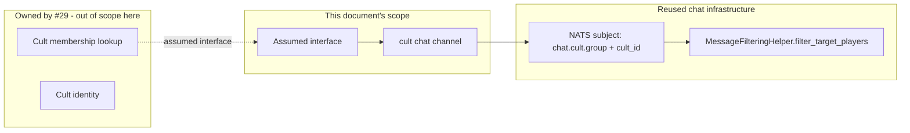

# Cult Chat Seam Design

**Version 1.0.0** · MythosMUD · 2026-09-09

---

## AI READING INSTRUCTION

Read `[SPEC]` and `[BUG]` blocks for authoritative facts.
Read `[NOTE]` only if additional context is needed.
`[?]` blocks are unverified — treat with lower confidence.

---

## 1. Overview

**[SPEC]**
**Status:** Planned. **Blocked-on:** [`#29`](https://github.com/arkanwolfshade/MythosMUD/issues/29)
("Implement cultist faction and PvP mechanics", Post-MVP, OPEN).

`#145` asks for "cult communication: hidden messages for cult members." `#29` already owns cultist
faction implementation, including membership and PvP mechanics. This document is deliberately
**narrow**: it specifies only the chat-side contract a cult host system must satisfy, not the
faction, ranks, initiation, or PvP mechanics themselves — those remain `#29`'s scope entirely. This
lets cult chat ship the moment `#29` lands a membership model, without this document (or its
implementer) pre-empting `#29`'s design work.

## 2. Architecture

**[SPEC]**



**Components:**

- **Assumed interface** — the minimal contract `#29`'s cult host must expose for this seam to be
  implementable:

  ```python
  def get_cult_membership(player_id: uuid.UUID) -> str | None:
      """Return the player's cult_id, or None if not a member of any cult."""
  ```

  This is the entire dependency. Nothing else about cult mechanics (ranks, secrecy, discovery) is
  assumed.
- **Cult chat channel** — a new NATS subject following the existing pattern documented in
  `docs/NATS_SUBJECT_PATTERNS.md` (table at lines 150–157): `chat.cult.group.{cult_id}`, mirroring
  `chat.party.group.{party_id}` exactly, since cult chat and party chat share the same shape (a
  closed group, resolved to a set of recipient player IDs before fan-out).
- **Filtering** — cult chat's recipient resolution plugs into the existing per-recipient fan-out at
  `MessageFilteringHelper.filter_target_players`
  (`server/realtime/message_filtering.py:660`), the same drop-stage that room, party, and whisper
  channels already use. No new filtering mechanism is needed; only a new target-collection function
  analogous to `collect_room_targets` (`message_filtering.py:56`) that resolves cult membership
  instead of room occupancy.

## 3. Key design decisions

**[SPEC]**

- **Seam only, host deferred to `#29`.** This document does not design cult membership, ranks,
  initiation rites, or discovery/exposure mechanics — all of that is `#29`'s territory. Designing
  those here would substantially pre-empt `#29`'s own design work before it has happened.
- **Channel shape mirrors party, not room.** Cult chat is a closed-membership group channel, the
  same shape as party chat (`chat.party.group.{party_id}`,
  `server/game/chat_service.py:311`'s `send_party_message`), not a room-scoped broadcast. The
  implementation, once `#29` exists, should be a close structural copy of `send_party_message` with
  `get_cult_membership` substituted for party roster lookup.
- **No new moderation model.** Cult chat reuses `ChatService`'s existing mute/admin primitives
  (`mute_channel`, `is_player_muted`, `server/game/chat_service.py:515-582`) rather than inventing
  cult-specific moderation.

## 4. Constraints

**[SPEC]**

- **Cannot ship before `#29` provides `get_cult_membership` or an equivalent.** This document's
  channel and filtering plumbing can be written and unit-tested against a stub of the assumed
  interface, but cannot be wired to real membership data until `#29` lands.
- **This document does not block `#29`.** `#29` can proceed and land membership without any
  awareness of this seam; the interface above is a request, not a prerequisite `#29` must design
  around.

## 5. Related docs

**[SPEC]**

- [`docs/NATS_SUBJECT_PATTERNS.md`](../NATS_SUBJECT_PATTERNS.md) — the subject-naming convention
  `chat.cult.group.{cult_id}` follows.
- [SUBSYSTEM_PARTY_DESIGN.md](SUBSYSTEM_PARTY_DESIGN.md) — the closest structural precedent for a
  closed-membership chat channel.

## 6. Changelog

**[SPEC]**

| Version | Date | Change |
| --- | --- | --- |
| 1.0.0 | 2026-09-09 | Initial version, filed to close part of `#145`: cult chat seam and assumed interface, blocked on `#29` |
