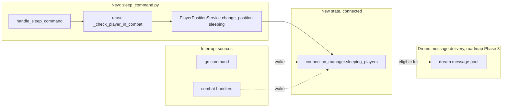

# Dream Messaging Subsystem Design

**Version 1.0.0** · MythosMUD · 2026-09-09

---

## AI READING INSTRUCTION

Read `[SPEC]` and `[BUG]` blocks for authoritative facts.
Read `[NOTE]` only if additional context is needed.
`[?]` blocks are unverified — treat with lower confidence.

---

## 1. Overview

**[SPEC]**
**Status:** Planned. Introduces a new `/sleep` command and connection state, staged toward two
follow-on phases. Filed to close part of `#145`'s "dream messages: messages that appear during rest
periods" bullet.

`#145`'s request collides with existing behavior: `/rest`
([SUBSYSTEM_REST_DESIGN.md](SUBSYSTEM_REST_DESIGN.md)) means **disconnect** — either instantly in a
`rest_location` room, or after a 10-second countdown elsewhere
(`server/commands/rest_countdown_task.py`, `GameConfig.rest_countdown_seconds`,
`server/config/models/game.py:40`). A player cannot receive dream messages during `/rest` because
`/rest` ends their session. This document specifies a **new, separate** command, `/sleep`, for a
resting-but-connected state, deliberately leaving `/rest`'s disconnect semantics untouched.

Three phases, roadmapped in one document because they build on each other:

1. **`/sleep` state** (this phase) — the connected-but-resting state itself, with no dream content
   yet.
2. **Dreamlands plane** (roadmap) — transiting `/sleep`ing characters into `dream_*` rooms.
3. **Status-effect-driven waking dreams** (roadmap) — dream messages delivered without requiring
   `/sleep` at all, driven by a status effect.

## 2. Architecture — Phase 1 (`/sleep`)

**[SPEC]**

**Components:**

- **`sleep_command.py`** (`server/commands/sleep_command.py`, new) — structurally parallel to
  `rest_command.py`, but with no countdown and no disconnect branch: `handle_sleep_command`
  validates not already resting/sleeping and not in combat (reusing
  `_check_player_in_combat`), sets position to `"sleeping"` via `PlayerPositionService
  .change_position` (a **new** position value alongside the existing
  `standing|sitting|lying`, per `SUBSYSTEM_STATUS_EFFECTS_DESIGN.md` §3's posture model), and adds
  the player to a **new** `connection_manager.sleeping_players` set. No task is spawned — there is
  no countdown, because sleeping does not end the session.
- **`sleeping_players`** (`ConnectionManager`, new field) — parallel to
  `resting_players`, but a set of player IDs, not a dict of tasks (there is no countdown task to
  hold). Movement (`go`) and combat handlers check and clear it on interrupt, the same pattern
  `cancel_rest_countdown` follows for `/rest`
  (`server/commands/rest_command.py`, per `SUBSYSTEM_REST_DESIGN.md` §5.2), restoring standing
  posture on wake.
- **Wake command** — `/wake` (new), the sleeping-state equivalent of standing up, removing the
  player from `sleeping_players` and restoring standing posture voluntarily rather than only via
  interrupt.

## 3. Key design decisions

**[SPEC]**

- **A new verb, not a new mode of `/rest`.** `/rest`'s disconnect semantics are load-bearing
  (clean logout, `intentional_disconnects` tracking) and are used constantly for ordinary session
  end. Overloading `/rest` to sometimes disconnect and sometimes not would be a worse interface than
  a second, narrowly-scoped command.
- **No countdown.** `/rest`'s 10-second countdown exists to give time to cancel an accidental
  disconnect. `/sleep` doesn't disconnect, so there is nothing to protect against — the state
  applies immediately (combat check aside).
- **Phased, not delivered whole.** Phase 1 ships a real, usable command (a resting posture with no
  mechanical payoff yet) rather than waiting for the Dreamlands plane or status-effect work to be
  ready. This mirrors the house habit of `(planned)` markers for staged work
  (`docs/BOUNDED_CONTEXTS_AND_SERVICE_BOUNDARIES.md:193`) rather than blocking on the full vision.

## 4. Constraints

**[SPEC]**

- **No combat while sleeping**: reuses `_check_player_in_combat`, identical to `/rest`.
- **New posture value**: `"sleeping"` must be added everywhere `position` is validated against a
  fixed set (`SUBSYSTEM_STATUS_EFFECTS_DESIGN.md` §3's posture model) — movement's
  `_check_player_posture` must treat it the same as `"lying"`/`"sitting"` (blocks movement) and wake
  the player rather than merely rejecting the move.
- **Distinct from `/rest`'s `resting_players`**: a player can be resting-toward-disconnect
  (`/rest`) or sleeping-and-connected (`/sleep`), never both; `handle_sleep_command` must check
  `resting_players` too and refuse if present, and vice versa.

## 5. Roadmap — Phase 2: Dreamlands plane

**[NOTE]**

Room IDs already carry a plane discriminator: `server/utils/room_utils.py:75`'s
`get_plane_from_room_id`, whose own docstring example is `dream_innsmouth_docks_warehouse_1` →
`'dream'`. The `{plane}_{zone}_{sub_zone}_{room_name}` seam already exists and treats `dream` as a
first-class example plane; only `earth` is populated with room data today, and **rooms are
database-resident, not file-based** (confirmed: no per-room JSON/YAML content files in the repo —
world data lives in the DB, migrated via stored procedures per `#633`). Populating a `dream` plane
is therefore a data/migration effort, not a content-file drop.

Phase 2 transits a `/sleep`ing character into a `dream_*` room instead of leaving them in their
waking room, using the existing plane/room-ID machinery unmodified. Transit rules, Dreamlands room
content, and waking/death-in-the-Dreamlands semantics are **not specified in this document** — they
are the subject of Phase 2's own design pass once Phase 1 ships and the population question (how
much Dreamlands content, curated by whom) is answered.

## 6. Roadmap — Phase 3: status-effect-driven waking dreams

**[NOTE]**

Once `/sleep` exists, a status effect (see
[SUBSYSTEM_STATUS_EFFECTS_DESIGN.md](SUBSYSTEM_STATUS_EFFECTS_DESIGN.md)) can trigger dream-toned
messages **without** the player needing to be actively `/sleep`ing — e.g. an effect applied by a
narrative event that causes waking daydreams. This phase is the delivery mechanism for `#145`'s
"dream messages" bullet in the common case (a player is unlikely to be actively asleep when reading
chat); Phase 1's `/sleep` state gates a *stronger* version of the same content while genuinely
resting. Delivery reuses the hallucination pool-and-trigger pattern
(`services/fake_hallucination_service.py`) rather than inventing a third delivery mechanism — see
[SUBSYSTEM_ENTITY_CONTACT_DESIGN.md](SUBSYSTEM_ENTITY_CONTACT_DESIGN.md) for the sibling design that
reuses the same pattern.

## 7. Related docs

**[SPEC]**

- [SUBSYSTEM_REST_DESIGN.md](SUBSYSTEM_REST_DESIGN.md) — the disconnect-oriented sibling command
  `/sleep` is deliberately kept separate from.
- [SUBSYSTEM_STATUS_EFFECTS_DESIGN.md](SUBSYSTEM_STATUS_EFFECTS_DESIGN.md) — posture model `/sleep`
  extends; the Phase 3 status-effect delivery mechanism.
- [SUBSYSTEM_ENTITY_CONTACT_DESIGN.md](SUBSYSTEM_ENTITY_CONTACT_DESIGN.md) — the trigger/pool
  pattern Phase 3 reuses.

## 8. Changelog

**[SPEC]**

| Version | Date | Change |
| --- | --- | --- |
| 1.0.0 | 2026-09-09 | Initial version, filed to close part of `#145`: `/sleep` connected-resting state (Phase 1), with Dreamlands plane transit (Phase 2) and status-effect waking dreams (Phase 3) roadmapped |
