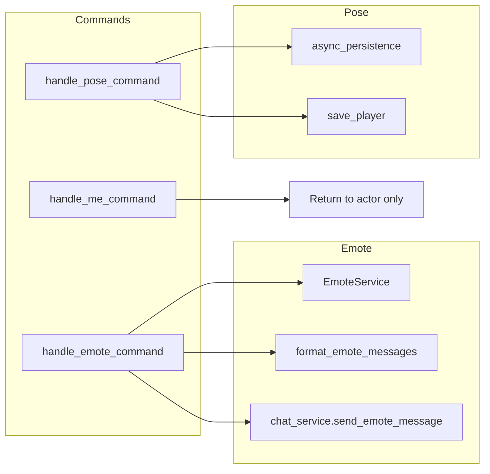

# Emote / Pose Subsystem Design

## Overview

The emote/pose subsystem covers three ways players express themselves in the room: **emote**
(predefined or freeform actions sent to the room via chat), **me** (freeform action text, currently
returned only to the actor), and **pose** (persistent character pose stored on the player and
displayed in look/room). Emote uses EmoteService for predefined messages (loaded from PostgreSQL
emotes/emote_aliases) and ChatService to broadcast; pose is a player attribute persisted and
cleared via the pose command.

## Architecture

**Components:**

- **emote_commands**: [server/commands/emote_commands.py](server/commands/emote_commands.py) –
  handle_emote_command: gets action from command_data, validates player/room via player_service,
  formats messages via EmoteService (predefined alias -> self_message/other_message, else custom
  "player_name action"), calls chat_service.send_emote_message(player_id, formatted_action),
  returns self_message to actor.
- **communication_commands**: [server/commands/communication_commands.py](server/commands/communication_commands.py) –
  handle_me_command: extracts action, returns "{player_name} {action}" to actor only (no room
  broadcast in current implementation). handle_pose_command: gets persistence, player by name, sets
  or clears player.pose, save_player, returns result.
- **EmoteService**: [server/game/emote_service.py](server/game/emote_service.py) – Loads emotes
  from PostgreSQL (emotes, emote_aliases) at init; is_emote_alias, get_emote_definition,
  format_emote_messages (self_message, other_message with {player_name} substitution). Falls back
  to custom emote (no DB) if table missing.
- **ChatService**: send_emote_message – Publishes/broadcasts emote to room (NATS/real-time).
- **Persistence**: Player model has pose attribute; pose command reads/writes it.

## Key design decisions

- **Emote = room broadcast**: Emote goes to room via chat_service.send_emote_message; actor gets
  self_message in command result.
- **Me = actor-only in current code**: handle_me_command returns the formatted string to the actor
  only; no broadcast. Comment in code notes "full implementation would broadcast to other players."
- **Pose = persistent attribute**: Stored on player; cleared with "pose" and no argument; displayed
  wherever player/room description is built (look, room state).
- **Predefined vs custom emotes**: EmoteService loads from DB; if action is an alias, use
  format_emote_messages; else use "player_name action" as custom emote.
- **Graceful degradation**: If emotes table is missing, EmoteService continues with empty
  emotes so custom emotes still work.

## Constraints

- **Player in room**: Emote and me require player to be resolved and have current_room_id (emote
  uses it via chat service).
- **Pose**: Any string; stored as-is. No length limit documented in code; consider validation for
  display/abuse.
- **Dependencies**: PlayerService, ChatService (emote); Persistence (pose). EmoteService uses
  asyncpg directly for DB load (separate event loop in thread during init).

## Component interactions

1. **emote &lt;action&gt;** – Resolve player and room; if action is predefined alias, format
   self_message and other_message; else custom. Call chat_service.send_emote_message(player_id,
   formatted_action); return self_message to actor.
2. **me &lt;action&gt;** – Return f"{player_name} {action}" to actor; no service call for broadcast.
3. **pose [description]** – If no pose arg, clear player.pose and save. Else set player.pose and
   save. Return confirmation. Client/room state can show pose in look/occupants.

## Developer guide

- **Adding predefined emotes**: Insert into emotes table (stable_id, self_message, other_message)
  and emote_aliases; restart or reload EmoteService so \_load_emotes runs (init only).
- **Making me broadcast**: Change handle_me_command to call chat_service.send_me_message (or
  equivalent) with player_id and action, and return self message; ensure chat/NATS supports the
  message type.
- **Pose length/validation**: Add validation in handle_pose_command (e.g. max length, strip) and
  document in this doc.
- **Tests**: server/tests/unit/commands/test_communication_commands.py (me, pose);
  test_emote_command in emote_commands; EmoteService unit tests for format_emote_messages and
  alias resolution.

## Troubleshooting

- **"Emote functionality is not available"**: Chat service or player service missing from
  container/app.state.
- **"You are not in a room"**: current_room_id is None; resolve player and room before sending
  emote.
- **Predefined emote not found**: Check emotes and emote_aliases tables and stable_id/alias;
  EmoteService loads at init – no hot reload.
- **Pose not showing**: Ensure look/room state code includes player.pose in description; client
  must consume pose from room_state or player_update.

See also [GAME_BUG_INVESTIGATION_PLAYBOOK](.cursor/rules/GAME_BUG_INVESTIGATION_PLAYBOOK.mdc).

## Related docs

- [COMMAND_MODELS_REFERENCE.md](../COMMAND_MODELS_REFERENCE.md)
- Chat/NATS: [NATS_SUBJECT_PATTERNS.md](../NATS_SUBJECT_PATTERNS.md), [realtime.md](../realtime.md)
