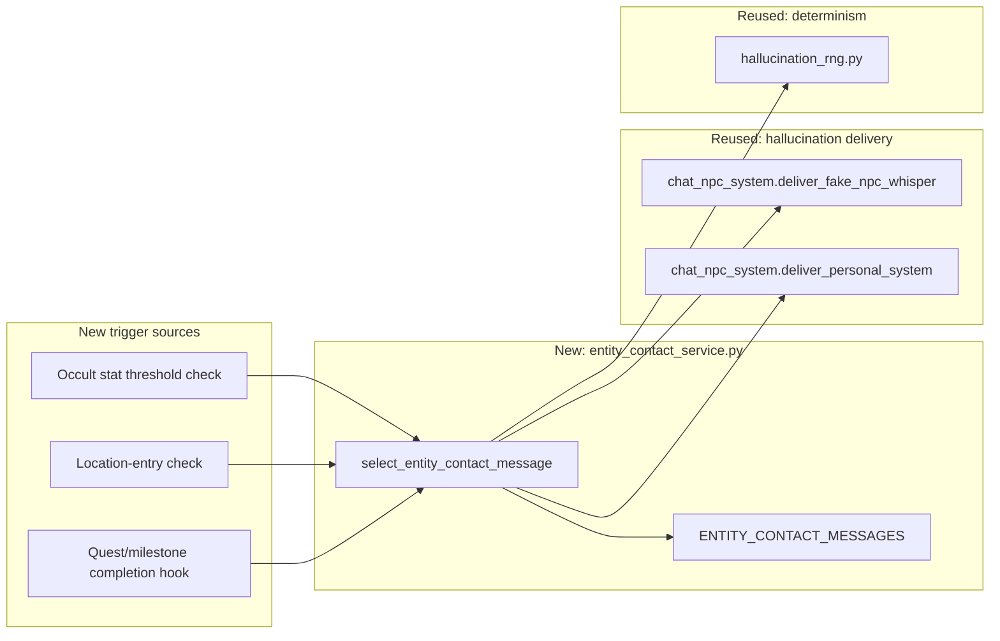

# Entity Contact Subsystem Design

**Version 1.0.0** · MythosMUD · 2026-09-09

---

## AI READING INSTRUCTION

Read `[SPEC]` and `[BUG]` blocks for authoritative facts.
Read `[NOTE]` only if additional context is needed.
`[?]` blocks are unverified — treat with lower confidence.

---

## 1. Overview

**[SPEC]**
**Status:** Planned. Smallest of the design documents filed against `#145` — a new trigger source
and message pool riding entirely on infrastructure the hallucination system already built for
`#714`. No new sender concept, no persistent state, no new delivery path.

`#145` asks for "messages from otherworldly entities." The hallucination system already delivers
messages from invented senders that are lies (`FAKE_NPC_NAMES`,
`server/services/fake_hallucination_service.py:40`). Entity contact is the same delivery shape with
a different, narratively-real-feeling trigger and message pool: **a scripted narrative event, not a
persistent being with memory or the ability to reply.** A design that gave entities state and
recall was considered and rejected — see §4.

## 2. Architecture

**[SPEC]**

**Components:**

- **`entity_contact_service.py`** (`server/services/entity_contact_service.py`, new) — structural
  copy of `FakeHallucinationService` (`server/services/fake_hallucination_service.py:84`):
  `ENTITY_CONTACT_MESSAGES` (an authored pool, distinct in tone from `FAKE_NPC_TELL_MESSAGES` —
  entity contact should read as *directed at the player specifically*, not overheard ambience),
  `select_entity_contact_message(trigger_context) -> str`. Reuses
  `services/hallucination_rng.py`'s shared, seedable RNG so entity-contact tests are deterministic
  the same way hallucination tests are.
- **Trigger sources** (new, one function each, called from existing hooks): a milestone/quest
  completion hook, a location-entry check (parallel to `MovementService
  ._maybe_trigger_room_entry_hallucination`, `server/game/movement_service.py:433`), and an occult
  stat threshold check (reading `Stats` — `server/models/game.py` already tracks `occult`, see the
  `OCC` field at line 85's `StatusEffectType` neighbor). Each is a **new** trigger, not a
  repurposing of `hallucination_frequency_service.py`'s existing tiers — entity contact is gated on
  narrative/progression state, not lucidity tier.
- **Delivery** — no new delivery code. Entity contact reuses
  `chat_npc_system.deliver_fake_npc_whisper` (`server/game/chat_npc_system.py:151`) for
  direct-address contact and `deliver_personal_system`
  (`server/game/chat_npc_system.py:177`) for ambient/environmental contact, identically to how
  `passive_lucidity_flux/hallucinations.py` already uses both.

## 3. Key design decisions

**[SPEC]**

- **Scripted, not stateful.** An entity contact event has no persistent identity: it does not
  remember the player, cannot be replied to meaningfully (any `reply` in-fiction failure uses the
  same `fake_sender_registry.py` mechanism a hallucinated whisper already uses — see
  [SUBSYSTEM_LUCIDITY_DESIGN.md](SUBSYSTEM_LUCIDITY_DESIGN.md) §6), and carries no state between
  triggers. This was chosen over a persistent Entity registry (§4) specifically because a being that
  cannot remember or answer is, in mechanical fact, indistinguishable from a hallucination — which
  is the point, not a limitation. The horror is that the player can never know which one it was.
- **Wire-identical to a hallucinated whisper.** Per ADR-024's server-authority rule, entity contact
  must not carry any marker distinguishing it from a hallucinated fake tell — same event shape, same
  channel, same lack of a distinguishing tag. This is inherited free from reusing
  `deliver_fake_npc_whisper` verbatim rather than building a parallel path.
- **New trigger sources, not new lucidity tiers.** Entity contact is gated on progression state
  (milestones, location, occult knowledge), which is a genuinely different axis from lucidity's
  tier-driven hallucination frequency. Reusing `hallucination_frequency_service.py`'s tier gates
  would make entity contact just another lucidity-tier hallucination flavor, losing the "you did
  something to earn/provoke this" narrative hook `#145`'s "entity contact" bullet implies.

## 4. Alternatives Considered

**[SPEC]**

1. **Special NPC class with a persisted contact ledger** — Considered. Gives entities cross-session
   memory and reuses `NPCCommunicationIntegration.send_whisper_to_player`
   (`server/npc/communication_integration.py:86`) and `#583`'s dialogue trees. Rejected for this
   round as more machinery than the narrative goal requires; revisit if a later design wants
   entities the player can build an ongoing (one-sided) relationship with.
2. **Standalone Entity registry, parallel to NPCs** — Rejected. Duplicates whisper delivery, naming,
   and dialogue plumbing the NPC layer already provides, for a subsystem whose defining trait is
   that it never needs any of NPCs' stateful lifecycle (spawning, movement, combat).
3. **Entities marked as genuinely real, distinguishable from hallucination** — Rejected. Reopens the
   exact truth-leak ADR-024 closed; would require its own ADR amendment analogous to ADR-025's, and
   the narrative case for it (player mastery of "real vs. imagined") is speculative against a
   concrete architectural cost.

## 5. Consequences

**[SPEC]**

- **Positive**: implementable immediately — no dependency on a system that doesn't exist yet, unlike
  the cult and dream documents. Recommended as the first of the six to build.
- **Positive**: zero new client code. Delivery is byte-identical to an existing, already-rendered
  message shape (whisper or system line).
- **Neutral**: because entity contact and hallucination are wire-identical, a player who wants to
  distinguish "the game world spoke to me" from "my mind is lying to me" fundamentally cannot — this
  is the intended horror, not an oversight, but content design should not accidentally write entity
  contact messages that only make narrative sense if the player believes them literally true.

## 6. Related docs

**[SPEC]**

- [ADR-024](../architecture/decisions/ADR-024-server-authoritative-perceived-reality.md) — the
  server-authority rule this subsystem's wire-identical delivery depends on.
- [SUBSYSTEM_LUCIDITY_DESIGN.md](SUBSYSTEM_LUCIDITY_DESIGN.md) §6 — the hallucination delivery
  machinery (`fake_sender_registry.py`, `hallucination_rng.py`, `deliver_fake_npc_whisper`) this
  subsystem reuses wholesale.

## 7. Changelog

**[SPEC]**

| Version | Date | Change |
| --- | --- | --- |
| 1.0.0 | 2026-09-09 | Initial version, filed to close part of `#145`: entity contact as a scripted narrative event reusing hallucination delivery |
