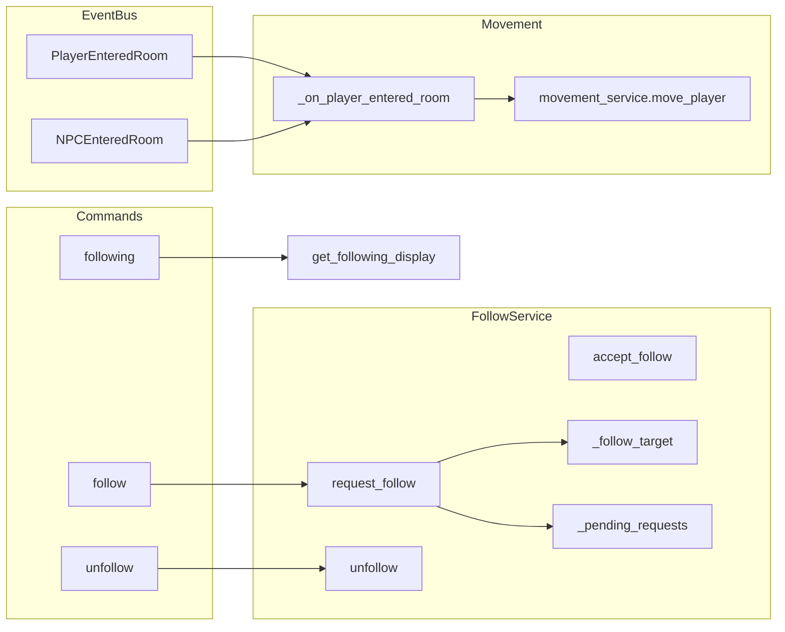

# Follow Subsystem Design

## Overview

The follow subsystem lets a player follow another player or an NPC. State is in-memory only (no
persistence). When the followed entity moves (PlayerEnteredRoom or NPCEnteredRoom), followers are
moved to the same room via MovementService; on move failure or inability to stand, the follower is
auto-unfollowed. Player-to-player follow requires target acceptance: a pending request (60s TTL) and
a follow_request event to the target; NPC follow is immediate.

## Architecture

**Components:**

- **Commands**: [server/commands/follow_commands.py](server/commands/follow_commands.py) – follow
  (target resolved via TargetResolutionService, same as combat), unfollow, following (display).
- **FollowService**: [server/game/follow_service.py](server/game/follow_service.py) – In-memory
  `_follow_target` (follower_id -> (target_id, target_type) or (target_id, target_type, display_name)
  for NPC), `_pending_requests` (request_id -> requestor/target/created_at). Subscribes to
  PlayerEnteredRoom and NPCEnteredRoom; on event, moves each follower via MovementService and
  unfollows on failure.
- **MovementService**: Used to move followers (same room-to-room move as go command).
- **PlayerPositionService**: Used to auto-stand followers (sitting/lying -> standing) before move so
  movement validation passes.
- **ConnectionManager / send_game_event**: Sends command_response, follow_state, follow_request to
  clients.

## Key design decisions

- **In-memory only**: No DB table for follow state; disconnect clears state (on_player_disconnect).
- **NPC follow immediate, player follow request/accept**: Following an NPC is set immediately;
  following a player creates a pending request and sends follow_request to target; target must accept
  (or request expires in 60s).
- **Move on enter**: Followers move only when the followed entity enters a new room (event-driven);
  no polling. Same direction is not used – followers always move to the same to_room_id as the
  leader.
- **Auto-unfollow on move failure**: If movement_service.move_player fails (e.g. combat, posture,
  exit), follower is unfollowed and notified ("You lost your target").
- **Auto-stand before move**: Follow service ensures follower is standing (via
  PlayerPositionService.change_position) before attempting move; if stand fails, unfollow.
- **Idempotency**: If follower is already in event.room_id, skip move and do not unfollow.
- **Mute check**: Before creating a player follow request, target muting the requestor causes
  "They are not accepting follow requests."

## Constraints

- **One follow per player**: A player can only follow one target at a time; must unfollow first.
- **No self-follow**: request_follow rejects when requestor_id == target_id.
- **Same-room resolution**: Target (player or NPC) is resolved in the same room as the requestor
  (TargetResolutionService uses current room).
- **Event must have from_room_id**: Propagation is skipped if event.from_room_id is missing.
- **Dependencies**: EventBus, MovementService, optional UserManager (mute), ConnectionManager,
  AsyncPersistence (display names, room check), PlayerPositionService (auto-stand).

## Component interactions

1. **follow &lt;target&gt;** – Resolve target (player/NPC) in room via TargetResolutionService; call
   follow_service.request_follow. For NPC: set \_follow_target, send follow_state to client. For
   player: mute check, create pending request, send follow_request to target via ConnectionManager.
2. **accept_follow** (from client/API when target accepts) – Pop pending request, set \_follow_target
   (requestor -> target), send result to both players and follow_state to requestor.
3. **PlayerEnteredRoom / NPCEnteredRoom** – FollowService handler gets followers of event.player_id
   or event.npc_id; for each, ensure standing, then movement_service.move_player(from_room_id,
   room_id); on failure or exception, unfollow and send "You lost your target."
4. **unfollow** – Remove from \_follow_target, send follow_state None to client.
5. **on_player_disconnect** – Remove player from \_follow_target and \_pending_requests; remove any
   followers whose target was this player.

## Developer guide

- **New follow type**: Extend TargetType and \_FollowTargetValue; add resolution in follow_commands and
  request_follow branch; ensure event type exists (e.g. NPCEnteredRoom) and is subscribed.
- **Changing TTL**: FOLLOW_REQUEST_TTL_SECONDS in follow_service.py; ensure \_expire_pending_requests
  is called where requests are evaluated (request_follow, accept_follow, decline_follow).
- **Tests**: server/tests/unit/game/test_follow_service.py – follow state, request/accept/decline,
  \_on_player_entered_room move and auto-unfollow, idempotency. Mock MovementService and EventBus.
- **Client**: Client must handle follow_request (show accept/decline UI) and call accept/decline
  endpoint or command; follow_state event updates "who I follow" in UI.

## Troubleshooting

- **"You lost your target"**: Movement failed (combat, posture, no exit, or already in room).
  Check MovementService validation and logs: "Follower lost target (move failed)", "could not
  stand to follow".
- **"Your follow request has expired"**: Target did not accept within 60s; requestor notified on
  next request_follow (which calls \_expire_pending_requests).
- **"They are not accepting follow requests"**: Target has muted the requestor (UserManager
  is_player_muted_async).
- **Follow state not updating on client**: Ensure follow_state event is sent (connection_manager,
  send_game_event) and client subscribes to it.
- **Followers not moving**: Ensure PlayerEnteredRoom/NPCEnteredRoom are published with from_room_id;
  check FollowService is subscribed to EventBus; check movement_service is injected.

See also [GAME_BUG_INVESTIGATION_PLAYBOOK](.cursor/rules/GAME_BUG_INVESTIGATION_PLAYBOOK.mdc).

## Related docs

- [SUBSYSTEM_MOVEMENT_DESIGN.md](SUBSYSTEM_MOVEMENT_DESIGN.md)
- [COMMAND_MODELS_REFERENCE.md](../COMMAND_MODELS_REFERENCE.md)
- [EVENT_OWNERSHIP_MATRIX.md](../EVENT_OWNERSHIP_MATRIX.md)
