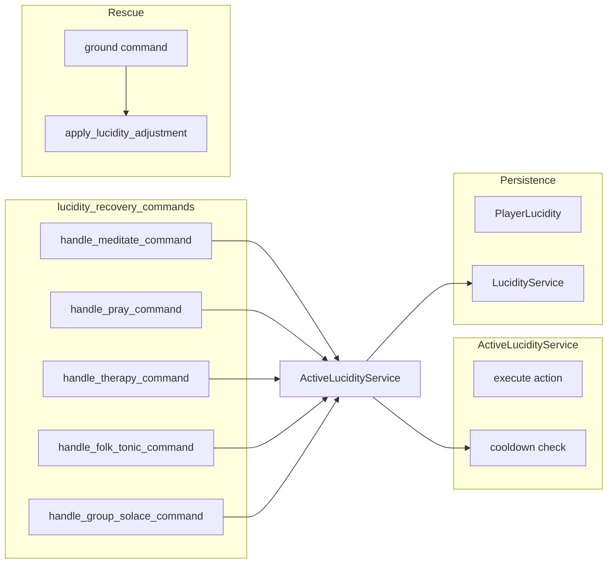

# Lucidity Subsystem Design

## Overview

The lucidity subsystem covers lucidity (LCD) as a stat, lucidity tiers (including catatonic),
recovery rituals (meditate, pray, therapy, folk_tonic, group_solace), and integration with
rescue/ground. ActiveLucidityService runs recovery actions with cooldowns; lucidity_recovery_commands
expose the rituals. Lucidity is stored in PlayerLucidity (or equivalent) and affects Mythos spell
costs and catatonia (rescue/ground). Archived doc docs/archive/lucidity-system.md provides
historical context.

## Architecture

**Components:**

- **lucidity_recovery_commands**: [server/commands/lucidity_recovery_commands.py](server/commands/
  lucidity*recovery_commands.py) – handle_meditate_command, handle_pray_command, handle_therapy*
  command, handle_folk_tonic_command, handle_group_solace_command. Each validates context
  (persistence, player, room), calls ActiveLucidityService (or equivalent) with action code,
  handles LucidityActionOnCooldownError and UnknownLucidityActionError; some actions restore MP
  (meditate, pray) via mp_regeneration_service.
- **ActiveLucidityService**: [server/services/active_lucidity_service.py](server/services/
  active_lucidity_service.py) – Executes lucidity recovery actions with cooldowns; raises
  LucidityActionOnCooldownError, UnknownLucidityActionError.
- **LucidityService**: [server/services/lucidity_service.py](server/services/lucidity_service.py) –
  apply_lucidity_adjustment (reason_code, metadata, location_id); updates PlayerLucidity and
  tier; notifies catatonia_observer when catatonia cleared.
- **Rescue/ground**: Uses LucidityService.apply_lucidity_adjustment to restore catatonic players
  to 1 LCD (see SUBSYSTEM_RESCUE_DESIGN.md).
- **Magic**: Mythos spells may require lucidity and spend lucidity_cost (SpellCostsService).

## Key design decisions

- **Recovery actions with cooldowns**: Each ritual has a cooldown; ActiveLucidityService enforces
  it and returns cooldown_expires_at for message ("Return in N minutes").
- **Room required**: Commands validate player has current_room_id ("Without a locus in space...").
- **MP restore for some actions**: meditate and pray can restore MP via mp_regeneration_service
  after the lucidity action.
- **Tier and catatonia**: PlayerLucidity has current_lcd and current_tier; catatonic tier triggers
  rescue/ground flow; apply_lucidity_adjustment updates tier when crossing thresholds.

## Constraints

- **Action codes**: meditate, pray, therapy, folk_tonic, group_solace (or as defined in
  ActiveLucidityService). Unknown action -> UnknownLucidityActionError.
- **Dependencies**: Persistence, get_async_session, ActiveLucidityService, optional
  mp_regeneration_service; rescue uses LucidityService and send_rescue_update_event.

## Component interactions

1. **meditate / pray / therapy / folk_tonic / group_solace** – Validate persistence and player
   room; call ActiveLucidityService with action code; on cooldown return formatted message; on
   success optionally restore MP (meditate, pray) and return result.
2. **ground** – LucidityService.apply_lucidity_adjustment(reason_code="ground_rescue") to bring
   catatonic target to 1 LCD; tier updates; catatonia_observer notified.
3. **Mythos spell** – SpellCostsService checks and applies lucidity_cost; can_cast_spell in
   MagicService validates current lucidity.

## Developer guide

- **New recovery action**: Add action code to ActiveLucidityService (cooldown and effect); add
  handle\_\*\_command in lucidity_recovery_commands and register in command_service.
- **Changing cooldowns**: Cooldown logic lives in ActiveLucidityService; adjust per action code.
- **Tests**: Unit tests for ActiveLucidityService (cooldown, unknown action); integration tests
  for commands with mocked service.
- **Client**: Cooldown message format ("Return in N minutes") is in \_format_cooldown_message.

## Troubleshooting

- **"The sigils are still cooling"**: Cooldown active; \_format_cooldown_message shows remaining
  time; ensure server and client time are consistent (UTC).
- **"The ritual falters"**: Persistence or player validation failed; check persistence and
  current_room_id.
- **UnknownLucidityActionError**: Action code not registered in ActiveLucidityService; check
  command_data and action code string.

See also [SUBSYSTEM_RESCUE_DESIGN.md](SUBSYSTEM_RESCUE_DESIGN.md), [SUBSYSTEM_MAGIC_DESIGN.md]
(SUBSYSTEM_MAGIC_DESIGN.md). Archived: [docs/archive/lucidity-system.md](../archive/lucidity-system.md).

## Related docs

- [COMMAND_MODELS_REFERENCE.md](../COMMAND_MODELS_REFERENCE.md)
