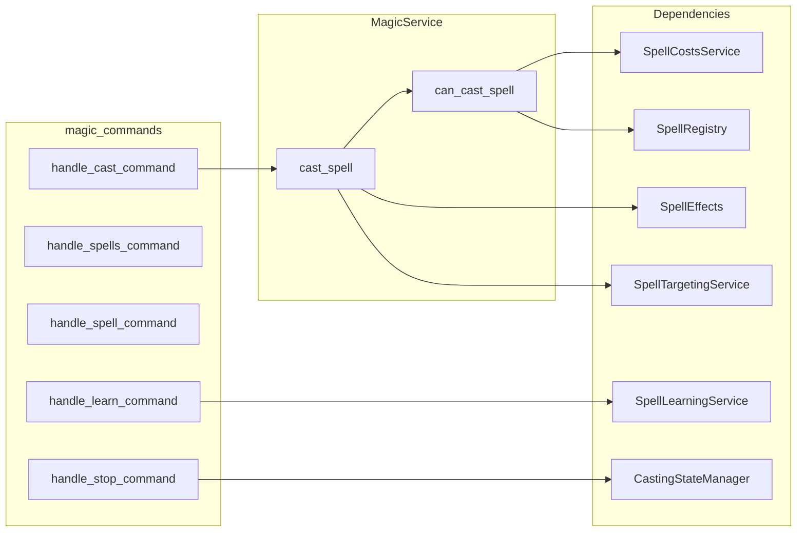

# Magic Subsystem Design

## Overview

The magic subsystem handles spellcasting: spell lookup (SpellRegistry), MP and lucidity costs
(SpellCostsService), targeting (SpellTargetingService), effect execution (SpellEffects), casting
state (CastingStateManager), and learning (SpellLearningService). Commands: cast, spells, spell,
learn, stop. Rest is interrupted when casting. Incapacitated players (DP <= 0) cannot cast. Mythos
spells can require lucidity; materials may be consumed. The server is authoritative for all
cast checks and effect application.

## Architecture

**Components:**

- **magic_commands**: [server/commands/magic_commands.py](server/commands/magic_commands.py) –
  MagicCommandHandler: handle_cast_command (incapacitated check, rest interrupt, spell_name/target,
  magic_service.cast_spell, announce); handle_spells_command, handle_spell_command (list/info);
  handle_learn_command (SpellLearningService); handle_stop_command (stop casting).
- **MagicService**: [server/game/magic/magic_service.py](server/game/magic/magic_service.py) –
  can_cast_spell (player, MP, lucidity for Mythos, materials); cast_spell (validate, target
  resolution, cost application, effect execution via SpellEffects, mastery/learning hooks).
- **SpellRegistry**: [server/game/magic/spell_registry.py](server/game/magic/spell_registry.py) –
  Spell lookup by name/id.
- **SpellEffects**: [server/game/magic/spell_effects.py](server/game/magic/spell_effects.py) –
  Effect execution (damage, heal, etc.) per spell type.
- **SpellTargetingService**: [server/game/magic/spell_targeting.py](server/game/magic/spell_targeting.py) –
  Resolve target (self, room, NPC, player) for spell.
- **SpellCostsService**: [server/game/magic/spell_costs.py](server/game/magic/spell_costs.py) –
  Apply MP and lucidity costs.
- **SpellMaterialsService**: [server/game/magic/spell_materials.py](server/game/magic/spell_materials.py) –
  Consume materials if required.
- **CastingStateManager**: [server/game/magic/casting_state_manager.py](server/game/magic/
  casting_state_manager.py) – Track active casting (e.g. for /stop).
- **SpellLearningService**: [server/game/magic/spell_learning_service.py](server/game/magic/
  spell_learning_service.py) – Learn spells (teach, books, etc.).
- **MP regeneration**: [server/game/magic/mp_regeneration_service.py](server/game/magic/
  mp_regeneration_service.py) – MP regen over time/tick.

## Key design decisions

- **Server authority**: All validation (can_cast_spell) and effect application (SpellEffects) on
  server; client displays results from command_response and room/game state.
- **Rest interrupt**: Cast command cancels rest (same pattern as combat/movement) so player can cast.
- **Incapacitated block**: current_dp <= 0 blocks cast with "You are incapacitated and cannot cast
  spells."
- **Mythos spells**: can_cast_spell checks spell.requires_lucidity() and lucidity_cost; SpellCosts
  applies lucidity cost.
- **Targeting**: SpellTargetingService resolves target_name to TargetMatch (self, player, NPC,
  room) per spell requirements.
- **Costs first**: MP and materials are checked and applied before effect; effect runs only after
  cost application.

## Constraints

- **Spell known**: cast_spell validates player knows spell (player_spell_repository or equivalent).
- **Room/visibility**: Targeting and effect scope may depend on room (same room, line of sight) per
  spell_targeting and spell_effects.
- **Dependencies**: PlayerService, persistence, SpellRegistry, SpellEffects, SpellTargetingService,
  SpellCostsService, SpellMaterialsService, CastingStateManager, optional SpellLearningService and
  CombatService.

## Component interactions

1. **cast &lt;spell&gt; [target]** – Get player; incapacitated check; rest interrupt; magic_service
   .cast_spell(player_id, spell_name, target_name). cast_spell: can_cast_spell; resolve target;
   apply costs (MP, lucidity, materials); execute effect via SpellEffects; update mastery/learning;
   return success/message. Command then announces and returns result.
2. **spells / spell** – List known spells or spell info from registry/player_spell_repository.
3. **learn** – SpellLearningService (teach, book, or other source).
4. **stop** – CastingStateManager stop casting (cancel in-progress cast).

## Developer guide

- **New spell**: Add to Spell registry/data; implement effect in SpellEffects; set MP/lucidity cost
  and targeting rules; ensure can_cast_spell and cast_spell handle the spell.
- **New effect type**: Extend SpellEffects; call from cast_spell with target and context.
- **New cost**: Extend SpellCostsService or spell model (lucidity, materials); can_cast_spell and
  cast_spell must check and apply.
- **Tests**: server/tests/unit/game/magic/, server/tests/unit/commands/ for magic_commands; mock
  MagicService and persistence.

## Troubleshooting

- **"Not enough magic points"**: can_cast_spell checks current_mp >= spell.mp_cost; ensure stats
  (magic_points, max_magic_points) are set and normalized (e.g. full MP at creation).
- **"You are incapacitated"**: current_dp <= 0; same as combat.
- **Spell not found / cannot cast**: Spell not in registry or player doesn't know spell; check
  SpellRegistry and player spell list.
- **Target invalid**: SpellTargetingService returns no match or wrong type; check targeting rules
  and room/visibility.
- **Rest not interrupting**: \_interrupt_rest_for_cast needs app/connection_manager; ensure handler
  or magic_service has \_app_instance set if used.

See also [SUBSYSTEM_REST_DESIGN.md](SUBSYSTEM_REST_DESIGN.md), [SUBSYSTEM_STATUS_EFFECTS_DESIGN.md]
(SUBSYSTEM_STATUS_EFFECTS_DESIGN.md), [GAME_BUG_INVESTIGATION_PLAYBOOK](.cursor/rules/
GAME_BUG_INVESTIGATION_PLAYBOOK.mdc). Archived: [docs/archive/MAGIC_SYSTEM_FEATURE_PLAN.md]
(../archive/MAGIC_SYSTEM_FEATURE_PLAN.md).

## Related docs

- [COMMAND_MODELS_REFERENCE.md](../COMMAND_MODELS_REFERENCE.md)
