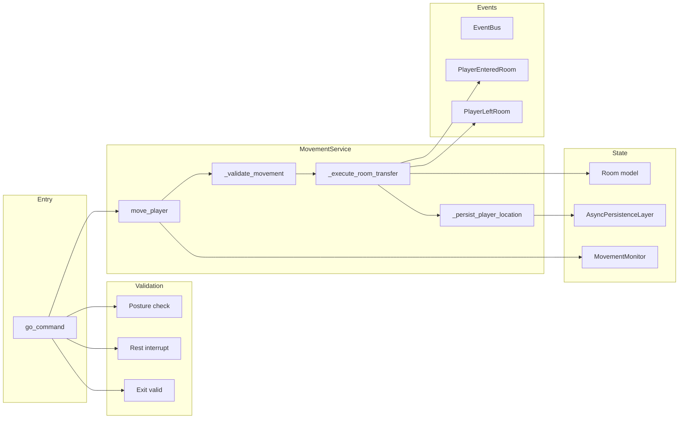

# Movement Subsystem Design

## Overview

The movement subsystem handles atomic player movement between rooms. It ensures a player is never in
multiple rooms simultaneously (ACID-style semantics), validates exits, enforces combat and posture
constraints, persists location, and triggers real-time events so clients see arrivals and departures.
Movement is foundational: follow, NPC population, and room visibility all depend on it.

## Architecture

**Components:**

- **Command**: [server/commands/go_command.py](server/commands/go_command.py) – Parses direction, resolves
  player/room, validates posture and rest, resolves exit, calls MovementService.
- **MovementService**: [server/game/movement_service.py](server/game/movement_service.py) – Single
  authority for `move_player`, `add_player_to_room`, `remove_player_from_room`, `get_player_room`,
  `get_room_players`, `validate_player_location`. Uses an RLock for thread-safe movement.
- **MovementMonitor**: [server/game/movement_monitor.py](server/game/movement_monitor.py) – Singleton;
  records attempts, success/failure, timing, room occupancy; optional integrity checks and alerts.
- **Room model**: [server/models/room.py](server/models/room.py) – `player_entered()`, `player_left()`,
  `add_player_silently()`; `player_entered(force_event=True)` emits EventBus events.
- **Persistence**: Player’s `current_room_id` is updated and saved via AsyncPersistenceLayer.
- **InstanceManager** (optional): Tutorial exit handling: when player moves to instance exit room,
  `tutorial_instance_id` is cleared and instance destroyed.

## Key design decisions

- **Server authority**: Only the server decides if a move succeeds; client sends direction only.
- **Atomic move**: Under a single lock: validate → remove from source room → add to destination room →
  persist. No intermediate state where the player is in two rooms or none.
- **Movement blocked in combat**: If `PlayerCombatService.is_player_in_combat_sync()` is true, movement
  fails (validation returns false).
- **Only standing posture**: Movement allowed only when player stats `position` is `"standing"`. Sitting
  or lying must be cleared (e.g. stand command or follow auto-stand) before going.
- **Rest interrupt on go**: If the player is resting, the go command cancels rest (via
  `_cancel_rest_countdown`) and then continues with movement.
- **Exit validation**: Room must have an exit in the given direction whose target room exists in
  persistence (instance-aware via InstanceManager when present).
- **Tutorial exit**: When moving to the instance’s configured exit room, the service clears
  `tutorial_instance_id` and destroys the instance (ADR-009).

## Constraints

- **Same room**: Moving to the same room is rejected (validation returns false).
- **Player in source room**: Player must be in `from_room` (in-memory or DB reconciliation via
  `_validate_player_room_membership`).
- **No duplicate occupancy**: Destination room must not already contain the player.
- **Valid exit**: `from_room.exits[direction] == to_room_id`.
- **Dependencies**: Requires AsyncPersistenceLayer; optional PlayerCombatService, ExplorationService,
  InstanceManager. Exploration marking is best-effort (non-blocking on failure).
- **Thread safety**: All move operations use `MovementService._lock` (RLock).

## Component interactions

1. **go command** → Gets app container (persistence, connection_manager, movement_service). Validates
   posture (standing), interrupts rest if needed, resolves exit from current room, then calls
   `movement_service.move_player(player_id, from_room_id, to_room_id)`.
2. **MovementService.move_player** → Under lock: resolve player, validate (combat, posture, room
   membership, exit), `from_room.player_left()`, `to_room.player_entered(..., force_event=True,
from_room_id=...)`, `save_player` (current_room_id), optional tutorial exit and exploration mark;
   records result on MovementMonitor.
3. **Room.player_entered** → Updates in-memory player set; if `force_event`, publishes
   PlayerEnteredRoom (and source room publishes PlayerLeftRoom) to EventBus.
4. **EventBus** → Real-time layer subscribes; NATS/WebSocket broadcast to room (see
   EVENT_OWNERSHIP_MATRIX, NATS_SUBJECT_PATTERNS). Follow subsystem subscribes to PlayerEnteredRoom
   to move followers.

## Developer guide

- **Adding a new movement blocker**: Extend `_validate_movement()` in MovementService (e.g. new check
  similar to `_check_combat_state` or `_check_player_posture`). Keep validation synchronous where
  possible to avoid holding the lock across awaits except for existing async steps.
- **New “go” alias or direction**: Register the same handler in CommandService; ensure direction is
  normalized (e.g. lowercase) and mapped in room exits.
- **Instanced rooms**: Room lookup is already instance-first (InstanceManager) when present. New
  instance types should set player state (e.g. instance id) and use the same exit pattern; clear
  instance state when moving to the configured exit room.
- **Tests**: Unit tests in `server/tests/unit/game/` for MovementService and MovementMonitor;
  integration tests for go command and EventBus/NATS propagation. Use `reset_movement_monitor()` in
  tests to avoid cross-test metric leakage.

## Troubleshooting

- **“You can't go that way”**: Exit missing for direction, or target room not found (check room IDs
  and instance remapping). Logs: `"No valid exit"`, `"Exit validation failed - room ID mismatch"`,
  `"target room not found"`.
- **Movement blocked (posture)**: Player not standing. Log: `"Movement blocked due to posture"`.
  Ensure stand/lie/sit and follow auto-stand are applied before move.
- **Movement blocked (combat)**: Log: `"COMBAT CHECK: BLOCKING MOVEMENT - Player is in combat"`.
  Resolve combat or flee before moving.
- **Player not in source room**: Log: `"Player not in room"` or `"Player not in expected room"`.
  Can indicate DB vs in-memory room mismatch; `_validate_player_room_membership` may add player
  to room if DB says they are in that room.
- **Slow moves**: Check MovementMonitor metrics (`get_metrics()`, `get_performance_summary()`):
  `lock_wait_ms`, `player_lookup_ms`, `room_update_ms`, `db_write_ms`. Alerts when failure rate or
  avg time exceeds thresholds.
- **Integrity**: `MovementMonitor.validate_room_integrity(rooms)` checks for players in multiple rooms
  or orphaned players. Use for debugging duplicate occupancy.

See also [GAME_BUG_INVESTIGATION_PLAYBOOK](.cursor/rules/GAME_BUG_INVESTIGATION_PLAYBOOK.mdc) and
[MYTHOSMUD_DEBUGGING_AGENT](.cursor/rules/MYTHOSMUD_DEBUGGING_AGENT.mdc).

## Related docs

- [COMMAND_MODELS_REFERENCE.md](../COMMAND_MODELS_REFERENCE.md)
- [EVENT_OWNERSHIP_MATRIX.md](../EVENT_OWNERSHIP_MATRIX.md)
- [NATS_SUBJECT_PATTERNS.md](../NATS_SUBJECT_PATTERNS.md)
- [ADR-009: Instanced rooms](../architecture/decisions/ADR-009-instanced-rooms.md)
