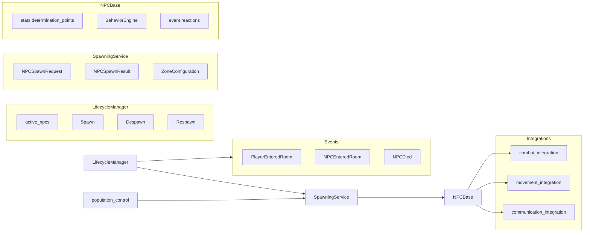

# NPC Subsystem Design

## Overview

The NPC subsystem manages non-player characters: definitions (NPCDefinition), lifecycle (spawn,
active, despawn, respawn), spawning (NPCSpawningService, spawn rules, zone configuration),
behavior (NPCBase, AggressiveMobNPC, PassiveMobNPC, ShopkeeperNPC, BehaviorEngine), and
integrations (combat, movement, communication). LifecycleManager holds active_npcs and
coordinates spawning/despawning; population control reacts to PlayerEnteredRoom/PlayerLeftRoom.
Combat targets NPCs; follow can target NPCs; NPCs can react to player_entered_room and player_left_room.

## Architecture

**Components:**

- **lifecycle_manager**: [server/npc/lifecycle_manager.py](server/npc/lifecycle_manager.py) –
  NPCLifecycleManager: active_npcs (npc_id -> NPCBase), lifecycle records (NPCLifecycleRecord),
  states (SPAWNING, ACTIVE, INACTIVE, DESPAWNING, DESPAWNED, RESPAWNING, ERROR). Spawn/despawn/
  respawn orchestration; subscribes to events; integrates with SpawningService and
  NPCPopulationController.
- **spawning_service**: [server/npc/spawning_service.py](server/npc/spawning_service.py) –
  NPCSpawnRequest, NPCSpawnResult, spawn logic (room, rules, zone config); builds NPC instances
  (AggressiveMobNPC, PassiveMobNPC, ShopkeeperNPC) from NPCDefinition.
- **npc_base**: [server/npc/npc_base.py](server/npc/npc_base.py) – NPCBase: npc_id, definition,
  current_room, spawn_room_id, \_alive, \_stats (determination_points), \_behavior_config,
  BehaviorEngine, event_reaction_system. Subclasses: AggressiveMobNPC, PassiveMobNPC,
  ShopkeeperNPC (in behaviors.py).
- **behavior_engine**: [server/npc/behavior_engine.py](server/npc/behavior_engine.py) – Executes
  behavior config (idle, combat, etc.).
- **combat_integration**: [server/npc/combat_integration.py](server/npc/combat_integration.py) –
  NPCCombatIntegration: calculate_damage; used by combat command and NPCCombatIntegrationService.
- **movement_integration**: [server/npc/movement_integration.py](server/npc/movement_integration.py) –
  NPC movement (e.g. idle movement, follow room exits).
- **communication_integration**: [server/npc/communication_integration.py](server/npc/
  communication_integration.py) – NPC say/emote/response.
- **event_reaction_system**: [server/npc/event_reaction_system.py](server/npc/
  event_reaction_system.py) – Reactions to PlayerEnteredRoom, PlayerLeftRoom (greeting, farewell).
- **population_control**: [server/npc/population_control.py](server/npc/population_control.py) –
  Subscribes to PlayerEnteredRoom/PlayerLeftRoom; adjusts population per zone (ZoneConfiguration).
- **zone_configuration**: [server/npc/zone_configuration.py](server/npc/zone_configuration.py) –
  Zone and spawn rules.
- **Commands**: look_npc, npc_admin_commands (npc command for admin spawn/despawn/list).

## Key design decisions

- **In-memory instances**: Active NPCs live in lifecycle_manager.active_npcs; definitions in DB
  (NPCDefinition); no persistence of instance state except as needed (e.g. respawn timer).
- **Determination points**: NPC stats use determination_points (legacy hp/dp supported); \_alive
  and is_alive reflect death.
- **Spawn rules**: NPCSpawnRule and zone config drive when/where NPCs spawn; population control
  reacts to player presence.
- **Event-driven**: NPCEnteredRoom, NPCLeftRoom, NPCDied published by lifecycle/movement; follow
  and population control subscribe.
- **Combat**: Player attacks NPC via TargetResolutionService (same room, NPC type); NPCCombatIntegrationService
  and combat_integration apply damage; NPC death triggers NPCDied and despawn/respawn logic.

## Constraints

- **Same room for target**: Combat and follow resolve NPC in player's current room.
- **NPC instance from lifecycle**: Commands and combat get NPC from get_npc_instance_service()
  .lifecycle_manager.active_npcs[npc_id].
- **Dependencies**: EventBus, AsyncPersistence (room, definitions), SpawningService, population
  control, zone config.

## Component interactions

1. **Player enters room** – Population control may request spawns for zone; SpawningService spawns
   NPCs; LifecycleManager adds to active_npcs; NPC event reactions (greeting) may fire.
2. **Combat attack** – Target resolved to NPC in room; \_get_npc_instance(npc_id) from lifecycle;
   NPCCombatIntegrationService.handle_player_attack_on_npc applies damage; if NPC dies, NPCDied
   and despawn/respawn per lifecycle.
3. **Follow NPC** – FollowService.request_follow with target_type "npc"; on NPCEnteredRoom,
   followers moved via MovementService (same as follow player).
4. **npc admin** – Admin command for spawn/despawn/list; uses lifecycle and spawning services.

## Developer guide

- **New NPC type**: Subclass NPCBase (or use existing PassiveMobNPC, AggressiveMobNPC,
  ShopkeeperNPC); register in SpawningService spawn builder; add spawn rules if needed.
- **New behavior**: Extend BehaviorEngine and behavior_config; add to NPC definition.
- **New event reaction**: Add template in event_reaction_system; wire in npc_base to event
  (PlayerEnteredRoom, PlayerLeftRoom).
- **Tests**: server/tests/unit/npc/ for lifecycle, spawning, behavior; combat and follow
  integration tests.

## Troubleshooting

- **"Target not found" / NPC not in room**: NPC must be in active_npcs and in same room as player;
  check lifecycle_manager.active_npcs and current_room.
- **NPC not spawning**: Check zone config and spawn rules; population control and
  PlayerEnteredRoom subscription; SpawnValidator and room capacity.
- **NPC not reacting**: Event reaction system must be set on NPC and event (e.g. greeting)
  configured in definition/behavior_config.
- **Combat NPC dead but still targetable**: Ensure is_alive is False and combat/look reject dead
  NPCs; lifecycle should despawn or mark dead.

See also [SUBSYSTEM_COMBAT_DESIGN.md](SUBSYSTEM_COMBAT_DESIGN.md), [SUBSYSTEM_FOLLOW_DESIGN.md]
(SUBSYSTEM_FOLLOW_DESIGN.md), [GAME_BUG_INVESTIGATION_PLAYBOOK](.cursor/rules/
GAME_BUG_INVESTIGATION_PLAYBOOK.mdc).

## Related docs

- [EVENT_OWNERSHIP_MATRIX.md](../EVENT_OWNERSHIP_MATRIX.md)
- [COMMAND_MODELS_REFERENCE.md](../COMMAND_MODELS_REFERENCE.md)
