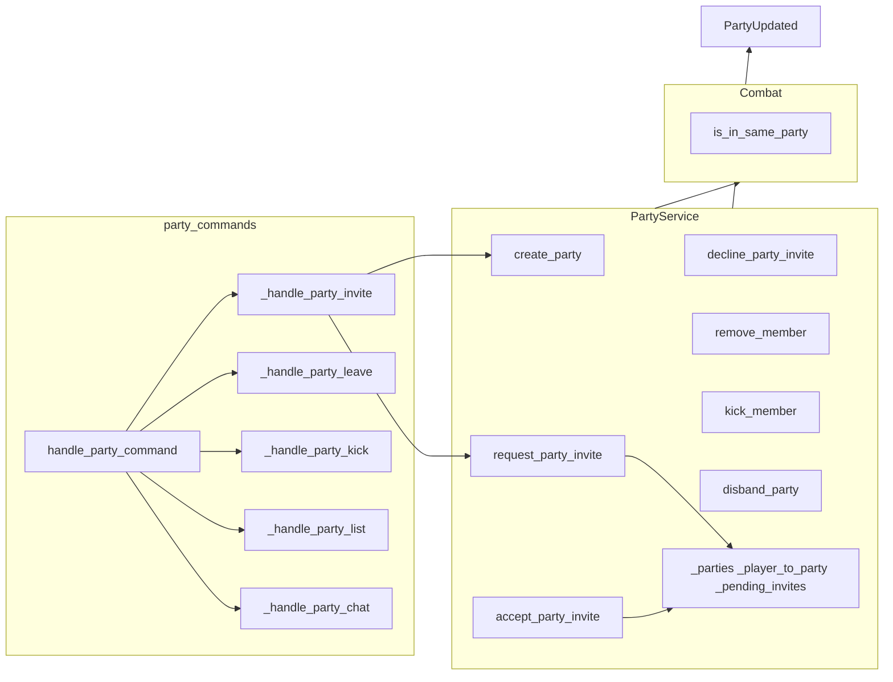

# Party Subsystem Design

## Overview

The party subsystem provides in-memory, ephemeral groups: a leader can form a party, invite
(same-room players, with accept/decline), kick, and disband; members can leave. State is not
persisted; disconnect removes the player from their party and disbands the party if they were
leader. Party invites use a 60-second TTL and party_invite event to the target; combat uses
is_in_same_party to block attacking party members. PartyUpdated events are emitted for client sync.

## Architecture

**Components:**

- **party_commands**: [server/commands/party_commands.py](server/commands/party_commands.py) –
  handle_party_command: subcommand invite|leave|kick|list or party &lt;message&gt; (party chat).
  Invite/kick use TargetResolutionService (same room, player only). Invite creates party if
  leader has none, then request_party_invite; leave/kick/list call PartyService methods.
  Party chat uses chat_service.send_party_message(player_id_str, message, party_id).
- **PartyService**: [server/game/party_service.py](server/game/party_service.py) – _parties
  (party_id -> Party), \_player_to_party (player_id -> party_id), \_pending_invites (invite_id ->
  inviter/target/party_id/created_at). Party dataclass: party_id, leader_id, member_ids (set).
  create_party, disband_party, add_member, remove_member (leader leave = disband), kick_member,
  request_party_invite (sends party_invite event), accept_party_invite, decline_party_invite,
  get_party_for_player, get_party_members, is_in_same_party. Emits PartyUpdated; on_player_
  disconnect cleans state and notifies.
- **Combat**: CombatValidator uses party_service.is_in_same_party to block attacking a party
  member (when party-friendly rules apply).
- **ChatService**: send_party_message for party chat (NATS/room-scoped to party).

## Key design decisions

- **In-memory only**: No DB; parties and invites disappear on server restart or disconnect.
- **Invite requires acceptance**: request_party_invite creates pending invite and sends party_invite
  to target; target must accept or decline (60s TTL).
- **Leader-only invite/kick/disband**: Only leader can invite, kick, or disband; members can only
  leave.
- **Leader leave = disband**: remove_member when leader leaves disbands party and notifies others.
- **Same-room resolution**: Invite and kick resolve target in current room via TargetResolutionService
  (player only, not NPC).
- **PartyUpdated event**: Emitted on create, disband, member_joined, member_left so clients can
  refresh party UI.

## Constraints

- **One party per player**: create_party and add_member fail if player already in a party.
- **Invite target not in party**: Target must not be in any party to receive invite.
- **Pending invite TTL**: 60 seconds; \_expire_pending_invites notifies inviter on next party action.
- **Dependencies**: EventBus, ConnectionManager (send_personal_message, send_game_event),
  AsyncPersistence (display names, optional), ChatService (party chat).

## Component interactions

1. **party invite &lt;name&gt;** – If no party, create_party(leader_id). Resolve target (player, same
   room). request_party_invite -> \_pending_invites, send party_invite to target. Target accepts
   -> add_member, notify both; decline -> notify inviter.
2. **party leave** – remove_member(party_id, player_id). If leader, disband and notify others.
3. **party kick &lt;name&gt;** – Leader only. Resolve target in party; kick_member; notify kicked
   player via \_notify_player_removed_from_party.
4. **party list** – get_party_for_player; list members with (leader) suffix; return formatted.
5. **party &lt;message&gt;** – get_party_for_player; chat_service.send_party_message(player_id,
   message, party_id).
6. **Combat** – Before applying attack, CombatValidator checks is_in_same_party(attacker, target);
   if true, block with "cannot attack party member" (or equivalent).

## Developer guide

- **Adding party-scoped logic**: Use get_party_for_player or get_party_members; for same-party
  checks use is_in_same_party. Call on_player_disconnect from session cleanup.
- **Changing TTL**: PARTY_INVITE_TTL_SECONDS in party_service.py; \_expire_pending_invites runs on
  invite/accept/decline.
- **Tests**: Unit tests for PartyService (create, add, remove, kick, disband, invite flow, disconnect);
  party_commands with mocked container and TargetResolutionService.
- **Client**: Handle party_invite (accept/decline UI), PartyUpdated (refresh party list/state).

## Troubleshooting

- **"You can only invite players"**: Target resolved as NPC; TargetResolutionService must return
  PLAYER for invite.
- **"That player is already in a party"**: Target in \_player_to_party; they must leave or be
  kicked first.
- **Invite not received**: Check party*invite event is sent via connection_manager.send_personal*
  message; client must handle event type.
- **Combat allowing party attack**: Ensure CombatValidator receives party_service and calls
  is_in_same_party; check party_service is same instance as command layer.

See also [SUBSYSTEM_COMBAT_DESIGN.md](SUBSYSTEM_COMBAT_DESIGN.md) and
[GAME_BUG_INVESTIGATION_PLAYBOOK](.cursor/rules/GAME_BUG_INVESTIGATION_PLAYBOOK.mdc). Archived:
[docs/archive/PARTY_SYSTEM_REFERENCE.md](../archive/PARTY_SYSTEM_REFERENCE.md).

## Related docs

- [COMMAND_MODELS_REFERENCE.md](../COMMAND_MODELS_REFERENCE.md)
- [EVENT_OWNERSHIP_MATRIX.md](../EVENT_OWNERSHIP_MATRIX.md)
