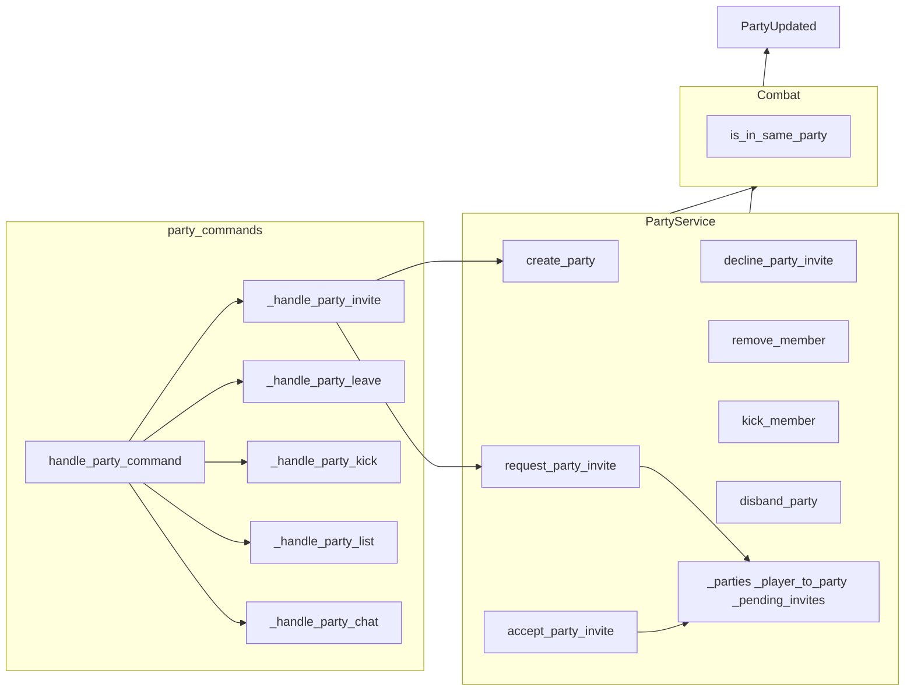

# Party Subsystem Design

**Version 1.2.0** · MythosMUD · 2026-09-20

---

## AI READING INSTRUCTION

Read `[SPEC]` and `[BUG]` blocks for authoritative facts.
Read `[NOTE]` only if additional context is needed.
`[?]` blocks are unverified — treat with lower confidence.

---

## 1. Overview

**[NOTE]**
The party subsystem provides in-memory, ephemeral groups: a leader can form a party, invite
(same-room players, with accept/decline), kick, and disband; members can leave. State is not
persisted; disconnect removes the player from their party and disbands the party if they were
leader. Party invites use a 60-second TTL and party_invite event to the target. PartyUpdated
events are emitted for client sync.

**[BUG]** `CombatValidator.is_in_same_party` (`server/validators/combat_validator.py`) exists as
a same-party check but has no production caller — melee player-vs-player combat does not exist
(non-NPC targets are rejected outright), so nothing ever calls it outside its own unit tests.
Friendly fire between party members is **not currently blocked** anywhere. The one live gap is
hostile spells targeting a player (`server/game/magic/spell_effects.py`), which has no party
check either. See §9 "Not implemented" for tracking.

## 2. Architecture

**[NOTE]**

```mermaid
flowchart LR
  subgraph commands [party_commands]
    PartyCmd[handle_party_command]
    Invite[_handle_party_invite]
    Leave[_handle_party_leave]
    Kick[_handle_party_kick]
    List[_handle_party_list]
    PartyChat[_handle_party_chat]
  end
  subgraph service [PartyService]
    Create[create_party]
    InviteReq[request_party_invite]
    Accept[accept_party_invite]
    Decline[decline_party_invite]
    Remove[remove_member]
    KickMember[kick_member]
    Disband[disband_party]
    State[_parties _player_to_party _pending_invites]
  end
  subgraph combat [Combat]
    is_in_same_party[is_in_same_party]
  end
  PartyCmd --> Invite
  PartyCmd --> Leave
  PartyCmd --> Kick
  PartyCmd --> List
  PartyCmd --> PartyChat
  Invite --> Create
  Invite --> InviteReq
  InviteReq --> State
  Accept --> State
  service --> PartyUpdated
  service --> combat
```

**Components:**

- **party_commands**: [server/commands/party_commands.py](../../server/commands/party_commands.py) –
  handle_party_command: subcommand invite|leave|kick|list or party &lt;message&gt; (party chat).
  Invite/kick use TargetResolutionService (same room, player only). Invite creates party if
  leader has none, then request_party_invite; leave/kick/list call PartyService methods.
  Party chat uses chat_service.send_party_message(player_id_str, message, party_id).
- **PartyService**: [server/game/party_service.py](../../server/game/party_service.py) – _parties
  (party_id -> Party), \_player_to_party (player_id -> party_id), \_pending_invites (invite_id ->
  inviter/target/party_id/created_at). Party dataclass: party_id, leader_id, member_ids (set).
  create_party, disband_party, add_member, remove_member (leader leave = disband), kick_member,
  request_party_invite (sends party_invite event), accept_party_invite, decline_party_invite,
  get_party_for_player, get_party_members, is_in_same_party. Emits PartyUpdated; on_player_
  disconnect cleans state and notifies.
- **Combat**: CombatValidator accepts a party_service and exposes is_in_same_party for a
  same-party attack check, but nothing calls it in production — see §1 [BUG] and §9.
- **ChatService**: send_party_message for party chat (NATS/room-scoped to party).

## 3. Key design decisions

**[SPEC]**

- **In-memory only**: No DB; parties and invites disappear on server restart or disconnect.
- **Invite requires acceptance**: request_party_invite creates pending invite and sends party_invite
  to target; target must accept or decline (60s TTL).
- **Leader-only invite/kick/disband**: Only leader can invite, kick, or disband; members can only
  leave.
- **Leader leave = disband**: remove_member when leader leaves disbands party and notifies others.
- **Same-room resolution**: Invite and kick resolve target in current room via TargetResolutionService
  (player only, not NPC).
- **PartyUpdated event**: Emitted on create, disband, member_joined, member_left so clients can
  refresh party UI.

## 4. Constraints

**[SPEC]**

- **One party per player**: create_party and add_member fail if player already in a party.
- **Invite target not in party**: Target must not be in any party to receive invite.
- **Pending invite TTL**: 60 seconds; \_expire_pending_invites notifies inviter on next party action.
- **Dependencies**: EventBus, ConnectionManager (send_personal_message, send_game_event),
  AsyncPersistence (display names, optional), ChatService (party chat).

## 5. Component interactions

**[SPEC]**

1. **party invite &lt;name&gt;** – If no party, create_party(leader_id). Resolve target (player, same
   room). request_party_invite -> \_pending_invites, send party_invite to target. Target accepts
   -> add_member, notify both; decline -> notify inviter.
2. **party leave** – remove_member(party_id, player_id). If leader, disband and notify others.
3. **party kick &lt;name&gt;** – Leader only. Resolve target in party; kick_member; notify kicked
   player via \_notify_player_removed_from_party.
4. **party list** – get_party_for_player; list members with (leader) suffix; return formatted.
5. **party &lt;message&gt;** – get_party_for_player; chat_service.send_party_message(player_id,
   message, party_id).
6. **Combat (not wired)** – CombatValidator.is_in_same_party(attacker, target) exists to block
   attacking a party member, but no combat or spell path calls it. See §1 [BUG] and §9.

## 6. Developer guide

**[SPEC]**

- **Adding party-scoped logic**: Use get_party_for_player or get_party_members; for same-party
  checks use is_in_same_party. Call on_player_disconnect from session cleanup.
- **Changing TTL**: PARTY_INVITE_TTL_SECONDS in party_service.py; \_expire_pending_invites runs on
  invite/accept/decline.
- **Tests**: Unit tests for PartyService (create, add, remove, kick, disband, invite flow, disconnect);
  party_commands with mocked container and TargetResolutionService.
- **Client**: Handle party_invite (accept/decline UI), PartyUpdated (refresh party list/state).

## 7. Troubleshooting

**[NOTE]**

- **"You can only invite players"**: Target resolved as NPC; TargetResolutionService must return
  PLAYER for invite.
- **"That player is already in a party"**: Target in \_player_to_party; they must leave or be
  kicked first.
- **Invite not received**: Check party*invite event is sent via connection_manager.send_personal*
  message; client must handle event type.
- **Party members can attack each other**: This is current behavior, not a bug to fix locally.
  `is_in_same_party` is never called (no melee PvP, spell path unguarded) — see §1 [BUG]. Do not
  "fix" this by re-wiring the validator without also confirming the target issue in §9 is being
  worked; wiring it half-done for one call site but not others creates an inconsistent rule.

See also [SUBSYSTEM_COMBAT_DESIGN.md](SUBSYSTEM_COMBAT_DESIGN.md) and
[GAME_BUG_INVESTIGATION_PLAYBOOK](../../.cursor/rules/GAME_BUG_INVESTIGATION_PLAYBOOK.mdc). Archived:
[docs/archive/PARTY_SYSTEM_REFERENCE.md](../archive/PARTY_SYSTEM_REFERENCE.md).

## 8. Related docs

**[SPEC]**

- [COMMAND_MODELS_REFERENCE.md](../COMMAND_MODELS_REFERENCE.md)
- [EVENT_OWNERSHIP_MATRIX.md](../EVENT_OWNERSHIP_MATRIX.md)

## 9. Not implemented

**[SPEC]**

The party subsystem is formation, management, and chat only. The following are not built, are not
in progress, and each has a tracking issue rather than being described elsewhere in this doc as
if planned or underway:

- **Party-safe combat/spell targeting**: `is_in_same_party` exists but nothing calls it (see §1
  [BUG]). Deferred until the magic system matures enough to warrant wiring it in. Tracked in
  GitHub issue: party members unprotected from hostile spells.
- **Shared experience**: No XP pool or split on the `Party` dataclass; XP is awarded to a single
  killer only (`server/services/combat_event_handler.py`). Tracked in #20.
- **Shared loot**: No mob loot/drop system exists at all yet (NPC death produces no corpse or
  items); party loot rules are blocked on that being built first. Tracked in two GitHub issues
  (mob loot/drop system; party loot rules, blocked on the former).
- **Party-based quests**: `QuestInstance` is keyed to a single `player_id`; no party awareness in
  `server/game/quest/`. Tracked in #20.
- **Party size limits, leader transfer/promote**: Not built, not currently tracked in a separate
  issue.
- **Persistence across restart**: By design, not planned. Parties are intentionally ephemeral
  (§3); this is not a gap to fill.

## 10. Changelog

**[SPEC]**

| Version | Date | Change |
| --- | --- | --- |
| 1.0.0 | 2026-07-30 | Initial HADS structural conversion |
| 1.1.0 | 2026-08-28 | Fix 2 broken component links (wrong depth) (#695) |
| 1.2.0 | 2026-09-20 | Correct false claim that combat/spells enforce is_in_same_party (they don't — no caller exists); add §9 Not implemented (#17 audit close) |
