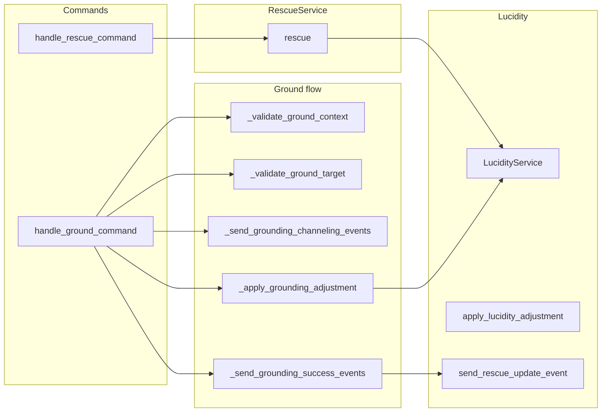

# Rescue Subsystem Design

## Overview

The rescue subsystem allows one player to help a catatonic (lucidity-tier) ally recover lucidity.
The user-facing command is **ground**: the rescuer and target must be in the same room; the target
must have a lucidity record in catatonic tier. Ground applies a lucidity adjustment (to 1 LCD),
sends rescue_update events to both players, and notifies the catatonia registry. A separate
**rescue** flow is implemented in RescueService and handle_rescue_command (same-room, catatonic
target, lucidity adjustment); only **ground** is registered in the command map.

## Architecture

**Components:**

- **rescue_commands**: [server/commands/rescue_commands.py](server/commands/rescue_commands.py) –
  handle*ground_command: validates rescuer/target/same room, loads PlayerLucidity, requires
  current_tier == "catatonic", sends channeling events, applies LucidityService.apply_lucidity*
  adjustment (reason_code "ground_rescue"), commits, sends success/failure events via
  send_rescue_update_event. handle_rescue_command: delegates to RescueService.rescue.
- **RescueService**: [server/services/rescue_service.py](server/services/rescue_service.py) –
  rescue(target_name, current_user, player_name): same-room check, load PlayerLucidity, require
  catatonic, apply_lucidity_adjustment (reason_code "rescue_command"), commit, dispatch
  rescue_update events (status "rescued").
- **LucidityService**: apply_lucidity_adjustment with reason_code and metadata; notifies
  catatonia_observer (e.g. catatonia_registry.on_catatonia_cleared) when applicable.
- **lucidity_event_dispatcher**: send_rescue_update_event – sends rescue_update to target and
  rescuer (e.g. for client UI progress/status).

## Key design decisions

- **Same room only**: Rescuer and target must have the same current_room_id; otherwise "not within
  reach."
- **Catatonic tier only**: Target's PlayerLucidity.current_tier must be "catatonic"; otherwise no
  rescue/ground.
- **Adjustment to 1 LCD**: Delta computed as 1 - current_lcd (or 1 if already at or above 1);
  apply_lucidity_adjustment restores lucidity; tier will change when crossing thresholds.
- **Channeling/success events**: Ground sends channeling (progress 10) then success/failure;
  RescueService sends "rescued" status. Events keep client and rescuer/target in sync.
- **Database session**: Ground uses get_async_session() and session.get(PlayerLucidity);
  RescueService uses session_factory. Commit on success; rollback on exception and send failure
  events.

## Constraints

- **Target must have PlayerLucidity**: If session.get(PlayerLucidity, target_id) is None, return
  error (ground: "aura cannot be located"; rescue: "lucidity record could not be found").
- **Rescuer/target resolution**: By player name via persistence.get_player_by_name; rescuer from
  current_user, target from command_data target/target_player.
- **Dependencies**: Async persistence, get_async_session, LucidityService, send_rescue_update_event,
  optional catatonia_registry. No combat or position checks (target can be sitting/lying).

## Component interactions

1. **ground &lt;target&gt;** – Validate rescuer and target, same room. Open session, get
   PlayerLucidity for target; if not catatonic, return. Send channeling events to both. Apply
   lucidity adjustment (ground_rescue), commit. On exception, rollback and send failure events. Send
   success events with new_lcd; return narrative.
2. **rescue (RescueService)** – Used by handle_rescue_command (if exposed via API or alternate
   command). Same flow: same room, catatonic, apply_lucidity_adjustment (rescue_command), commit,
   dispatch rescued events.
3. **LucidityService** – apply_lucidity_adjustment updates lucidity record and tier; observer
   (catatonia_registry) notified when catatonia is cleared.

## Developer guide

- **Adding a new rescue variant**: Reuse LucidityService.apply_lucidity_adjustment with a distinct
  reason_code and metadata; send appropriate rescue_update events; keep same-room and catatonic
  checks.
- **Tests**: Unit tests for RescueService.rescue (same room, catatonic, success/failure, event
  dispatch); integration tests for handle_ground_command with DB and mock send_rescue_update_event.
- **Event schema**: rescue_update event payload (status, rescuer_name, target_name, message,
  progress, current_lcd) – ensure client and dispatcher stay in sync.

## Troubleshooting

- **"isn't catatonic and needs no grounding"**: current_tier != "catatonic". Check lucidity
  thresholds and tier computation.
- **"not within reach"**: current_room_id of rescuer and target differ. Verify room persistence
  and that both are in the same room instance.
- **"The target's aura cannot be located"**: No PlayerLucidity row for target. Ensure lucidity
  records are created for players (e.g. on login or first use).
- **Ground succeeds but client doesn't update**: Check send_rescue_update_event is called and
  client subscribes to rescue_update; check connection_manager.send_personal_message or equivalent.

See also [SUBSYSTEM_LUCIDITY_DESIGN.md](SUBSYSTEM_LUCIDITY_DESIGN.md) and
[GAME_BUG_INVESTIGATION_PLAYBOOK](.cursor/rules/GAME_BUG_INVESTIGATION_PLAYBOOK.mdc).

## Related docs

- [SUBSYSTEM_LUCIDITY_DESIGN.md](SUBSYSTEM_LUCIDITY_DESIGN.md)
- [COMMAND_MODELS_REFERENCE.md](../COMMAND_MODELS_REFERENCE.md)
