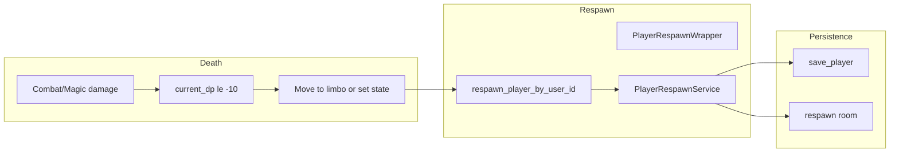

# Respawn Subsystem Design

## Overview

The respawn subsystem places a dead player (DP <= -10 or in limbo) back into the world at a
respawn location and restores their state (e.g. DP). PlayerRespawnWrapper and PlayerRespawnService
handle the flow; death is determined by player.get_stats().current_dp <= -10 or current_room_id
== LIMBO_ROOM_ID. Multi-character: respawn by user_id finds the dead character(s) and respawns
one. Combat and damage application trigger death when DP reaches -10; respawn is then invoked (e.g. via
API or game loop).

## Architecture

**Components:**

- **PlayerRespawnWrapper**: [server/game/player_respawn_wrapper.py](server/game/player_respawn_wrapper.py) –
  respawn_player_by_user_id(user_id, session, respawn_service, persistence): Load all active
  players for user; find dead (is_dead() or current_room_id == LIMBO_ROOM_ID); call respawn_service
  to respawn; return player and room data. Multi-character: finds dead player(s) among user's
  characters.
- **PlayerRespawnService**: [server/services/player_respawn_service.py](server/services/
  player_respawn_service.py) – Core respawn logic: set respawn room, restore DP (or default),
  persist, return room data. LIMBO_ROOM_ID constant for "in limbo" check.
- **Death detection**: Player.is_dead() (e.g. get_stats().current_dp <= -10); or in limbo room
  (handles persistence race or restart).
- **Combat/damage**: When damage application brings current_dp to -10, death/respawn flow is
  triggered (by event, API, or game tick); see SUBSYSTEM_STATUS_EFFECTS_DESIGN.md and combat
  integration.

## Key design decisions

- **Death at -10 DP**: Incapacitated is 0 to -9; -10 is death; respawn restores player to respawn
  location and resets DP.
- **Limbo room**: If player is in LIMBO_ROOM_ID they are treated as eligible for respawn (e.g. after
  crash or restart before state was persisted).
- **Respawn by user_id**: Multi-character support; wrapper loads all non-deleted players for user,
  filters to dead/limbo, respawns via service.
- **Respawn room**: PlayerRespawnService (or persistence) defines respawn location (e.g. default
  room or last rest location).

## Constraints

- **Player must be dead or in limbo**: \_is_eligible_for_respawn checks is_dead() or
  current_room_id == LIMBO_ROOM_ID; otherwise ValidationError "No dead character found".
- **Session and persistence**: respawn_player_by_user_id requires AsyncSession and
  PlayerRespawnService; persistence for room data.
- **Dependencies**: Persistence, PlayerRespawnService, session (for player load with user
  relationship).

## Component interactions

1. **Death (DP -10)** – Damage path (combat/magic) applies damage; when current_dp reaches -10,
   death handler or event triggers respawn flow (e.g. API call or internal respawn_player_by_user_id).
2. **respawn_player_by_user_id** – Load players by user_id; filter to dead or limbo; call
   respawn_service.respawn(player) (or equivalent); get respawn room; return response with player
   and room data for client update.
3. **PlayerRespawnService** – Set player current_room_id to respawn room, restore DP (and possibly
   other stats), save_player; return room info.

## Developer guide

- **Changing respawn location**: Respawn room is determined in PlayerRespawnService (or config);
  update that logic (e.g. last_rest_room, default_room_id).
- **Multi-character**: Wrapper already selects dead player(s) by user_id; if multiple dead,
  document or implement which one is respawned (e.g. first, or by character select).
- **Tests**: Unit tests for PlayerRespawnWrapper (eligible check, multi-player); PlayerRespawnService
  (respawn room, DP restore); integration test with persistence and session.
- **no_death rooms**: In no_death rooms damage is capped so DP never goes below 0 (ADR-009); respawn
  is not triggered there.

## Troubleshooting

- **"Player not found for respawn"**: No active players for user_id; check user_id and is_deleted.
- **"No dead character found"**: No player has current_dp <= -10 and none in limbo; check is_dead()
  and LIMBO_ROOM_ID; ensure damage path actually sets -10 and triggers respawn.
- **Respawn room wrong**: Check PlayerRespawnService respawn room logic and persistence room data.
- **DP not restored**: Respawn service must set current_dp (or equivalent) to respawn value after
  move; verify save_player is called.

See also [SUBSYSTEM_STATUS_EFFECTS_DESIGN.md](SUBSYSTEM_STATUS_EFFECTS_DESIGN.md),
[SUBSYSTEM_COMBAT_DESIGN.md](SUBSYSTEM_COMBAT_DESIGN.md), [ADR-009](../architecture/decisions/
ADR-009-instanced-rooms.md) (no_death).

## Related docs

- [COMMAND_MODELS_REFERENCE.md](../COMMAND_MODELS_REFERENCE.md)
