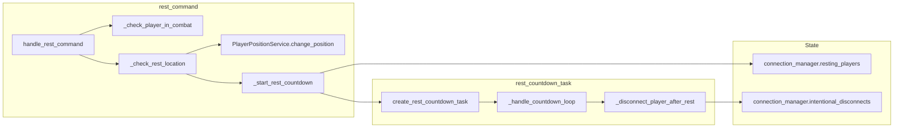

# Rest Subsystem Design

## Overview

The rest subsystem implements the /rest command for clean disconnection. In rest locations (room
attribute rest_location, e.g. inns/hotels/motels), the player disconnects immediately when not in
combat. Elsewhere, the player is set to sitting and a 10-second countdown starts; completion
disconnects the player without a grace period. The countdown is interrupted by combat, movement
(go), or spellcasting; it is not interrupted by chat, look, or inventory.

## Architecture

**Components:**

- **rest_command**: [server/commands/rest_command.py](server/commands/rest_command.py) – Validates
  not already resting, not in combat; if rest location, calls \_disconnect_player_intentionally;
  else sets position to sitting and starts countdown via create_rest_countdown_task, stored in
  connection_manager.resting_players[player_id].
- **rest_countdown_task**: [server/commands/rest_countdown_task.py](server/commands/rest_countdown_task.py) –
  Async task: every second sends "You will disconnect in N second(s)..." and checks if still in
  resting_players (interrupted if removed). On completion, sends intentional_disconnect event, calls
  disconnect_func (force_disconnect_player), then removes from resting_players in finally.
- **ConnectionManager**: resting_players (player_id -> asyncio.Task), intentional_disconnects (set of
  player_id). Combat, go_command, and magic_commands call \_cancel_rest_countdown and/or
  is_player_resting to interrupt or detect rest.
- **PlayerPositionService**: Used to set player to sitting before countdown (change_position).

## Key design decisions

- **Rest location = instant disconnect**: Room.rest_location true means no countdown; immediate
  intentional disconnect. Used for safe logout in inns.
- **10-second countdown elsewhere**: Gives time to cancel (move, attack, cast); avoids accidental
  logouts; sitting position is visible to others.
- **Interrupt on movement/combat/spellcasting**: Go command and combat/magic handlers call
  \_cancel_rest_countdown(player_id, connection_manager) so rest is cancelled and task removed from
  resting_players. Countdown loop also checks \_is_rest_interrupted (player_id not in resting_players).
- **Intentional disconnect**: \_disconnect_player_intentionally adds player_id to
  intentional_disconnects before force_disconnect_player so reconnection logic does not apply grace
  period.
- **Public helpers**: is_player_resting(player_id, connection_manager) and \_cancel_rest_countdown
  are used by go_command, combat, and magic_commands; they are the contract for "rest is active."

## Constraints

- **No rest in combat**: \_check_player_in_combat uses combat_service.get_combat_by_participant;
  if in combat, rest is blocked entirely.
- **Already resting**: If player_id in connection_manager.resting_players, return "You are already
  resting..."
- **Room must have rest_location**: persistence.get_room_by_id(room_id).rest_location for instant
  disconnect.
- **Dependencies**: Persistence (player, room), ConnectionManager (resting*players, intentional*
  disconnects, force_disconnect_player), PlayerPositionService, combat_service (app.state or
  container).

## Component interactions

1. **/rest** – Get persistence, connection_manager. If already in resting_players, return. If in
   combat, return "You cannot rest during combat." If room.rest_location, call
   \_disconnect_player_intentionally (add to intentional_disconnects, force_disconnect_player). Else
   change_position(player_name, "sitting"), then create_rest_countdown_task and store in
   resting_players[player_id]; return result with player_update (position).
2. **Interrupt (go/attack/cast)** – Caller calls \_cancel_rest_countdown(player_id, connection_manager):
   task = resting_players[player_id], task.cancel(), await task, del resting_players[player_id].
3. **Countdown task** – Loop 10..1: if not in resting_players, return; send countdown message; sleep
   1s. Then send intentional_disconnect event, call disconnect_func (force_disconnect_player).
   Finally block always removes player_id from resting_players.

## Developer guide

- **Changing countdown duration**: REST_COUNTDOWN_DURATION in rest_command.py and rest_countdown_task.py
  (keep in sync or centralize in one module).
- **New interrupt trigger**: Where the interrupting action runs (e.g. new command), call
  \_cancel_rest_countdown(player_id, connection_manager) and optionally is_player_resting to check
  first. Export from rest_command so other commands can import.
- **Tests**: Unit tests for handle_rest_command (combat block, rest location instant, non-rest
  countdown start), rest_countdown_task (interrupt, completion, cleanup). Mock connection_manager
  and persistence.
- **Room attribute**: Ensure room loader sets rest_location on inn/hotel/motel rooms so instant
  disconnect works.

## Troubleshooting

- **"You cannot rest during combat"**: combat_service.get_combat_by_participant returned non-None.
  End combat or flee first.
- **Rest not interrupting on go**: Ensure go_command calls \_cancel_rest_countdown after
  is_player_resting; check connection_manager is same instance as rest uses.
- **Countdown completes but player not disconnected**: Check disconnect_func is
  \_disconnect_player_intentionally and force_disconnect_player is called; check finally block
  removes from resting_players so task is not left dangling.
- **Grace period applied after rest**: Ensure intentional_disconnects.add(player_id) is called
  before force_disconnect_player and that disconnect tracking (e.g. track_player_disconnected_impl)
  respects intentional_disconnects.

See also [GAME_BUG_INVESTIGATION_PLAYBOOK](.cursor/rules/GAME_BUG_INVESTIGATION_PLAYBOOK.mdc).

## Related docs

- [SUBSYSTEM_MOVEMENT_DESIGN.md](SUBSYSTEM_MOVEMENT_DESIGN.md) (rest interrupt on go)
- [COMMAND_MODELS_REFERENCE.md](../COMMAND_MODELS_REFERENCE.md)
