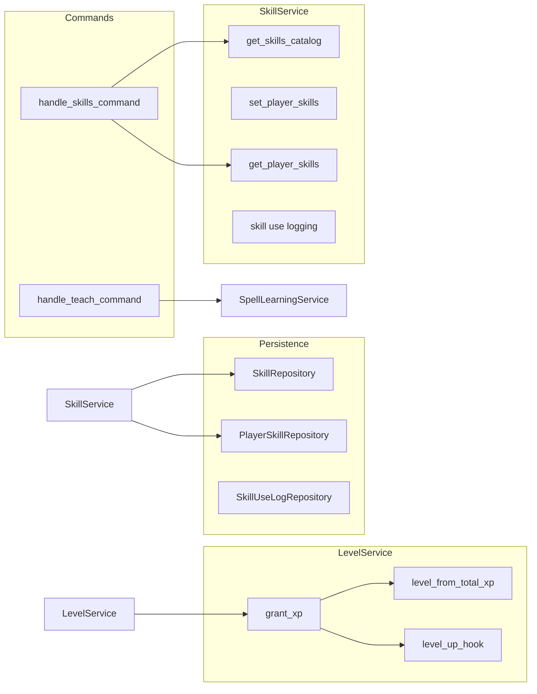

# Skills / Level Subsystem Design

## Overview

The skills/level subsystem covers the skills catalog, per-character skill values (including
occupation and personal interest at creation), skill use logging, improvement rolls, and
level/XP. LevelService grants XP and computes level from a level curve; level-up can trigger a hook
(e.g. for skill improvement). SkillService provides the skills catalog, set_player_skills,
get_player_skills (with ownership), and skill use logging. The teach command uses SpellLearningService
and may integrate with skills. Character creation assigns occupation slots (one 70, two 60, three
50, three 40) and personal interest bonus (20); max skill value 99.

## Architecture

**Components:**

- **SkillService**: [server/game/skill_service.py](server/game/skill_service.py) – get*skills*
  catalog (SkillRepository.get_all_skills), set_player_skills (occupation + personal interest
  validation), get_player_skills (PlayerSkillRepository, ownership), skill use logging
  (SkillUseLogRepository), improvement rolls. Constants: OCCUPATION_VALUES (9 slots: 70,60,60,50,50,
  50,40,40,40), PERSONAL_INTEREST_BONUS 20, MAX_SKILL_VALUE 99.
- **LevelService**: [server/game/level_service.py](server/game/level_service.py) – grant_xp(player_id,
  amount): add to experience_points, level = level_from_total_xp(total_xp), if level increased
  save and call level_up_hook(player_id, new_level). Level-up hook is optional (e.g. skill
  improvement on level-up).
- **level_curve**: [server/game/level_curve.py](server/game/level_curve.py) – level_from_total_xp
  (XP-to-level mapping).
- **skills_commands**: [server/commands/skills_commands.py](server/commands/skills_commands.py) –
  handle_skills_command: list/inspect skills (catalog and player values).
- **teach_command**: [server/commands/teach_command.py](server/commands/teach_command.py) –
  handle_teach_command: integrates with SpellLearningService for teaching spells (and possibly
  skills).
- **Repositories**: SkillRepository, PlayerSkillRepository, SkillUseLogRepository (persistence).

## Key design decisions

- **Occupation slots at creation**: Exactly 9 skills with one 70, two 60, three 50, three 40;
  validated in \_validate_occupation_slots.
- **Personal interest**: One skill gets PERSONAL_INTEREST_BONUS (20) in addition to base/occupation.
- **Level from XP curve**: level_from_total_xp(total_xp) determines level; grant_xp adds XP and
  recomputes level; level-up is when new_level > player.level.
- **Level-up hook**: Optional async (player_id, new_level) for side effects (e.g. skill improvement);
  stub if not provided.
- **Own language / Cthulhu Mythos**: Special skill keys (OWN_LANGUAGE_KEY, CTHULHU_MYTHOS_KEY) may
  have different rules (e.g. improvement caps).

## Constraints

- **Max skill value**: 99 (MAX_SKILL_VALUE).
- **Catalog**: Skills come from SkillRepository (DB); allow_at_creation and category affect
  character creation and display.
- **Dependencies**: AsyncPersistence, SkillRepository, PlayerSkillRepository, SkillUseLogRepository;
  LevelService needs persistence and optional level_up_hook.

## Component interactions

1. **skills command** – Get catalog and player skills; return formatted list/info.
2. **Character creation** – Set occupation_slots and personal interest via SkillService (or
   character_creation_service); validation enforces OCCUPATION_VALUES.
3. **grant_xp** – Called from combat, quests, or other sources; LevelService.grant_xp adds XP,
   recomputes level, saves and runs level_up_hook on level-up.
4. **teach** – SpellLearningService for spell teaching; may reference skills for eligibility.

## Developer guide

- **New skill**: Add to skills table/catalog (SkillRepository); ensure allow_at_creation/category
  set if used at creation.
- **Changing level curve**: Update level_curve.level_from_total_xp; ensure grant_xp and any
  UI that shows "XP to next level" stay in sync.
- **Skill improvement on level-up**: Implement level_up_hook that reads SkillUseLogRepository (or
  equivalent) and grants skill improvements for skills used during the previous level.
- **Tests**: server/tests/unit/game/ for SkillService and LevelService; test occupation validation,
  grant_xp and level-up hook.

## Troubleshooting

- **"occupation_slots must have exactly 9 entries"**: Character creation must send 9 slots with
  values matching OCCUPATION_VALUES.
- **Level not increasing**: Check experience_points is persisted and level_from_total_xp curve;
  ensure grant_xp is called and save_player after level change.
- **Skill not in catalog**: Ensure skill exists in SkillRepository and is returned by get_all_skills.

See also [SUBSYSTEM_MAGIC_DESIGN.md](SUBSYSTEM_MAGIC_DESIGN.md) (teach/learn),
[GAME_BUG_INVESTIGATION_PLAYBOOK](.cursor/rules/GAME_BUG_INVESTIGATION_PLAYBOOK.mdc).

## Related docs

- [COMMAND_MODELS_REFERENCE.md](../COMMAND_MODELS_REFERENCE.md)
