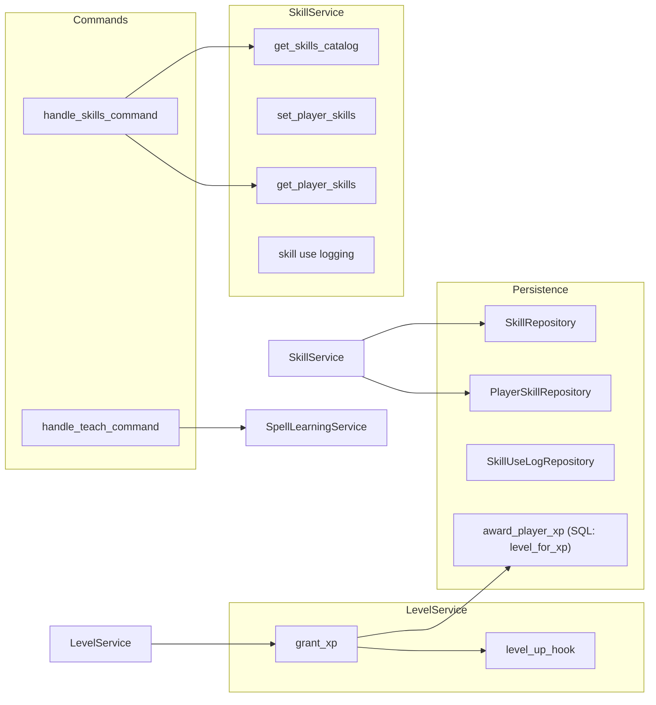

# Skills / Level Subsystem Design

**Version 1.2.0** · MythosMUD · 2026-09-22

---

## AI READING INSTRUCTION

Read `[SPEC]` and `[BUG]` blocks for authoritative facts.
Read `[NOTE]` only if additional context is needed.
`[?]` blocks are unverified — treat with lower confidence.

---

## 1. Overview

**[NOTE]**
The skills/level subsystem covers the skills catalog, per-character skill values (including
occupation and personal interest at creation), skill use logging, improvement rolls, and
level/XP. LevelService grants XP and computes level from a level curve; level-up can trigger a hook
(e.g. for skill improvement). SkillService provides the skills catalog, set_player_skills,
get_player_skills (with ownership), and skill use logging. The teach command uses SpellLearningService
and may integrate with skills. Character creation assigns occupation slots (one 70, two 60, three
50, three 40) and personal interest bonus (20); max skill value 99.

**[SPEC]** As of #879, the curve lives entirely in SQL (`level_for_xp`, `db/procedures/experience.sql`),
not in a Python module -- there is no `server/game/level_curve.py`. `LevelService.grant_xp` is the
single XP/level authority for both combat kills and quest rewards; it delegates the atomic
XP-add-and-level-recompute to `persistence.award_player_xp`, which row-locks the player and applies
`GREATEST(level, level_for_xp(new_xp))` so level can only ever go up. Prior to #879, three divergent
code paths existed (one atomic, one naive `xp // 100` formula, one through this service) and the
Python-side curve was inverted (cheaper per level at higher levels) — see the changelog below.

## 2. Architecture

**[NOTE]**

```mermaid
flowchart LR
  subgraph commands [Commands]
    SkillsCmd[handle_skills_command]
    Teach[handle_teach_command]
  end
  subgraph skill_service [SkillService]
    Catalog[get_skills_catalog]
    SetSkills[set_player_skills]
    GetSkills[get_player_skills]
    UseLog[skill use logging]
  end
  subgraph level_service [LevelService]
    GrantXP[grant_xp]
    LevelUpHook[level_up_hook]
  end
  subgraph persistence [Persistence]
    SkillRepo[SkillRepository]
    PlayerSkillRepo[PlayerSkillRepository]
    SkillUseLogRepo[SkillUseLogRepository]
    AwardXP["award_player_xp (SQL: level_for_xp)"]
  end
  SkillsCmd --> Catalog
  SkillsCmd --> GetSkills
  SkillService --> SkillRepo
  SkillService --> PlayerSkillRepo
  LevelService --> GrantXP
  GrantXP --> AwardXP
  GrantXP --> LevelUpHook
  Teach --> SpellLearningService
```

**Components:**

- **SkillService**: [server/game/skill_service.py](../../server/game/skill_service.py) – get*skills*
  catalog (SkillRepository.get_all_skills), set_player_skills (occupation + personal interest
  validation), get_player_skills (PlayerSkillRepository, ownership), skill use logging
  (SkillUseLogRepository), improvement rolls. Constants: OCCUPATION_VALUES (9 slots: 70,60,60,50,50,
  50,40,40,40), PERSONAL_INTEREST_BONUS 20, MAX_SKILL_VALUE 99.
- **LevelService**: [server/game/level_service.py](../../server/game/level_service.py) – grant_xp(player_id,
  amount) delegates to `persistence.award_player_xp` (atomic XP-add + level recompute); if the
  returned new_level > old_level, calls level_up_hook(player_id, new_level). Level-up hook is
  optional (e.g. skill improvement on level-up). Single XP/level authority for combat and quests (#879).
- **award_player_xp / level_for_xp**: [db/procedures/experience.sql](../../db/procedures/experience.sql) –
  the XP-to-level curve and its atomic application live in SQL, not Python. `level_for_xp(xp)` is
  the exact inverse of `total(L) = 50*L*(L-1)`; `award_player_xp` row-locks the player, adds XP,
  and sets `level = GREATEST(level, level_for_xp(new_xp))`.
- **skills_commands**: [server/commands/skills_commands.py](../../server/commands/skills_commands.py) –
  handle_skills_command: list/inspect skills (catalog and player values).
- **teach_command**: [server/commands/teach_command.py](../../server/commands/teach_command.py) –
  handle_teach_command: integrates with SpellLearningService for teaching spells (and possibly
  skills).
- **Repositories**: SkillRepository, PlayerSkillRepository, SkillUseLogRepository (persistence).

## 3. Key design decisions

**[SPEC]**

- **Occupation slots at creation**: Exactly 9 skills with one 70, two 60, three 50, three 40;
  validated in \_validate_occupation_slots.
- **Personal interest**: One skill gets PERSONAL_INTEREST_BONUS (20) in addition to base/occupation.
- **Level from XP curve**: `level_for_xp(xp)` (SQL) determines level; `award_player_xp` adds XP and
  recomputes level atomically in one row-locked UPDATE; level-up is when new_level > old_level.
  Level is monotonic -- `GREATEST(level, level_for_xp(new_xp))` means it can only increase.
- **Level-up hook**: Optional async (player_id, new_level) for side effects (e.g. skill improvement);
  stub if not provided.
- **Own language / Cthulhu Mythos**: Special skill keys (OWN_LANGUAGE_KEY, CTHULHU_MYTHOS_KEY) may
  have different rules (e.g. improvement caps).

## 4. Constraints

**[SPEC]**

- **Max skill value**: 99 (MAX_SKILL_VALUE).
- **Catalog**: Skills come from SkillRepository (DB); allow_at_creation and category affect
  character creation and display.
- **Dependencies**: AsyncPersistence, SkillRepository, PlayerSkillRepository, SkillUseLogRepository;
  LevelService needs persistence and optional level_up_hook.

## 5. Component interactions

**[SPEC]**

1. **skills command** – Get catalog and player skills; return formatted list/info.
2. **Character creation** – Set occupation_slots and personal interest via SkillService (or
   character_creation_service); validation enforces OCCUPATION_VALUES.
3. **grant_xp** – Called from combat (PlayerCombatService.award_xp_on_npc_death, on the killing
   blow only -- process_attack, not the NPC death handler, to avoid a double award) and quests
   (QuestService._apply_xp_reward). LevelService.grant_xp calls persistence.award_player_xp
   (atomic XP-add + level recompute) and runs level_up_hook on level-up.
4. **teach** – SpellLearningService for spell teaching; may reference skills for eligibility.

## 6. Developer guide

**[NOTE]**

- **New skill**: Add to skills table/catalog (SkillRepository); ensure allow_at_creation/category
  set if used at creation.
- **Changing level curve**: Update `level_for_xp` in `db/procedures/experience.sql` (SQL, not
  Python); ensure any UI that shows "XP to next level" and the total(L) formula it's the inverse
  of stay in sync.
- **Skill improvement on level-up**: Implement level_up_hook that reads SkillUseLogRepository (or
  equivalent) and grants skill improvements for skills used during the previous level.
- **Tests**: server/tests/unit/game/ for SkillService and LevelService; test occupation validation,
  grant_xp and level-up hook.

## 7. Troubleshooting

**[NOTE]**

- **"occupation_slots must have exactly 9 entries"**: Character creation must send 9 slots with
  values matching OCCUPATION_VALUES.
- **Level not increasing**: Check that the award actually goes through `LevelService.grant_xp` --
  before #879, `PlayerCombatService.award_xp_on_npc_death` had a fallback path that added XP via
  `Player.add_experience` (a naive, now-deleted formula) without ever calling grant_xp.
- **Skill not in catalog**: Ensure skill exists in SkillRepository and is returned by get_all_skills.

See also [SUBSYSTEM_MAGIC_DESIGN.md](SUBSYSTEM_MAGIC_DESIGN.md) (teach/learn),
[GAME_BUG_INVESTIGATION_PLAYBOOK](../../.cursor/rules/GAME_BUG_INVESTIGATION_PLAYBOOK.mdc).

## 8. Related docs

**[SPEC]**

- [COMMAND_MODELS_REFERENCE.md](../COMMAND_MODELS_REFERENCE.md)

## 9. Changelog

**[SPEC]**

| Version | Date | Change |
| --- | --- | --- |
| 1.0.0 | 2026-07-30 | Initial HADS structural conversion |
| 1.1.0 | 2026-08-28 | Fix 5 broken component links (wrong depth) (#695) |
| 1.2.0 | 2026-09-22 | #879: consolidate 3 divergent XP-award paths (1 atomic, 1 naive `xp // 100`, 1 through this service) and 2 contradictory formulas onto one authority (LevelService.grant_xp -> persistence.award_player_xp); move the curve into SQL (`level_for_xp`, quadratic, replacing the inverted Python placeholder); fix the attack command double-awarding XP on every kill; delete `server/game/level_curve.py` and `Player.add_experience` |
