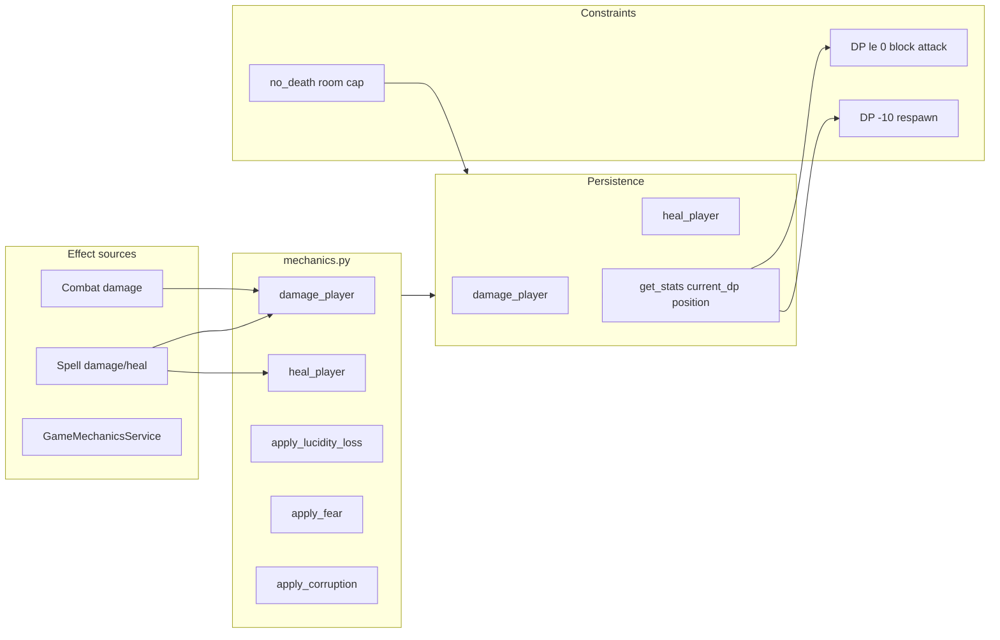

# Status Effects Subsystem Design

## Overview

The status effects subsystem covers damage, healing, posture, incapacitation, and death as
reflected in player and NPC state. There is no separate "status effect" registry; effects are
embodied in stats (e.g. current_dp, position), persistence (damage_player, heal_player,
apply_lucidity_loss, apply_fear, apply_corruption), and room attributes (no_death, no_combat).
Combat and magic apply damage; mechanics and persistence own the actual stat updates. Incapacitation
(DP 0 to -9) blocks attack and movement (posture/combat checks); death at -10 triggers respawn.
ADR-009 no_death rooms cap damage so DP does not go below 0.

## Architecture

**Components:**

- **mechanics.py**: [server/game/mechanics.py](server/game/mechanics.py) – GameMechanicsService:
  apply_lucidity_loss, apply_fear, apply_corruption, heal_player, damage_player, gain_experience.
  Delegates to persistence (apply_lucidity_loss, damage_player, heal_player, etc.). Used by
  combat, magic, and other callers for consistent stat updates.
- **Persistence**: Player stats (current_dp, position, etc.) and repository methods (damage_player,
  heal_player) implement the actual state change. damage_player/heal_player are the authority for
  HP/DP; no_death room handling can cap damage in persistence or combat layer (ADR-009).
- **Combat**: Applies damage via NPC combat integration and persistence; combat command checks
  current_dp <= 0 to block attack (incapacitated).
- **Movement**: \_check_player_posture blocks movement unless position == "standing"; position
  comes from get_stats() (sitting/lying from pose/rest/ground).
- **Respawn**: When DP reaches -10 (death), respawn flow places player at respawn location and
  restores DP (see SUBSYSTEM_RESPAWN_DESIGN.md).
- **Room attributes**: no_combat (block combat), no_death (cap damage so DP never below 0) per
  ADR-009.

## Key design decisions

- **No central effect registry**: Effects are implicit in stat names and persistence methods;
  combat and magic call mechanics or persistence directly.
- **Incapacitated band (0 to -9 DP)**: Player cannot attack or (via posture) move; must reach -10
  to die and respawn. Command and movement validation check current_dp and position.
- **Position (posture)**: Stored in stats (e.g. position: standing|sitting|lying). Rest sets
  sitting; stand/lie/sit/ground commands and follow auto-stand update it. Movement requires
  standing.
- **Server authority**: All effect application is server-side; client displays state from
  room_state/game_state/player_update.
- **no_death rooms**: Damage is capped so player DP does not go below 0 in no_death rooms
  (tutorial/safe zones).

## Constraints

- **current_dp**: Source of truth in persistence; combat and magic should apply through
  mechanics.damage_player or persistence.damage_player so no_death and death logic apply.
- **position**: Must be standing for movement and (typically) combat; follow and rest change it.
- **Dependencies**: Persistence (player, stats, damage/heal/lucidity/fear/corruption methods),
  room attributes (no_combat, no_death).

## Component interactions

1. **Combat damage** – NPC combat integration computes damage; applies to NPC or player via
   persistence/mechanics; player current_dp updated; if <= 0 command layer blocks further attack;
   at -10 respawn triggered.
2. **Healing** – Magic or item calls mechanics.heal_player or persistence.heal_player; stats
   updated.
3. **Lucidity / fear / corruption** – mechanics.apply_lucidity_loss, apply_fear, apply_corruption
   delegate to persistence; used by spells, encounters, or rescue/lucidity flows.
4. **Posture** – PlayerPositionService (position commands, rest, follow) and rescue/ground do not
   use mechanics for position; they update player stats or dedicated fields. Movement and combat
   read get_stats().position.

## Developer guide

- **Adding a new stat effect**: Add persistence method (e.g. apply_foo) and optionally
  GameMechanicsService method; call from combat, magic, or commands. Document stat name and
  range in this doc.
- **New blocking condition**: Add check in command or movement validation (e.g. current_dp,
  position, or new flag); return user-facing message and log.
- **no_death implementation**: Ensure damage path (persistence or combat) checks room.no_death
  and caps applied damage so current_dp never goes below 0.
- **Tests**: Mechanics tests for apply\_\* and damage/heal; combat tests for incapacitated and
  death; movement tests for posture block.

## Troubleshooting

- **Player can attack when incapacitated**: Ensure attack handler reads current_dp from
  get_stats() (or equivalent) and blocks when current_dp <= 0.
- **Movement allowed when sitting**: MovementService.\_check_player_posture must use get_stats()
  .position and block when not "standing"; ensure follow/rest/position commands update the same
  stat.
- **Death not triggering**: Respawn subscribes to death event or checks DP after damage; ensure
  damage path applies through persistence and emits or triggers respawn at -10.
- **no_death not capping**: Find where damage is applied (persistence or combat layer) and add
  room.no_death check and min(current_dp - damage, 0) cap.

See also [SUBSYSTEM_COMBAT_DESIGN.md](SUBSYSTEM_COMBAT_DESIGN.md),
[SUBSYSTEM_RESPAWN_DESIGN.md](SUBSYSTEM_RESPAWN_DESIGN.md),
[SUBSYSTEM_MAGIC_DESIGN.md](SUBSYSTEM_MAGIC_DESIGN.md),
[ADR-009](../architecture/decisions/ADR-009-instanced-rooms.md). Archived:
[docs/archive/EFFECTS_SYSTEM_REFERENCE.md](../archive/EFFECTS_SYSTEM_REFERENCE.md).

## Related docs

- [EVENT_OWNERSHIP_MATRIX.md](../EVENT_OWNERSHIP_MATRIX.md) (if death/effect events are emitted)
