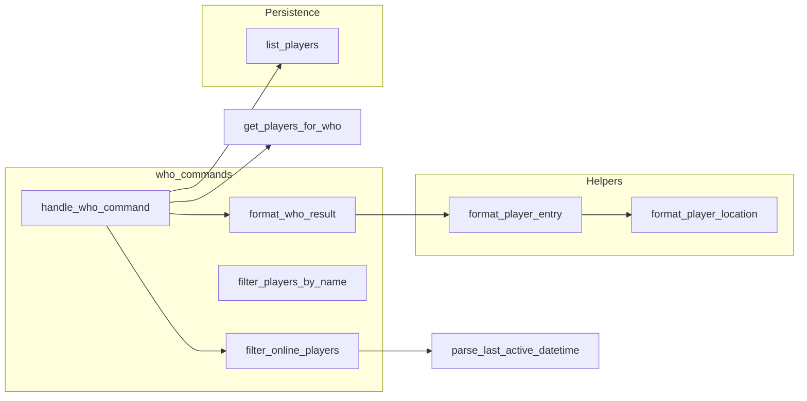

# Who Subsystem Design

## Overview

The who subsystem lists players considered "online" and optionally filters them by name. The only
entry point is the **who** command. Online is defined as having last_active within the last 5
minutes. Results are sorted by name and formatted as "Name [Level] - Zone: Subzone: Room"; admins
get an [ADMIN] tag. No real-time connection list is used – who uses persistence.list_players() and
filters by last_active.

## Architecture

**Components:**

- **who_commands**: [server/commands/who_commands.py](server/commands/who_commands.py) – handle*who*
  command gets optional filter term (target_player), persistence from container, calls
  persistence.list_players(), filter_online_players(players, online_threshold) with threshold =
  now - 5 minutes, get_players_for_who (apply name filter if any), format_who_result; returns
  result string. Helpers in same file: filter_players_by_name (case-insensitive partial),
  format_player_location (room_id -> "Zone: Subzone: Room"), format_player_entry (player -> "Name
  [Level] - Location" or with [ADMIN]), parse_last_active_datetime, filter_online_players,
  format_who_result, get_players_for_who.
- **Persistence**: list_players() returns all players (from DB); each player has last_active,
  name, level, current_room_id, is_admin.
- **PlayerSearchService**: [server/game/player_search_service.py](server/game/player_search_service.py) –
  Used elsewhere (e.g. chat name resolution); who does not use it. Who uses in-file
  filter_players_by_name for name filtering.

## Key design decisions

- **Online = last_active within 5 minutes**: No connection_manager check; who is purely
  persistence-based. Players who disconnected but had activity in last 5 minutes still appear.
- **Optional name filter**: command_data.target_player; if present, filter_players_by_name (partial
  case-insensitive match) before formatting.
- **Room ID parsing**: format*player_location splits room_id on "*" and expects at least 4 parts
  (earth_zone_subzone_room...) to build "Zone: Subzone: Room" display.
- **Admin indicator**: format_player_entry adds " [ADMIN]" when player.is_admin.

## Constraints

- **Persistence required**: No persistence -> "Player information is not available."
- **list_players**: Must return players with last_active, name, level, current_room_id, is_admin.
- **last_active**: Must be comparable (datetime or ISO string); parse_last_active_datetime
  normalizes to timezone-aware datetime.

## Component interactions

1. **who [filter]** – Get persistence; list_players(); online_threshold = now - 5 minutes;
   filter_online_players(players, online_threshold); get_players_for_who(online_players, filter_term)
   (apply name filter if filter_term); format_who_result (sorted by name, comma-separated entries);
   return result.
2. **format_player_location(room_id)** – Parse room_id string; return "Unknown Location" if invalid
   or parts < 4.
3. **format_player_entry(player)** – Build "Name [Level] - Location" or with [ADMIN]; use
   format_player_location(player.current_room_id).

## Developer guide

- **Changing online threshold**: In handle_who_command, timedelta(minutes=5); change to desired
  window. Consider making it configurable.
- **Using connection-based online**: To show only connected players, inject connection_manager
  and filter list_players() by who is in connection_manager; document new contract.
- **Tests**: server/tests/unit/commands/ for who (mock persistence.list_players, assert
  filter_online_players and format_who_result); test format_player_location with various room_id
  formats.
- **PlayerSearchService**: Who does not use it; for consistent name search elsewhere, consider
  reusing PlayerSearchService in who or sharing filter logic.

## Troubleshooting

- **"No players are currently online"**: All players have last_active older than 5 minutes, or
  list_players empty. Check last_active is updated on activity (e.g. commands, movement).
- **"Unknown Location" for all**: room*id format may not have 4+ parts; check format_player*
  location and room_id schema (e.g. instance room IDs).
- **Filter returns no one**: filter_players_by_name uses "in" (substring); ensure filter term
  matches; check case-insensitivity.
- **Who slow**: list_players() loads all players; if DB is large, consider indexing last_active
  and filtering in DB.

See also [GAME_BUG_INVESTIGATION_PLAYBOOK](.cursor/rules/GAME_BUG_INVESTIGATION_PLAYBOOK.mdc).
Archived spec: [docs/archive/WHO_COMMAND_FRD.md](../archive/WHO_COMMAND_FRD.md).

## Related docs

- [COMMAND_MODELS_REFERENCE.md](../COMMAND_MODELS_REFERENCE.md)
